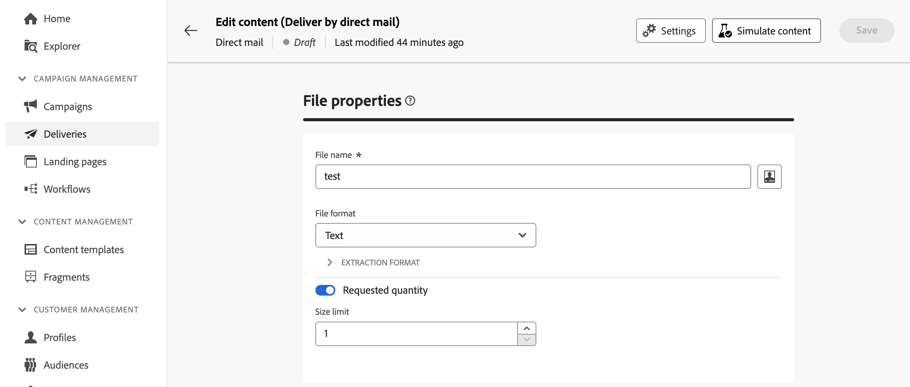
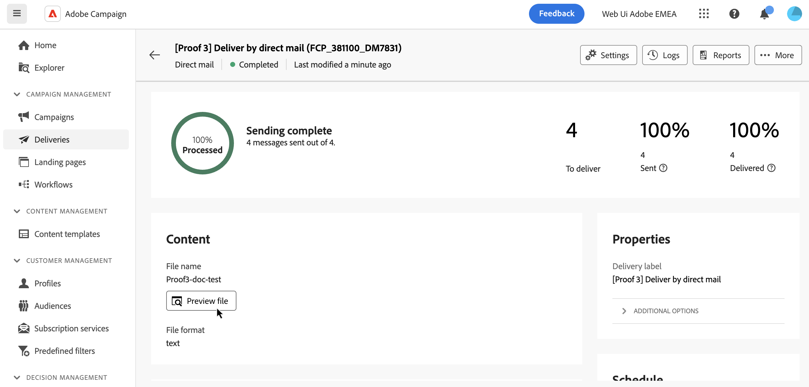

# Förhandsgranska och skicka direktreklam {#send-direct-mail}

När du har konfigurerat extraheringsfilen för direktutskick kan du förhandsgranska den med testprofiler. Om personaliserat innehåll inkluderas bör du undersöka hur innehållet visas i kolumnerna med hjälp av testprofildata. Detta garanterar att filinnehållet återges korrekt och att anpassade element är korrekt inbyggda.

När extraheringsfilen är klar skickar du direktutskick för att generera filen och dela den med din direktreklamleverantör. [Lär dig hur du skickar direktreklam](#dm-send)

## Förhandsgranska extraheringsfilen {#preview-dm}

De viktigaste stegen för att förhandsgranska extraheringsfilen är följande. Mer information om hur du förhandsgranskar leveranser finns i [det här avsnittet](../preview-test/preview-content.md).

1. Använd **[!UICONTROL Simulate content]** från din leveransinnehållssida för att förhandsgranska ditt personliga innehåll.

   {zoomable="yes"}

1. Klicka på **[!UICONTROL Add test profile(s)]** för att markera en eller flera profiler och förhandsgranska deras data i extraheringsfilens innehåll.

1. I den högra rutan visas en förhandsgranskning av extraheringsfilen, där personaliserade element dynamiskt ersätts med data från den valda profilen.

   {zoomable="yes"}

## Skicka korrektur {#test-dm}

Skicka korrektur med **Adobe Campaign** innan du levererar dem till huvudmålgruppen. I det här steget valideras leveransen och eventuella problem identifieras. Testmottagarna granskar element som personaliseringsinställningar, ger optimala prestanda och identifierar fel. Denna process förfinar och optimerar extraheringsfilen innan den når ut till huvudmålgruppen.

För direktutskick genereras ett prov av extraheringsfilen med hjälp av data från de valda testprofilerna när du skickar korrektur. Så här öppnar du den:

1. Klicka på knappen **[!UICONTROL Send proof]** på skärmen för att simulera innehåll och följ samma steg som för alla typer av leveranser för att skicka ett korrektur. [Lär dig skicka korrektur](../preview-test/test-deliveries.md)

1. När korrekturet har skickats kan du få åtkomst till det från knappen **[!UICONTROL View proofs]** eller från leveranslistan. [Lär dig hur du får åtkomst till skickade korrektur](../preview-test/test-deliveries.md#access-test-deliveries)

1. Klicka på knappen **[!UICONTROL Preview file]** på kontrollpanelen för korrekturleverans för att öppna en förhandsgranskning av extraheringsfilen.

   {zoomable="yes"}

   >[!NOTE]
   >
   >Endast de första 100 raderna visas i förhandsvisningsfilen.

## Skicka direktmejl {#send-dm}

När du är klar att skicka din direktreklam till dina kunder skickar du leveransen för att påbörja dataextraheringen i den angivna extraheringsfilen. Följ dessa steg för att göra detta:

1. När du har utformat innehållet i extraheringsfilen klickar du på **[!UICONTROL Review & send]** på sidan **[!UICONTROL Delivery]**.

   {zoomable="yes"}

1. Klicka på **[!UICONTROL Prepare]** och övervaka förloppet och statistiken.

   Om det uppstår några fel hittar du detaljerad information om felet på **[!UICONTROL Logs]**-menyn.

   {zoomable="yes"}

1. Skicka meddelandena genom att klicka på **[!UICONTROL Send]** för att fortsätta med den sista sändningsprocessen.

1. Bekräfta skicka-åtgärden genom att klicka på **[!UICONTROL Send]**.

   Klicka på knappen **[!UICONTROL Send as scheduled]** om direktmeddelandeleveransen är schemalagd. Läs mer om leveransplanering i [det här avsnittet](../msg/gs-messages.md#schedule-the-delivery-sending).

När leveransen har skickats genereras extraheringsfilen automatiskt och exporteras till den plats som anges i det **[!UICONTROL Routing]** externa kontot som valts i leveransmallens [avancerade inställningar](../advanced-settings/delivery-settings.md).

Spåra dina KPI-data (Key Performance Indicator) från din leveranssida och data från **[!UICONTROL Logs]**-menyn.

Börja mäta effekten av ert budskap med inbyggda rapporter. [Läs mer](../reporting/direct-mail.md)