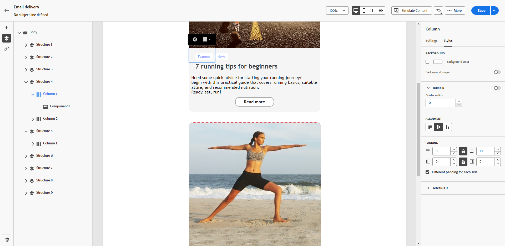

# Justera lodrät justering och utfyllnad {#alignment-and-padding}

I det här exemplet justerar vi utfyllnad och lodrät justering inuti en strukturkomponent som består av tre kolumner.

1. Markera strukturkomponenten direkt i e-postmeddelandet eller använd **[!UICONTROL Navigation tree]** som är tillgänglig i den vänstra rutan.

   {zoomable="yes"}

1. Klicka på **[!UICONTROL Select a column]** i det sammanhangsberoende verktygsfältet och välj den som du vill redigera. Du kan också välja det i strukturträdet till vänster.

   {zoomable="yes"}

1. De redigerbara parametrarna för den kolumnen visas på fliken **[!UICONTROL Styles]**. Justera **[!UICONTROL Alignment]** med hjälp av det dedikerade avsnittet.

   {zoomable="yes"}

   Välj till exempel **[!UICONTROL Bottom]**. Innehållskomponenten flyttas längst ned i kolumnen.

1. Under **[!UICONTROL Padding]** definierar du den översta utfyllnaden i kolumnen och anger vänster och höger utfyllnad för den kolumnen.

   >[!NOTE]
   >
   >Klicka på låsikonen om du vill bryta synkroniseringen mellan utfyllnaden längst upp/längst ned eller vänster/höger.

   {zoomable="yes"}

1. Gör på samma sätt om du vill justera justeringen och utfyllnaden för de andra kolumnerna.

1. Spara ändringarna.
