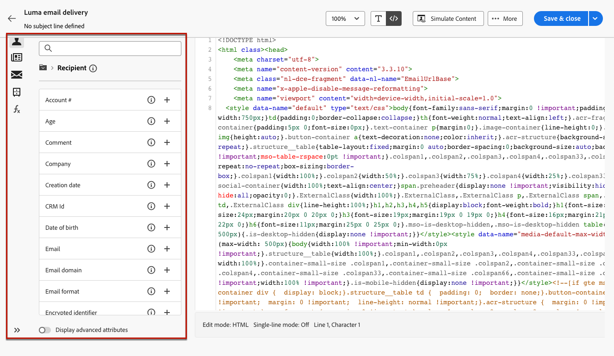

# Koda eget e-postinnehåll {#code-content}

Använd **[!UICONTROL Code your own]** läge för att importera obearbetat HTML och/eller koda ditt e-postinnehåll.

>[!CAUTION]
>
>Den här metoden kräver kunskaper i HTML.

1. På [E-postdesigner](get-started-email-designer.md) startsida, välja **[!UICONTROL Code your own]**.

   

1. Ange eller klistra in Raw-HTML-koden på huvudarbetsytan.

1. Använd den vänstra rutan för att utnyttja personaliseringsmöjligheterna. [Läs mer](../personalization/gs-personalization.md)

   

1. Klicka på **[!UICONTROL Simulate content]** för att kontrollera meddelandets utformning och personalisering med testprofiler. [Läs mer](../preview-test/preview-test.md)

1. När koden är klar klickar du **[!UICONTROL Save & close]** för att gå tillbaka till fönstret där meddelandet skapades och slutföra meddelandet.
