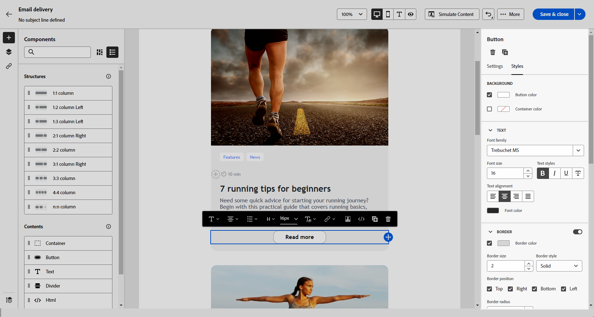

# Använda innehållskomponenter {#content-components}

>[!CONTEXTUALHELP]
>id="ac_content_components_email"
>title="Om innehåll"
>abstract="Innehållskomponenterna är tomma platshållare för innehåll som du kan använda för att skapa layouten för ett e-postmeddelande."

>[!CONTEXTUALHELP]
>id="ac_content_components_landing_page"
>title="Om innehåll"
>abstract="Innehållskomponenterna är tomma platshållare för innehåll som du kan använda för att skapa layouten för en landningssida."

>[!CONTEXTUALHELP]
>id="ac_content_components_fragment"
>title="Om innehåll"
>abstract="Innehållskomponenter är tomma platshållare för innehåll som du kan använda för att skapa layouten för ett innehållsfragment."

>[!CONTEXTUALHELP]
>id="ac_content_components_template"
>title="Om innehåll"
>abstract="Innehållskomponenter är tomma platshållare för innehåll som du kan använda för att skapa layouten för en mall."

När du skapar ditt e-postinnehåll kan du med **[!UICONTROL Content]**-komponenter anpassa din e-post ytterligare med tomma komponenter som du kan använda en gång i ett e-postmeddelande.

Du kan lägga till så många **[!UICONTROL Contents]** som du behöver i en **[!UICONTROL Structure]** som definierar layouten för ditt e-postmeddelande.

## Lägg till innehållskomponenter {#add-content-components}

Följ stegen nedan för att lägga till innehållskomponenter i e-postmeddelanden och anpassa dem efter dina behov.

1. Använd ett [befintligt innehåll](existing-content.md) eller dra och släpp en **[!UICONTROL Structure]** i ditt tomma innehåll för att definiera layouten för e-postmeddelandet i e-postmeddelandet. [Lär dig hur](create-email-content.md)

1. Dra och släpp **[!UICONTROL Content]** i de relevanta strukturerna.

   {zoomable="yes"}

   >[!NOTE]
   >
   >Du kan lägga till flera komponenter i en enda struktur och i varje kolumn i en struktur.

1. Justera alternativen för varje komponent med hjälp av fliken **[!UICONTROL Settings]**. Du kan t.ex. välja att bara visa den på datorn eller mobila enheter, eller både och. Du kan också hantera länkalternativ på den här fliken. [Läs mer om att hantera länkar](message-tracking.md)

1. Justera formatattributen för varje komponent på fliken **[!UICONTROL Style]**. Du kan till exempel ändra textstil, utfyllnad eller marginal för varje komponent. [Läs mer om justering och utfyllnad](alignment-and-padding.md)

   {zoomable="yes"}

1. På den avancerade menyn i **[!UICONTROL Content]** till höger kan du enkelt ta bort eller duplicera valfri innehållskomponent efter behov.

## Behållare {#container}

Du kan lägga till en enkel behållare i vilken du lägger till en annan innehållskomponent. På så sätt kan du använda en särskild formatering för behållaren, som skiljer sig från den komponent som används inuti.

Lägg till exempel till en **[!UICONTROL Container]**-komponent och lägg sedan till en [ Button](#button) -komponent i den behållaren. Du kan använda en specifik bakgrund för behållaren och en annan för knappen.

{zoomable="yes"}

## Knapp {#buttons}

Använd komponenten **[!UICONTROL Button]** för att infoga en eller flera knappar i e-postmeddelandet och dirigera om din e-postmålgrupp till en annan sida.

1. Dra och släpp **[!UICONTROL Button]**-komponenten från listan **[!UICONTROL Contents]** till en **[!UICONTROL Structure]**-komponent.

   {zoomable="yes"}

1. Klicka på knappen som du har lagt till för att anpassa texten och få tillgång till flikarna **[!UICONTROL Settings]** och **[!UICONTROL Styles]**.

   {zoomable="yes"}

1. På flikarna **[!UICONTROL Settings]** i fältet **[!UICONTROL URL]** lägger du till den URL som du vill omdirigera till när du klickar på knappen.

1. Välj hur innehållet ska visas med den nedrullningsbara listan **[!UICONTROL Target]**:

   * **[!UICONTROL None]**: öppnar länken i samma ram som den klickades på (standard).
   * **[!UICONTROL Blank]**: öppnar länken i ett nytt fönster eller på en ny flik.
   * **[!UICONTROL Self]**: öppnar länken i samma ram som den klickades på.
   * **[!UICONTROL Parent]**: öppnar länken i den överordnade ramen.
   * **[!UICONTROL Top]**: öppnar länken i hela fönstrets brödtext.

   {zoomable="yes"}

1. Du kan anpassa knappen ytterligare genom att ändra formatattribut som **[!UICONTROL Border]**, **[!UICONTROL Size]**, **[!UICONTROL Margin]** osv. från fliken **[!UICONTROL Styles]**.

## Text {#text}

Använd komponenten **[!UICONTROL Text]** för att infoga text i e-postmeddelandet och justera formatet (kantlinje, storlek, utfyllnad osv.) med flikarna **[!UICONTROL Settings]** och **[!UICONTROL Styles]**.

1. Dra och släpp **[!UICONTROL Text]** från menyn **[!UICONTROL Contents]** till en **[!UICONTROL Structure]**-komponent.

   {zoomable="yes"}

1. Klicka på den nya komponenten som du har lagt till för att anpassa texten och få tillgång till flikarna **[!UICONTROL Settings]** och **[!UICONTROL Styles]**.

1. Ändra texten med följande alternativ i det sammanhangsberoende verktygsfältet:

   {zoomable="yes"}

   * **[!UICONTROL Change text style]**: Använd fet, kursiv, understrykning eller genomstrykning i texten.
   * **Ändra justering**: välj mellan vänsterjustering, högerjustering, centrering eller marginaljustering för texten.
   * **[!UICONTROL Create list]**: lägg till punkt- eller nummerlista i texten.
   * **[!UICONTROL Set heading]**: lägg till upp till sex rubriknivåer i texten.
   * **Teckensnittsstorlek**: välj teckensnittsstorleken för texten i pixlar.
   * **[!UICONTROL Edit image]**: lägg till en bild eller en resurs i textkomponenten.
   * **[!UICONTROL Show the source code]**: visa källkoden för texten. Den kan inte ändras.
   * **[!UICONTROL Duplicate]**: lägg till en kopia av textkomponenten.
   * **[!UICONTROL Delete]**: ta bort den markerade textkomponenten från e-postmeddelandet.
   * **[!UICONTROL Add personalization]**: lägg till anpassningsfält för att anpassa innehållet från dina profildata.
   * **[!UICONTROL Enable conditional content]**: lägg till villkorligt innehåll för att anpassa komponentens innehåll till målprofilerna.

1. Justera övriga formatattribut, t.ex. textfärg, teckensnittsfamilj, kantlinje, utfyllnad, marginal. från fliken **[!UICONTROL Styles]**.

   {zoomable="yes"}

## Delare {#divider}

Använd komponenten **[!UICONTROL Divider]** för att infoga en delningslinje för att ordna layouten och innehållet i ditt e-postmeddelande.

Du kan justera formatattribut som linjefärg, format och höjd på fliken **[!UICONTROL Styles]**.

{zoomable="yes"}

## HTML {#HTML}

Använd komponenten **[!UICONTROL HTML]** för att kopiera och klistra in de olika delarna av din befintliga HTML. På så sätt kan du skapa kostnadsfria modulära HTML-komponenter för att återanvända en del externt innehåll.

1. Dra och släpp **[!UICONTROL HTML]**-komponenten från **[!UICONTROL Components]** till en **[!UICONTROL Structure]**-komponent.

   {zoomable="yes"}

1. Klicka på den nya komponenten och välj sedan **[!UICONTROL Show the source code]** i det sammanhangsberoende verktygsfältet för att lägga till HTML.

   {zoomable="yes"}

>[!NOTE]
>
>Om du bara vill göra ett externt innehåll kompatibelt med e-post-Designer rekommenderar Adobe att [skapar ett meddelande från grunden](create-email-content.md) och kopierar innehållet från ditt befintliga e-postmeddelande till komponenter.

## Bild {#image}

>[!IMPORTANT]
>
>Åtkomsten till Assets-menyn är begränsad till användare som har en aktiv licens för Adobe Experience Essentials. Om du inte har den här licensen är Assets-menyn inte tillgänglig.

Använd komponenten **[!UICONTROL Image]** för att infoga en bildfil från datorn i e-postmeddelandet.

1. Dra och släpp **[!UICONTROL Image]** i en **[!UICONTROL Structure]**-komponent på menyn **[!UICONTROL Content]**.

   {zoomable="yes"}

1. Klicka på **[!UICONTROL Browse]** om du vill välja en bildfil bland dina resurser. Du kan också välja att **[!UICONTROL Import your media]**.

   Mer information om hur du överför och lägger till resurser i Adobe Experience Manager finns i [Adobe Experience Manager as a Cloud Service-dokumentationen](https://experienceleague.adobe.com/docs/experience-manager-cloud-service/content/assets/manage/add-assets.html).

   {zoomable="yes"}

1. Navigera i mapparna för att hitta den resurs du behöver, eller använd sökfältet för att hitta den effektivt.

   Klicka på **[!UICONTROL Select]** när du har hittat resursen du söker efter.

   {zoomable="yes"}

1. Klicka på den nya komponenten och ange bildegenskaper på fliken **[!UICONTROL Settings]**:

   * Med **[!UICONTROL Image title]** kan du definiera en titel för bilden.
   * Med **[!UICONTROL Alt text]** kan du definiera bildtexten som är länkad till bilden. Detta motsvarar alt HTML-attributet.

   {zoomable="yes"}

1. Ni kan lägga till en länk för att dirigera om er målgrupp till ett annat innehåll. [Läs mer](message-tracking.md)

1. Justera övriga formatattribut som marginal, kant osv. med fliken **[!UICONTROL Styles]**.

## Social {#social}

Använd komponenten **[!UICONTROL Social]** för att infoga länkar till sidor för sociala medier i ditt e-postinnehåll.

1. Dra och släpp **[!UICONTROL Social]**-komponenten i en **[!UICONTROL Structure]** -komponent från menyn **[!UICONTROL Components]**.

1. Klicka på den nya komponenten.

1. I fältet **[!UICONTROL Social]** på fliken **[!UICONTROL Settings]** väljer du vilka sociala medier du vill lägga till eller ta bort.

   {zoomable="yes"}

1. Välj storleken på ikonerna i fältet **[!UICONTROL Size of images]**.

1. Klicka på var och en av dina ikoner för sociala medier för att konfigurera **[!UICONTROL URL]** som din målgrupp omdirigeras till.

   {zoomable="yes"}

1. Du kan också ändra ikonerna för vart och ett av dina sociala medier om det behövs i fältet **[!UICONTROL Source]**.

1. Justera övriga formatattribut, t.ex. format, marginal, kant. från fliken **[!UICONTROL Styles]**.
