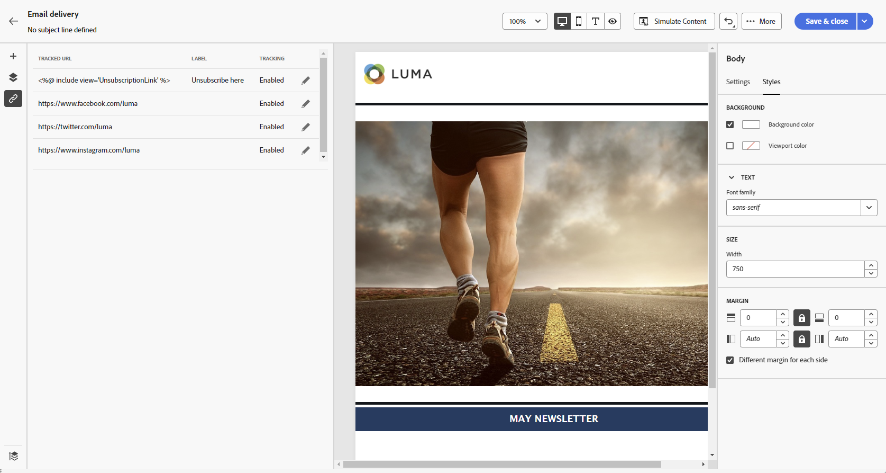

# Starta ditt e-postinnehåll från grunden {#create-email-content}

>[!CONTEXTUALHELP]
>id="ac_structure_components_email"
>title="Lägg till strukturer"
>abstract="Strukturer definierar layouten för e-postmeddelandet. Dra och släpp en **Structure**-komponent på arbetsytan för att börja designa ditt e-postinnehåll."

>[!CONTEXTUALHELP]
>id="ac_structure_components_landing_page"
>title="Lägg till strukturer"
>abstract="Strukturer definierar landningssidans layout. Dra och släpp en **Structure**-komponent på arbetsytan för att börja designa landningssidan."

>[!CONTEXTUALHELP]
>id="ac_structure_components_fragment"
>title="Lägg till strukturer"
>abstract="Strukturer definierar layouten för innehållsfragmentet. Dra och släpp en **Structure**-komponent på arbetsytan för att börja designa fragmentinnehållet."

>[!CONTEXTUALHELP]
>id="ac_structure_components_template"
>title="Lägg till strukturer"
>abstract="Strukturer definierar mallens layout. Dra och släpp en **Structure**-komponent på arbetsytan för att börja designa mallinnehållet."

>[!CONTEXTUALHELP]
>id="ac_edition_columns_email"
>title="Definiera e-postkolumner"
>abstract="Med E-postdesigner kan du enkelt definiera layouten för e-postmeddelandet genom att definiera kolumnstrukturen."

>[!CONTEXTUALHELP]
>id="ac_edition_columns_landing_page"
>title="Definiera landningssidans kolumner"
>abstract="Med e-post-Designer kan du enkelt definiera layouten för landningssidan genom att definiera kolumnstrukturen."

>[!CONTEXTUALHELP]
>id="ac_edition_columns_fragment"
>title="Definiera kolumner för innehållsfragment"
>abstract="Med e-post-Designer kan du enkelt definiera layouten för ditt innehållsfragment genom att definiera kolumnstrukturen."

>[!CONTEXTUALHELP]
>id="ac_edition_columns_template"
>title="Definiera mallkolumner"
>abstract="Med e-post-Designer kan du enkelt definiera mallens layout genom att definiera kolumnstrukturen."

Med e-post-Designer kan du enkelt definiera e-postens struktur. Genom att lägga till och flytta strukturella element med enkla dra-och-släpp-åtgärder kan du utforma e-postmeddelandets brödtext på bara några sekunder.

➡️ [Upptäck den här funktionen i en video](#video)

Följ stegen nedan för att börja skapa e-postinnehåll.

1. Välj alternativet [&#x200B; på hemsidan &#x200B;](get-started-email-designer.md#start-authoring)E-posta Designer **[!UICONTROL Design from scratch]** .

   {zoomable="yes"}

1. Börja designa ditt e-postinnehåll genom att dra och släppa **[!UICONTROL Structures]** på arbetsytan för att definiera layouten för e-postmeddelandet.

   >[!NOTE]
   >
   >Det går inte att stapla kolumner i alla e-postprogram. Om det inte finns stöd för det här alternativet staplas inte kolumner.

1. Lägg till så många **[!UICONTROL Structures]** som behövs och redigera inställningarna i den dedikerade rutan till höger.

   {zoomable="yes"}

1. Välj komponenten **[!UICONTROL n:nkolumn]** för att definiera antalet kolumner som du väljer (mellan 3 och 10). Definiera bredden på varje kolumn genom att flytta pilarna längst ned i varje kolumn.

   >[!NOTE]
   >
   >Varje kolumnstorlek får inte vara mindre än 10 % av strukturkomponentens totala bredd. Du kan inte ta bort en kolumn som inte är tom.

1. I avsnittet **[!UICONTROL Components]** drar och släpper du så många element som behövs i en eller flera strukturer. [Läs mer om innehållskomponenter](content-components.md)

1. Anpassa varje komponent med hjälp av flikarna **[!UICONTROL Settings]** eller **[!UICONTROL Style]** till höger. Du kan till exempel ändra textstil, utfyllnad eller marginal för varje komponent. [Läs mer om justering och utfyllnad](alignment-and-padding.md)

   {zoomable="yes"}

1. Infoga anpassningsfält för att anpassa ditt e-postinnehåll baserat på profildata. [Läs mer om innehållspersonalisering](../personalization/personalize.md)

1. Lägg till länkar till ditt innehåll.

   Klicka på fliken **[!UICONTROL Links]** i den vänstra rutan för att visa alla URL:er för ditt innehåll som ska spåras. Ändra deras **[!UICONTROL Tracking Type]** eller **[!UICONTROL Label]** och lägg till **[!UICONTROL Categories]** vid behov.

[Läs mer om länkar och meddelandespårning](message-tracking.md)

   {zoomable="yes"}

1. Om det behövs kan du anpassa e-postmeddelandet ytterligare genom att klicka på **[!UICONTROL Switch to code editor]** på den avancerade menyn. På så sätt kan du redigera e-postkällkoden, till exempel för att lägga till spårning eller anpassade HTML-taggar. [Läs mer om kodredigeraren](code-content.md)

   >[!CAUTION]
   >
   >Du kan inte återgå till den visuella designern för det här e-postmeddelandet efter att du har växlat till kodredigeraren.

1. När innehållet är klart klickar du på **[!UICONTROL Simulate content]** för att kontrollera din e-poståtergivning. Välj skrivbordsvy eller mobilvy. [Läs mer om hur du förhandsgranskar ditt e-postmeddelande](../preview-test/preview-test.md)

   {zoomable="yes"}

1. När e-postmeddelandet är klart klickar du på **[!UICONTROL Save]**.

## Instruktionsvideo {#video}

Lär dig navigera i e-post-Designer. Lär dig strukturera och utforma ett e-postmeddelande från grunden, anpassa och testa ditt e-postmeddelande.

>[!VIDEO](https://video.tv.adobe.com/v/3453569/?captions=swe&quality=12)