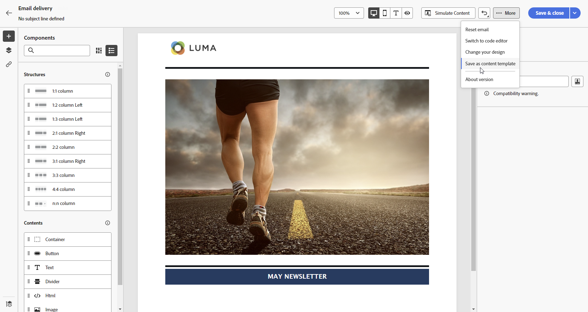

# Arbeta med innehållsmallar {#content-templates}

>[!CONTEXTUALHELP]
>id="acw_contenttemplate_menu"
>title="Innehållsmallar"
>abstract="För en snabbare och förbättrad designprocess kan du skapa fristående e-postmallar för att enkelt återanvända anpassat innehåll i Adobe Campaign. Dessa innehållsmallar kan utformas från grunden, baserat på inbyggda eller anpassade mallar, skapas från ett befintligt innehåll eller importeras i innehållsmallens redigerare."

För en snabbare och förbättrad designprocess kan du skapa fristående mallar för att enkelt återanvända anpassat innehåll i [!DNL Adobe Campaign]. Dessa innehållsmallar kan utformas från grunden, baserat på inbyggda eller anpassade mallar, skapas från ett befintligt innehåll eller importeras i innehållsmallens redigerare.

Med den här funktionen kan innehållsorienterade användare arbeta med fristående mallar så att marknadsföringsanvändare kan återanvända och anpassa dem i sina egna e-postkampanjer.

>[!NOTE]
>
>För närvarande stöds bara **e-post**-innehållsmallar.

## Åtkomst till innehållsmallar {#access-templates}

>[!CONTEXTUALHELP]
>id="acw_contenttemplate_edition"
>title="Redigera mallinnehåll"
>abstract="Klicka på knappen **Redigera innehåll** för att uppdatera ditt innehåll med e-post-Designer."

Bläddra till menyn **[!UICONTROL Content Management]** > **[!UICONTROL Content Templates]** från den vänstra listen för att få åtkomst till innehållsmalllistan.

{zoomable="yes"}

På den här instrumentpanelen visas alla tillgängliga innehållsmallar som en lista. Du kan filtrera på en viss [mapp](../get-started/permissions.md#folders) med listrutan eller lägga till regler med [frågemodelleraren](../query/query-modeler-overview.md).

{zoomable="yes"}

I listan kan du redigera, duplicera eller ta bort befintliga innehållsmallar. Använd knappen i det övre avsnittet för att skapa en innehållsmall.

## Skapa innehållsmallar {#create-content-templates}

>[!CONTEXTUALHELP]
>id="acw_contenttemplate_design"
>title="Design av innehållsmall"
>abstract="Designa en mall för e-postinnehåll."

>[!CONTEXTUALHELP]
>id="acw_contenttemplate_selection"
>title="Val av innehållsmall"
>abstract="Välj din e-postinnehållsmall."

Du kan skapa innehållsmallar genom att [spara ett befintligt e-postmeddelande som en mall](#save-as-template), eller från listan med e-postmallar, med knappen **Skapa innehållsmall** [som visas nedan](#create-template-from-scratch).

När du har sparat mallen kan du nu använda den när du skapar ett [e-postmeddelande](../email/create-email.md) i [!DNL Adobe Campaign]. [Lär dig hur](use-email-templates.md)

>[!NOTE]
>
>* Ändringar som görs i innehållsmallar sprids inte till e-postmeddelanden.
>
>* När mallar används i ett e-postmeddelande påverkas inte heller de ändringar du gör i e-postinnehållet av den tidigare använda innehållsmallen.

### Skapa en ny innehållsmall {#create-template-from-scratch}

>[!CONTEXTUALHELP]
>id="acw_contenttemplate_properties"
>title="Definiera mallegenskaper"
>abstract="Definiera egenskaper för e-postinnehållsmallar som ska hämtas enkelt när det behövs."

Så här skapar du en ny innehållsmall från kontrollpanelen för innehållsmallar:

1. Bläddra till innehållsmalllistan från den vänstra listen **[!UICONTROL Content Management]** > **[!UICONTROL Content templates]**.

1. Välj **[!UICONTROL Create template]**.

   {zoomable="yes"}

1. Ange malletiketten och -egenskaperna. Du kan välja den mapp där du vill spara mallen. Som standard lagras innehållsmallar i en dedikerad mapp i Adobe Campaign-hierarkin: **[!UICONTROL Explorer]** > **[!UICONTROL Resources]** > **[!UICONTROL Templates]** > **[!UICONTROL Content templates]**. Läs mer om mappar på [den här sidan](../get-started/permissions.md#folders)

   {zoomable="yes"}

1. Klicka på **[!UICONTROL Create]** och välj hur du vill utforma mallen bland de olika alternativen:

   * [Designa ditt innehåll från grunden](create-email-content.md) via e-postgränssnittet i Designer.

   * [Kod eller kopiera och klistra in Raw-HTML](code-content.md) direkt i e-postens Designer.

   * [Importera befintligt HTML-innehåll](existing-content.md) från en fil eller en ZIP-mapp.

   * Använd befintligt innehåll från en lista med inbyggda eller anpassade mallar. Stegen för hur du använder en innehållsmall i ett e-postmeddelande beskrivs i [det här avsnittet](use-email-templates.md).

   {zoomable="yes"}

1. E-post-Designer visas. Redigera ditt innehåll efter behov, på samma sätt som för alla e-postmeddelanden, beroende på vilket alternativ du har valt. Lär dig hur du använder e-post-Designer i [det här avsnittet](get-started-email-designer.md).

   <!--You can test your content if needed. [Learn how](#test-template)-->

1. När mallen är klar klickar du på **[!UICONTROL Save]**.

   Om det behövs klickar du på pilen bredvid mallnamnet för att gå tillbaka till skärmen **[!UICONTROL Details]** och redigera mallen.

   {zoomable="yes"}

Mallen är tillgänglig i listan **[!UICONTROL Content templates]**. [Läs mer](#access-templates)

Du kan nu använda den här mallen för att skapa ett nytt innehåll: den är tillgänglig på fliken **[!UICONTROL Saved templates]** i e-post-Designer. [Lär dig hur](use-email-templates.md)

### Spara e-postinnehåll som mall {#save-as-template}

När du har [utformat ett e-postmeddelande](create-email-content.md) kan du spara innehållet som en mall för framtida återanvändning. Sparade mallar är tillgängliga för alla användare i din Adobe Campaign-miljö.

Så här sparar du ett e-postinnehåll som en mall:

1. I e-postdesignern klickar du på knappen **[!UICONTROL More]** överst till höger på skärmen.

1. Välj **[!UICONTROL Save as content template]** i listrutan.

   {zoomable="yes"}

1. Ange ett namn för mallen och spara.

   {zoomable="yes"}

Mallen sparas och visas i listan **[!UICONTROL Content templates]**. Det blir en fristående innehållsmall som du kan komma åt, redigera och ta bort som alla andra objekt i listan. [Läs mer](#access-manage-templates)

Du kan nu använda den här mallen för att skapa ett nytt innehåll: den är tillgänglig på fliken **[!UICONTROL Saved templates]** i e-post-Designer. [Lär dig hur](use-email-templates.md)

{zoomable="yes"}

>[!NOTE]
>
>Ändringar i den nya mallen sprids inte till det e-postmeddelande som den kommer från. På samma sätt ändras inte den nya mallen när det ursprungliga innehållet redigeras i det e-postmeddelandet.

<!--

Test your content template {#test-template}

You can test the rendering of any email content template, whether created from scratch or from an email. To do so, follow the steps below.

1. Access the content template list.

1. Click **[!UICONTROL Edit content]** from the **[!UICONTROL Template properties]**.

1. Click **[!UICONTROL Simulate Content]** and select a test profile to check your email rendering. You can choose the desktop or mobile view.

1. You can send a proof to test your content and have it approved by some internal users before using it. To do so, click the **[!UICONTROL Send proof]** button and follow the steps described in .

-->

## Ändra en innehållsmall {#modify-delete}

Så här uppdaterar du en befintlig innehållsmall:

1. I listan med innehållsmallar klickar du på mallens etikett för att redigera den.

1. Klicka på knappen **[!UICONTROL Edit content]** om du vill uppdatera ditt innehåll med [e-post-Designer](get-started-email-designer.md).

{zoomable="yes"}

>[!NOTE]
>
>Ändringar som görs i innehållsmallar sprids inte till e-postmeddelanden med den här innehållsmallen.

## Ta bort en innehållsmall {#content-delete}

Du kan ta bort en innehållsmall på två sätt:

* Klicka på ellipsknappen i listan med innehållsmallar och välj sedan **Ta bort**

  

* från själva innehållsmallen klickar du på knappen **Mer** och väljer sedan **Ta bort**

>[!NOTE]
>
>När du tar bort en innehållsmall påverkas inte leveranser som skapats med den här mallen.

## Duplicera en innehållsmall {#content-duplicate}

Du kan duplicera en innehållsmall på två sätt:

* i listan med innehållsmallar klickar du på ellipsknappen och väljer **Duplicera**

* från själva innehållsmallen klickar du på knappen **Mer** och väljer sedan **Duplicera**

I båda fallen måste du bekräfta dupliceringen för att skapa den nya innehållsmallen. Etiketten för den nya innehållsmallen är **Kopia av`<label of the initial campaign`**. Bläddra till mallinställningarna för att uppdatera den här etiketten.

