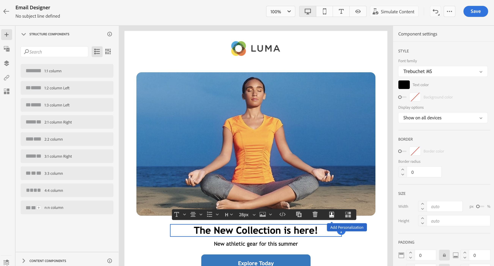
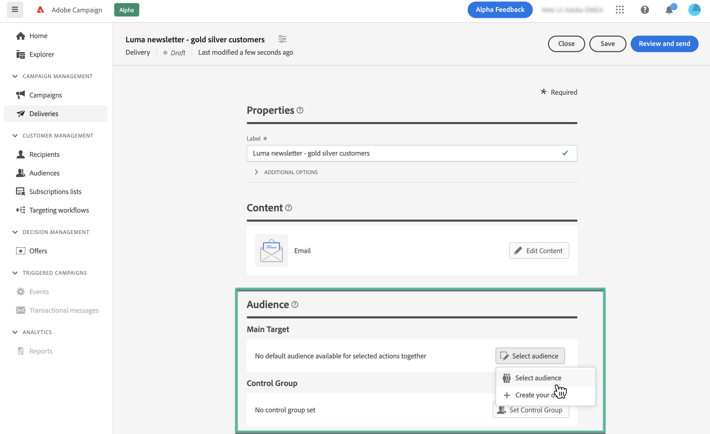
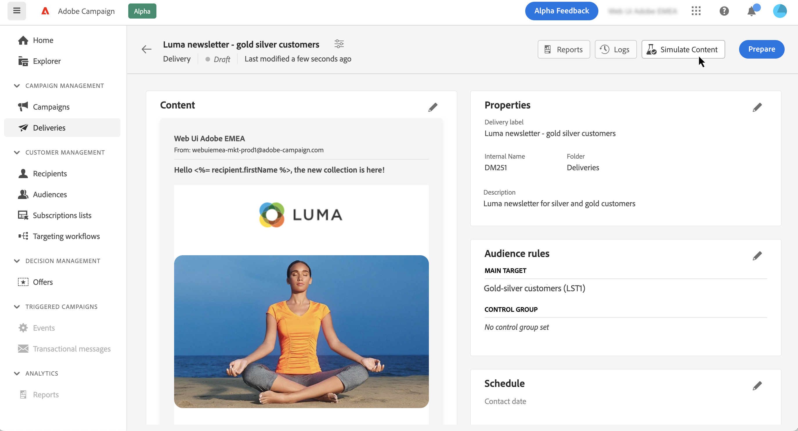

# Skicka ditt första e-postmeddelande {#first-email}

>[!NOTE]
>
>Dokumentationen håller på att byggas och uppdateras ofta. Den slutliga versionen av detta innehåll är klar i januari 2023.

I det här exemplet visas hur du skapar ditt första e-postmeddelande. Vi kommer att schemalägga sändning av ett mejl på en viss dag till kunder med silver- och guldkunder. Det här e-postmeddelandet kommer att utformas med en fördefinierad mall och kommer att innehålla personalisering med hjälp av profilens attribut.

## Skapa e-postmeddelandet {#create-email}

>[!CONTEXTUALHELP]
>id="acw_deliveries_email_template_selection"
>title="Välj en e-postmall"
>abstract="En mall definieras i Adobe Campaign v8-konsolen. Detta är en specifik leveranskonfiguration som innehåller fördefinierade parametrar som typologiregler, personalisering eller routningsparametrar."

>[!CONTEXTUALHELP]
>id="acw_deliveries_email_properties"
>title="E-postegenskaper"
>abstract="Egenskaperna är de vanligaste leveransparametrarna som hjälper dig att namnge och klassificera leveransen. Om leveransen baseras på ett utökat schema som har definierats i Adobe Campaign v8-konsolen, kan vissa specifika **Anpassade alternativ** fält är tillgängliga."

1. Skapa en ny leverans från **[!UICONTROL Deliveries]** -menyn.

1. Välj **[!UICONTROL Email]** kanalen och mallen som ska användas klickar sedan på **[!UICONTROL Create]**.

   >[!NOTE]
   >
   >En mall är en specifik leveranskonfiguration som har sparats som en mall för att kunna återanvändas. Leveransmallar konfigureras av administrationsanvändare i Adobe Campaign Console. [Lär dig hur du arbetar med leveransmallar](https://experienceleague.adobe.com/docs/campaign-classic/using/sending-messages/using-delivery-templates/about-templates.html){target=&quot;_blank&quot;}

   

1. Ange en etikett för e-postmeddelandet och konfigurera ytterligare alternativ baserat på dina behov:

   * **[!UICONTROL Internal name]**: tilldela en unik identifierare till leveransen,
   * **[!UICONTROL Folder]**: lagra leveransen i en viss mapp,
   * **[!UICONTROL Delivery code]**: Använd det här fältet för att ordna leveranser baserat på din egen namnkonvention,
   * **[!UICONTROL Description]**: ange en beskrivning av leveransen,
   * **[!UICONTROL Nature]**: Ange vilken typ av e-post det gäller för klassificeringsändamål.<!--The content of the list is defined in the delivery template selected when creating the email.-->

   >[!NOTE]
   >
   >Om du har utökat ditt schema med specifika anpassade fält kan du komma åt dem från **[!UICONTROL Custom options]** -avsnitt.

   

   Dessutom avancerade inställningar (typologiregel, målmappningar osv.) är tillgängliga från knappen bredvid leveransnamnet. De är fördefinierade i mallen som väljs när e-postmeddelandet skapas. Du kan redigera dem om det behövs.

## Skapa e-postinnehåll {#create-content}

>[!CONTEXTUALHELP]
>id="acw_homepage_card3"
>title="Lär dig hur du utformar e-postinnehåll med hjälp av e-postdesignern."
>abstract="Lär dig designa innehåll"

I det här fallet ska vi utforma e-postmeddelandet med en fördefinierad mall. Detaljerad information om hur du konfigurerar e-postinnehåll finns i [det här avsnittet](../content/edit-content.md).

1. Klicka på **[!UICONTROL Edit content]** för att börja skapa innehållet i ditt e-postmeddelande.

   På den här skärmen kan du konfigurera e-postinnehållet och utforma det med e-postdesignern.

   

1. Ange ämnet för ditt e-postmeddelande och anpassa det med Uttrycksredigeraren. [Lär dig anpassa ditt innehåll](../personalization/personalize.md)

   

1. Klicka på **[!UICONTROL Edit email body]** för att skapa och utforma innehållet i e-postmeddelandet.

   Välj den metod du vill använda för att skapa e-postinnehåll. I det här exemplet vill vi använda en befintlig designmall.

   

<!--1. Select the HTML or ZIP file to import then click **[!UICONTROL Next]**.

    If your folder contains assets, choose the instance and folder where they should be stored then click **[!UICONTROL Import]**. (+ link to doc on assets?)

    -->

1. När du har valt mallen visas den i e-postdesignern, där du kan redigera den om det behövs och lägga till anpassning.

   I det här exemplet vill vi lägga till personalisering i e-posttiteln. Det gör du genom att markera komponentblocket och sedan klicka på **[!UICONTROL Add Personalization]**.

   

1. När innehållet är klart sparar du det och klickar sedan på pilen för att gå tillbaka till skärmen för att skapa e-postmeddelanden.

   

## Definiera målgruppen {#define-audience}

>[!CONTEXTUALHELP]
>id="acw_deliveries_email_audience"
>title="Definiera målgruppen"
>abstract="Välj den bästa målgruppen för ert marknadsföringsbudskap. Du kan välja en befintlig målgrupp som redan definierats i en Campaign v8-instans eller från Adobe Experience Platform, eller så kan du välja att skapa en ny målgrupp med regelbyggaren."

I det här fallet ska vi skicka e-postmeddelandet till en befintlig målgrupp. Mer information om hur du arbetar med målgrupper finns i [det här avsnittet](../audience/about-audiences.md).

1. Klicka på **[!UICONTROL Select audience]** väljer du sedan en befintlig målgrupp.

   I det här exemplet vill vi använda en befintlig målgrupp som riktar sig till kunder som tillhör lojalitetsnivåerna silver och guld.

   

   >[!NOTE]
   >
   >De målgrupper som är tillgängliga i listan kommer antingen från Campaign V8-instansen eller från Adobe Experience Platform om integreringen av mål/källor har konfigurerats på din instans.
   >
   >Med integreringen Destination/Sources kan ni skicka segment från Experience Platform till Adobe Campaign och skicka loggar för leverans och spårning av kampanjer till Adobe Experience Platform. [Lär dig hur du arbetar med Campaign och Adobe Experience Platform](https://experienceleague.adobe.com/docs/campaign/campaign-v8/connect/ac-aep.html)

1. När målgruppen har valts kan du förfina den med ytterligare regler.

   Du kan också ställa in en kontrollgrupp för att analysera beteendet hos e-postmottagarna jämfört med beteendet hos profiler som inte var målinriktade. [Lär dig hur du arbetar med kontrollgrupper](../audience/control-group.md)

## Schemalägg sändningen {#schedule}

>[!CONTEXTUALHELP]
>id="acw_deliveries_email_schedule"
>title="Schemalägg sändningen"
>abstract="Ange datum och exakt tid för sändningen. Genom att välja den tid som passar bäst för ert marknadsföringsbudskap kan ni maximera öppningsfrekvensen."

Om du vill schemalägga sändning av e-post klickar du på **[!UICONTROL Enable]** Ange sedan önskat datum och klockslag för sändningen.

Som standard är **[!UICONTROL Confirm before sending]** är aktiverat, vilket innebär att du måste bekräfta sändningen för att tillåta att e-postmeddelandet skickas vid angivet datum och klockslag. Inaktivera det här alternativet om du vill tillåta att e-postmeddelandet skickas på det schemalagda datumet och den schemalagda tidpunkten utan att någon bekräftelse behövs.

## Förhandsgranska och testa e-postmeddelandet {#preview-test}

När e-postmeddelandet är klart kan du förhandsgranska och testa det innan du börjar skicka det.

I det här fallet ska vi förhandsgranska e-postmeddelandet och skicka ett korrektur med befintliga profiler.

Mer information om hur du förhandsgranskar och testar e-postmeddelanden finns i [det här avsnittet](../preview-test/preview-test.md).

1. Klicka på **[!UICONTROL Review to send]**. En förhandsgranskning av e-postmeddelandet visas tillsammans med alla konfigurerade egenskaper, målgrupp och schema. Du kan redigera dessa element med knappen Ändra.

1. Klicka på **[!UICONTROL Simulate content]** om du vill förhandsgranska e-postmeddelandet och skicka korrektur.

   

1. I den vänstra delen markerar du de profiler som ska användas för att förhandsgranska e-postmeddelandet.

1. En förhandsgranskning av e-postmeddelandet visas i den högra rutan baserat på den valda profilen. Om du har lagt till flera profiler kan du växla mellan dem för att förhandsgranska motsvarande e-postmeddelande.

   

   <!-- !NOTE
    >
    >Additionally, the **[!UICONTROL Render email]** button allows you to preview the email using mutiple devices or mail providers. Learn on how to preview email rendering-->

1. Klicka på knappen **[!UICONTROL Test]** markerar du sedan de profiler som ska ta emot korrekturet.

   <!--TO REPLACE WITH SUBSTITUTION PROFILE-->In this example, we want to send the proofs to a specific test profile, which is a seed address that is not part of the target. [Learn how to work with seed addresses](https://experienceleague.adobe.com/docs/campaign-classic/using/sending-messages/using-seed-addresses/about-seed-addresses.html){target="_blank"}

   

   >[!NOTE]
   >
   >Du kan också testa dina meddelanden genom att personifiera några av målprofilerna och skicka korrekturmeddelandet till den e-postadress du väljer. [Lär dig hur du skickar korrektur](../preview-test/preview-test.md)

1. Klicka **[!UICONTROL Send test email ]** bekräfta sändningen.

   När korrekturen har skickats kan du kontrollera deras status genom att klicka på **[!UICONTROL View test email log]** -knappen.

## Skicka och övervaka e-postmeddelandet {#prepare-send}

När du har granskat och testat ditt e-postmeddelande kan du starta det och skicka det.

1. Klicka **[!UICONTROL Prepare]** för att starta förberedelsen av meddelandet. [Lär dig hur du förbereder ett e-postmeddelande](../monitor/prepare-send.md)

   

1. När e-postmeddelandet är klart att skickas klickar du på **[!UICONTROL Send]** bekräfta sändningen.

   Du kan spåra sändningen i realtid, tillsammans med statistik. Dessutom finns **[!UICONTROL Logs]** kan du komma åt detaljerad information om e-postmeddelandet. [Lär dig övervaka leveransloggar](../monitor/delivery-logs.md)
   

1. När e-postmeddelandet har skickats kan du komma åt dedikerad [rapporter](../reporting/reports.md) för vidare analys.

   
