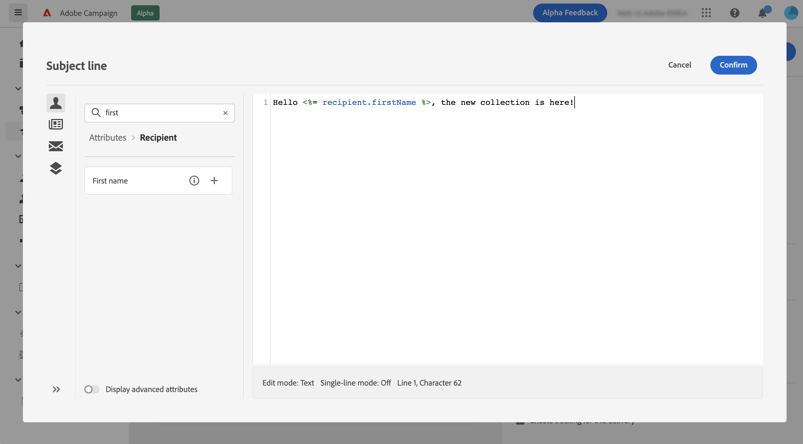

# Skicka ditt första e-postmeddelande {#first-email}

>[!NOTE]
>
>Dokumentationen håller på att byggas och uppdateras ofta. Den slutliga versionen av detta innehåll är klar i januari 2023.

Det här användningsexemplet visar hur du skapar ditt första e-postmeddelande

I det här exemplet kommer vi att schemalägga sändning av ett e-postmeddelande på ett visst datum till kunder med silver- och guldkunder. Det här e-postmeddelandet kommer att utformas med en fördefinierad HTML-mall från en ZIP-fil och kommer att innehålla personalisering med profilens attribut.

## Skapa e-postmeddelandet {#create-email}

1. Skapa en ny leverans från **[!UICONTROL Deliveries]** -menyn.
1. Välj **[!UICONTROL Email]** kanalen och mallen som ska användas klickar sedan på **[!UICONTROL Create]**.

   >[!NOTE]
   >
   >information om mallar. kontrollera info i V7 doc

   

1. Ange en etikett för leveransen och konfigurera ytterligare alternativ beroende på dina behov:

   * Internt namn:
   * Mapp:
   * Leveranskod:
   * Beskrivning:
   * Natur:

   kontrollera vilka inställningar som är definierade i mallen och ange dem(description)? mapp?, natur?)

   

   >[!NOTE]
   >
   >info om leveransinställningsknapp + länk till dokument

## Skapa e-postinnehåll {#create-content}

>[!CONTEXTUALHELP]
>id="acw_homepage_card3"
>title="Skapa ditt första e-postinnehåll med e-postdesignern."
>abstract="Skapa ditt första e-postinnehåll"

>[!CONTEXTUALHELP]
>id="acw_deliveries_email_content"
>title="Skapa e-postinnehåll"
>abstract="TBC"

1. Klicka på **[!UICONTROL Edit content]** för att börja skapa innehållet i ditt e-postmeddelande.

   På den här skärmen kan du konfigurera e-postinnehållet och utforma det med e-postdesignern.

   

   >[!NOTE]
   >
   >E-postinformationen Från och Från är fördefinierad i den valda e-postmallen.
   >
   >Som standard är e-postspårning aktiverat för öppningar och klick. Om du vill inaktivera de här alternativen avmarkerar du dem i avsnittet Valfria funktioner.

1. Ange ämnet för ditt e-postmeddelande med Uttrycksredigeraren. [Lär dig anpassa ditt innehåll](../personalization/personalize.md)

   I det här exemplet vill vi anpassa ämnesraden med profilens förnamn.

   

1. Lägg till en bifogad fil i e-postmeddelandet om det behövs. Lär dig hur du redigerar e-postinnehåll

1. Klicka på **[!UICONTROL Edit email body]** för att skapa och utforma innehållet i e-postmeddelandet.

   Välj den metod du vill använda för att skapa e-postinnehåll. I det här exemplet vill vi importera ett befintligt HTML-innehåll.

   

1. Markera HTML eller ZIP-filen som ska importeras och klicka sedan på **[!UICONTROL Next]**.

   Om mappen innehåller resurser väljer du den instans och mapp där de ska lagras och klickar sedan på **[!UICONTROL Import]**. (+ länk till dokumentet om resurser?)

   

1. När innehållet har importerats visas det i e-postdesignern, där du kan redigera det om det behövs och lägga till personalisering.

   I det här exemplet vill vi lägga till personalisering i e-posttiteln. Det gör du genom att markera komponentblocket och sedan klicka på **[!UICONTROL Add Personalization]**.

   

1. När innehållet är klart sparar du det och klickar sedan på pilen för att gå tillbaka till skärmen för att skapa e-postmeddelanden.

   

## Definiera målgruppen {#define-audience}

>[!CONTEXTUALHELP]
>id="acw_deliveries_email_audience"
>title="Definiera målgruppen"
>abstract="TBC"

1. Klicka på **[!UICONTROL Select audience]** väljer du sedan en befintlig målgrupp eller skapar en ny.

   I det här exemplet vill vi använda en befintlig målgrupp som riktar sig till kunder som tillhör lojalitetsnivåerna silver och guld.

   

   >[!NOTE]
   >
   >De målgrupper som är tillgängliga i listan kommer antingen från din Campaign V8-instans eller från Adobe Experience Platform om integreringen Mål/Källor har implementerats i din instans. Lär dig hur du väljer e-postmålgrupp

1. När målgruppen har valts kan du redigera reglerna om det behövs. Du kan också ställa in en kontrollgrupp för att analysera beteendet hos e-postmottagarna jämfört med beteendet hos profiler som inte var målinriktade. Lär dig hur du arbetar med kontrollgrupper

## Schemalägg sändningen {#schedule}

>[!CONTEXTUALHELP]
>id="acw_deliveries_email_schedule"
>title="Schemalägg sändningen"
>abstract="TBC"

Om du vill schemalägga sändning av e-post klickar du på Aktivera och anger sedan önskat datum och tid.

= bekräfta innan du skickar alternativet : vad som händer på schemalagt datum: för att bekräfta att meddelandet har skickats?

## Förhandsgranska och testa e-postmeddelandet {#preview-test}

När e-postmeddelandet är klart kan du förhandsgranska och testa det innan du börjar skicka det.

1. Klicka på **[!UICONTROL Review to send]**. En förhandsgranskning av e-postmeddelandet visas tillsammans med alla konfigurerade egenskaper, målgrupp och schema. Du kan redigera dessa element med knappen Ändra.

   

1. Klicka på **[!UICONTROL Simulate content]** om du vill förhandsgranska e-postmeddelandet och skicka korrektur.

1. I den vänstra delen markerar du de profiler som ska användas för att förhandsgranska e-postmeddelandet. Du kan använda riktade profiler eller dedikerade testprofiler.

1. En förhandsgranskning av e-postmeddelandet visas på den högra sidan baserat på den valda profilen. Om du har lagt till flera profiler kan du växla mellan dem för att förhandsgranska motsvarande e-postmeddelande.

   

   >[!NOTE]
   >
   >Dessutom finns **[!UICONTROL Render email]** kan du förhandsgranska e-postmeddelandet med flera enheter eller e-postleverantörer. Lär dig hur du förhandsgranskar e-poståtergivning

1. Klicka på knappen **[!UICONTROL Test]** markerar du sedan de profiler som ska ta emot korrekturet. I det här exemplet vill vi skicka korrektur till en specifik testprofil.

   

   >[!NOTE]
   >
   >Du kan också testa dina meddelanden genom att personifiera några av målprofilerna och skicka korrekturmeddelandet till den e-postadress du väljer. Lär dig hur du använder Ersätt från målläge

1. Klicka **[!UICONTROL Send test email ]** bekräfta sändningen.

   När korrekturen har skickats kan du kontrollera deras status genom att klicka på **[!UICONTROL View test email log]** -knappen.

## Skicka och övervaka e-postmeddelandet {#prepare-send}

När du har granskat och testat ditt e-postmeddelande kan du starta det och skicka det.

1. Klicka **[!UICONTROL Prepare]** för att starta förberedelsen av meddelandet.

   Du kan spåra förloppet i realtid, tillsammans med statistik. När beredningen är klar kan du få tillgång till detaljerade loggar för ytterligare analys. Lär dig övervaka leveranser

   

1. När e-postmeddelandet är klart att skickas klickar du på **[!UICONTROL Send]** bekräfta sändningen.

   Du kan spåra sändningen i realtid, tillsammans med statistik. Dessutom finns **[!UICONTROL Logs]** kan du komma åt detaljerad information om e-postmeddelandet. Lär dig övervaka leveranser

   

1. När e-postmeddelandet har skickats kan du få åtkomst till dedikerade rapporter för ytterligare analys.

   
