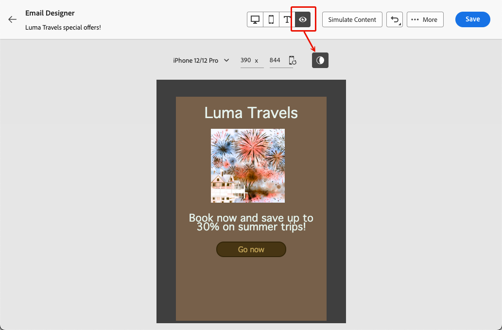

# Hantera innehåll i mörkt läge {#dark-mode}

>[!CONTEXTUALHELP]
>id="ac_edition_darkmode"
>title="Växla till mörkt läge"
>abstract="Växla till mörkt läge där du kan förhandsgranska hur det kan återges och definiera specifika anpassade inställningar.  Den slutliga återgivningen beror på mottagarens e-postklient. Observera att alla e-postklienter inte stöder anpassat mörkt läge."

>[!CONTEXTUALHELP]
>id="ac_edition_darkmode_preview"
>title="Växla till mörkt läge"
>abstract="Växla till mörkt läge om du vill förhandsgranska hur det kan återges på e-postklienter som stöds.  Den slutliga återgivningen beror på mottagarens e-postklient. Observera att alla e-postklienter inte stöder mörkt läge."

När du utformar dina e-postmeddelanden kan du växla till [!DNL Adobe Campaign]-vyn med [&#128279;](get-started-email-designer.md)e-post-Designer **[!UICONTROL Dark mode]**.

I den här <!--Email Designer -->mörka vyn kan du även definiera specifika anpassade inställningar som ska visas av e-postklienter som stöder e-post när deras mörka läge är aktiverat.

## Vad är mörkt läge? {#what-is-dark-mode}

Det sätt som mörkt läge återges i de olika e-postklienterna är komplext. Låt oss först definiera mörkt läge.

I mörkt läge kan e-postklienter och appar som stöder e-post visa e-postmeddelanden med mörkare bakgrund och ljusare färger för text, knappar och andra gränssnittselement. Det gör det möjligt att minska ögonbelastningen, spara batteritid och förbättra läsbarheten i miljöer med svag belysning för en mer bekväm visningsupplevelse.

Som en allt större trend för större operativsystem och appar <!-- (Apple Mail, Gmail, Outlook, Twitter, Slack)--> har det blivit en viktig faktor i modern e-postdesign för att säkerställa att innehållet förblir läsbart och visuellt tilltalande för alla användare.

## Guardrails {#guardrails}

Förväntningarna när det gäller återgivning i mörkt läge måste beaktas med försiktighet eftersom det sätt som används av olika e-postklienter kan variera mycket.

<!--The dark mode final rendering depends on the recipient's email client. It is not possible to guarantee that your email will look the same in dark mode across all devices.-->

Innan du använder mörkt läge i e-post-Designer för [!DNL Adobe Campaign] är det viktigt att du förstår hur de viktigaste e-postklienterna hanterar det. Det finns tre olika fall att skilja mellan:

<!--
* Check out the list of [email clients supporting dark mode](https://www.caniemail.com/search/?s=dark){target="_blank"}

* Learn more on Dark mode in this [Litmus blog post](https://www.litmus.com/blog/the-ultimate-guide-to-dark-mode-for-email-marketers){target="_blank"}
-->

### Klienter som inte stöder mörkt läge {#not-supporting}

Vissa e-postklienter stöder inte den här funktionen alls, till exempel:

* Yahoo!Mail
* AOL

Vare sig du definierar anpassade inställningar för mörkt läge eller inte i e-post-Designer visas aldrig någon återgivning i mörkt läge för dessa e-postklienter. <!--Regardless of whether the interface is in light or dark mode, your email will render the same.-->

### Klienter som använder sitt eget mörka läge {#default-support}

Vissa e-postklienter tillämpar systematiskt sitt eget mörka standardläge för alla e-postmeddelanden som tas emot. Färger, bakgrunder, bilder osv. justeras automatiskt med inställningar för mörkt läge som är specifika för e-postklienten, vilket innebär att ingen extern ändring är möjlig.

<!--It is important to note that less than 25% of email clients offer customization options for dark mode. Clients such as Gmail implement their own dark mode rendering, which is not subject to external modification.-->

De här klienterna är till exempel:

* Gmail (Desktop Webmail, iOS, Android, Mobile Webmail)
* Outlook-fönster
* Outlook Windows Mail

I det här fallet, om du definierar anpassade mörkt läge-inställningar i e-post-Designer, åsidosätts dessa inställningar av e-postklientinställningarna.

Det är viktigt att förstå att dessa e-postklienter hanterar mörkt läge, men din specifika design för mörkt läge återges inte.

### Klienter som stöder anpassat mörkt läge {#custom-support}

Andra e-postklienter erbjuder alternativet att återge anpassat mörkt läge med frågan `@media (prefers-color-scheme: dark)`, som är den metod som används av Designer-e-postmeddelandet i [!DNL Journey Optimizer] .

Här är en lista över de huvudklienter som hanterar det här alternativet:

* Apple Mail macOS
* Apple Mail iOS
* Outlook macOS
* Outlook.com
* Outlook iOS
* Outlook Android

I det här fallet ska de specifika inställningar som du anger i e-post-Designer visas.

>[!NOTE]
>
>Lär dig hur du definierar anpassade inställningar för mörkt läge med e-post-Designer i [det här avsnittet](#define-custom-dark-mode).

Vissa begränsningar kan dock gälla för varje e-postklient. Vissa klienter, till exempel Apple Mail 16 (macOS 13), kommer inte att generera ett mörkt läge om det finns bilder i e-postinnehållet.

Testa innehållet med de e-postklienter du riktar in dig på för att få optimala resultat. Om du vill se en simulering som ligger så nära det slutliga resultatet som möjligt för varje klient använder du alternativet [E-poståtergivning](../preview-test/email-rendering.md) i e-post-Designer.

## Mörkt läge i e-post-Designer {#dark-mode-email-designer}

När det gäller det mörka läget i e-post-Designer finns det två aspekter att tänka på:

* Du kan få en förhandsvisning av hur det mörka standardläget kommer att återges i de flesta e-postklienter som stöds. [Läs mer](#preview-dark-mode)

* Om du vill åsidosätta standardinställningarna för e-postklienter [som stöder det anpassade mörka läget](#custom-support) kan du definiera anpassade inställningar för det e-postmeddelande som du redigerar. [Läs mer](#define-custom-dark-mode)

### Förhandsvisa standardläget för mörk {#preview-dark-mode}

Följ stegen nedan för att öppna det mörka läget i e-postprogrammet Designer och få en förhandsvisning av standardinställningarna för det mörka läget.

1. Välj alternativet **[!UICONTROL Design from scratch]** på hemsidan för e-post till Designer. [Läs mer](create-email-content.md)

1. Lägg till [strukturer](create-email-content.md) och [innehållskomponenter](content-components.md) i ditt innehåll.

1. Växla till **[!UICONTROL Dark mode]** överst till höger på arbetsytan i mitten.

   

1. Standardförhandsvisningen i mörkt läge visas.

   

Som standard används färgschemat&quot;Fullfärgsinvertering&quot; för alla element utom bilder och ikoner i förhandsvisningen av Designer i mörkt läge.

Det innebär att det upptäcker områden med ljusa och mörka element och inverterar dem, så att ljusa bakgrunder blir mörka och mörk text blir ljusa, medan mörka bakgrunder blir ljusa och ljusa text blir mörka.

>[!CAUTION]
>
>Den slutliga återgivningen kan variera beroende på mottagarens e-postklient. Använd alternativet [E-poståtergivning](../preview-test/email-rendering.md) om du vill se en simulering som ligger så nära det slutliga resultatet för varje e-postklient som möjligt.

### Definiera anpassat mörkt läge {#define-custom-dark-mode}

>[!CONTEXTUALHELP]
>id="ac_edition_darkmode_image"
>title="Använd en viss bild för mörkt läge"
>abstract="Du kan välja en annan bild som ska visas när mörkt läge är aktiverat.  Att lägga till en viss bild för mörkt läge garanterar inte att den återges korrekt i alla e-postklienter. Observera att alla e-postklienter inte stöder anpassat mörkt läge."

När du har växlat till **[!UICONTROL Dark mode]** kan du välja att redigera specifika formatelement för ditt innehåll som bara visas när mörkt läge är aktiverat i mottagarens e-postklient, förutsatt att det har stöd för den funktionen.

>[!WARNING]
>
>Den slutliga återgivningen i mörkt läge beror på varje e-postklient, så resultatet kan variera från en till en annan. [Läs mer](#guardrails)

<!--
>[!WARNING]
>
>Not all email clients support dark mode. Moreover, some email clients only apply their own default dark mode for all emails that are received. In both cases, the custom settings that you defined in the Email Designer cannot be rendered.-->

Journey Optimizer använder <!-- `@media (prefers-color-scheme: dark)` method--> för att utnyttja den anpassade stilen för mörkt läge i e-postläge i Designer `@media (prefers-color-scheme: dark)` CSS-fråga som identifierar om användarens e-postklient är inställd på mörkt läge och använder den design med mörka teman som definierats i ditt e-postmeddelande.

Följ stegen nedan för att definiera egna inställningar för mörkt läge.

1. Se till att du växlar till förhandsgranskningen av **[!UICONTROL Dark mode]** i e-post-Designer. [Lär dig hur](#preview-dark-mode)

1. Redigera formatfärgattribut som text, bakgrunder, knapp med mera.

1. Du kan inte ändra färgerna på bilder och ikoner, men du kan definiera specifika resurser enbart för mörkt läge.

   Markera en bild om du vill göra det. Växla till **[!UICONTROL Dark mode]** med den dedikerade växlingsknappen i rutan **[!UICONTROL Settings]** och välj en annan resurs.

   

   <!---->

1. Du kan när som helst **[!UICONTROL Switch to live view]** för att kontrollera hur ditt innehåll kan återges på olika enhetsstorlekar. I den här vyn väljer du det mörka läget längst upp på skärmen för att förhandsvisa den mörka lägesversionen av innehållet på olika enheter.

   {width="80%" align="center"}

   >[!CAUTION]
   >
   >Live-vyn är en allmän förhandsvisning som är utformad för att jämföra hur återgivningen kan se ut på olika enhetsstorlekar. Den slutliga återgivningen kan variera beroende på mottagarens e-postklient.

1. När du är nöjd med ändringarna för mörkt läge klickar du på **[!UICONTROL Simulate Content]**.

   

1. Välj **[!UICONTROL Render email]** och anslut till ditt Litmus-konto. Du kan se den slutliga återgivningen i mörkt läge för olika e-postklienter. Läs mer om [E-poståtergivning](../preview-test/email-rendering.md).

   >[!WARNING]
   >
   >Simuleringen simulerar i hög grad hur e-postmeddelanden kommer att se ut i mörkt läge, men den faktiska återgivningen kan variera beroende på variationer i e-postleverantörer eller inställningar på enhetsnivå.

## Bästa praxis {#best-practices}

Efterhand som användningen av mörkt läge ökar för alla större e-postklienter är det viktigt att tänka på hur dina e-postmeddelanden återges i både ljusa och mörka miljöer, oavsett om du använder [anpassat mörkt läge](#define-custom-dark-mode) eller inte.

Mörkt läge kan ändra färger, bakgrunder och bilder - ibland åsidosätta designalternativ. För att säkerställa visuell enhetlighet, tillgänglighet och varumärkesintegritet följer du de bästa metoderna nedan.

**Optimera bilder och logotyper**

* Spara logotyper och ikoner som PNG-filer med genomskinliga bakgrunder för att undvika synliga vita rutor i mörkt läge.

* Undvik bilder med hårdkodade vita eller ljusa bakgrunder.

* Om genomskinlighet inte är ett alternativ kan du placera bilder på en solid bakgrund i designen för att förhindra otydliga färgförändringar.

**Se dina bakgrunder**

* Se till att det finns tillräcklig kontrast mellan text och bakgrundsfärger för läsbarhet i både ljust och mörkt läge.

* Undvik att använda enbart bakgrundsfärger för viktigt innehåll. Vissa klienter åsidosätter bakgrundsfärger i mörkt läge, så se till att viktig information fortfarande visas.

<!--**Inline critical styles**

Inline CSS helps maintain more control over styling, as some clients strip external styles in dark mode.-->

**Designa hjälpmedelsanpassat innehåll i mörkt läge**

<!--KEEP dark mode accessibility best practices IN ONE SINGLE LOCATION - for now listed on this page.
If needed, it can be moved to the Design accessible content page:
The best practices for designing accesible content in dark mode are listed in [this section](accessible-content.md#dark-mode).-->

* Använd färgkombinationer som är enkla att skilja på för färgblinda.

* Använd en mellantonspalett för att säkerställa kontrast mot både ljusa och mörka bakgrunder.

* Använd tillgängliga färgkombinationer med hög kontrast för att förbättra läsbarheten och följa WCAG-standarderna (Web Content Accessibility Guidelines). Använd verktyg som Kontrast i Kontrast i WebAIM för att kontrollera färgkontrasten.

* Undvik tunna teckensnitt eftersom det kan påverka läsbarheten. Om ert varumärke kräver ett tunt teckensnitt kan du fet stil i mörkt läge.

* Hoppa över rent vitt på rent svart eftersom det kan orsaka ögonproblem och kan inverteras automatiskt av vissa e-postklienter.

* Ange hjälpmedelsanpassad grundformatering om mörkt läge inte stöds.

**Testa dina e-postmeddelanden i mörkt läge**

* Använd Designer [förhandsvisning i mörkt läge](#preview-dark-mode) som använder inverterade färgscheman för att upptäcka problem tidigt.

* Använd alternativet [Återgivning via e-post](../preview-test/email-rendering.md) som använder Litmus för att simulera dina designer för de vanligaste e-postklienterna (Apple Mail, Gmail, Outlook) och se hur färger och bilder beter sig i mörkt läge.
