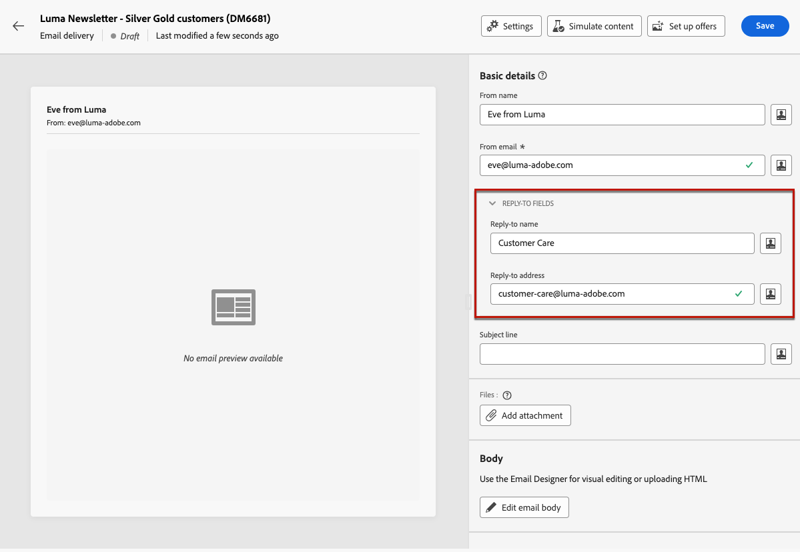

# Konfigurera e-postinnehållet {#edit-content}

>[!CONTEXTUALHELP]
>id="acw_deliveries_email_content"
>title="Definiera e-postinnehållet"
>abstract="På skärmen **Redigera innehåll** kan du definiera grundläggande element i meddelandet, till exempel avsändarens adress och ämnesrad, utföra ytterligare åtgärder som att lägga till bilagor eller erbjudanden och komma åt e-post-Designer för att ge meddelandet ett snyggt utseende."

>[!CONTEXTUALHELP]
>id="acw_deliveries_email_header"
>title="Ange e-postegenskaper"
>abstract="I avsnittet **Grundläggande information** kan du uppdatera avsändarens adress och svarsadress och definiera ämnesraden med hjälp av uttrycksredigeraren."

>[!CONTEXTUALHELP]
>id="acw_deliveries_email_attachment"
>title="Bifoga filer i e-postmeddelandet"
>abstract="Markera en eller flera filer som ska infogas i meddelandet. För att undvika prestandaproblem rekommenderar vi att du inte inkluderar mer än en bifogad fil per e-post."

>[!CONTEXTUALHELP]
>id="acw_deliveries_email_options"
>title="Redigeringsspårning"
>abstract="Spårning är aktiverat som standard för leverans, vilket innebär att alla länkar som ingår i meddelandeinnehållet spåras. Du kan inaktivera det här alternativet härifrån."
>additional-url="https://experienceleague.adobe.com/sv/docs/campaign-web/v8/content/email-design/design-content/message-tracking" text="Lägga till länkar och spåra meddelanden"

På skärmen för e-post **[!UICONTROL Edit content]** kan du:

* Definiera grundläggande element i meddelandet, t.ex. avsändarens adress och ämnesraden
* Utför ytterligare åtgärder som att lägga till bilagor eller konfigurera erbjudanden
* Gå till [e-postmeddelandet om Designer](get-started-email-designer.md#start-authoring) för att börja skapa rätt innehåll i e-postmeddelandet
* Lägg till språkvarianter i leveranserna. [Läs mer](../msg/multilingual.md)

>[!NOTE]
>
>Alla redigerbara textfält på den här skärmen kan fyllas i med hjälp av anpassningsfält. [Lär dig anpassa innehåll](../personalization/personalize.md)

## Konfigurera leveransen

Följ stegen nedan för att konfigurera eller redigera innehållet i ett e-postmeddelande.

1. Klicka på knappen **[!UICONTROL Edit content]** på skärmen [dashboard](../email/create-email.md) för e-postleverans.

   {zoomable="yes"}

1. E-postinnehållets versionsskärm öppnas.

   {zoomable="yes"}

   >[!NOTE]
   >
   >Om du konfigurerar ett nytt e-postmeddelande fylls fälten **[!UICONTROL From name]** och **[!UICONTROL From email]** redan i.

1. Fältet **[!UICONTROL From name]** definieras i e-postmallen. Om du vill ändra det använder du ett namn som mottagarna lätt kan identifiera, till exempel ert varumärkes namn, för att öka öppningshastigheten för era leveranser.

   >[!NOTE]
   >
   >Om du vill förbättra mottagarens upplevelse ytterligare kan du lägga till en persons namn, t.ex. &quot;Härva från Luma&quot;.

1. Adressfältet **[!UICONTROL From email]** definieras också i e-postmallen. Kontrollera att adressdomänen matchar den underdomän som du har delegerat till Adobe.

   >[!NOTE]
   >
   >Du kan ändra den del som föregår @, men inte domänadressen.

1. Expandera avsnittet **[!UICONTROL Reply-to fields]**. Avsändarens namn och adresser används som standard för svar. Adobe rekommenderar dock att du använder en befintlig riktig adress, till exempel kundtjänst för ditt varumärke. Om en mottagare skickar ett svar kan kundtjänstteamet hantera det.

   {zoomable="yes"}

1. Definiera e-postadressen **[!UICONTROL Subject line]**. Skriv ditt ämne direkt i det dedikerade fältet eller öppna uttrycksredigeraren för att lägga till [personalisering](../personalization/personalize.md) med olika attribut, uttrycksfragment eller erbjudanden.

1. Om du vill bifoga en fil till e-postmeddelandet klickar du på knappen **[!UICONTROL Add attachment]** och väljer sedan en eller flera filer.

   >[!NOTE]
   >
   >För att undvika prestandaproblem rekommenderar vi att du inte inkluderar mer än en bifogad fil per e-post.

   <!--limitation on size + number of files?-->

1. Om du vill skicka erbjudanden med e-postmeddelandet markerar du dem med knappen **[!UICONTROL Set up offers]**.

   Sedan kan du infoga dem i e-postmeddelandet med hjälp av anpassningsfält. [Lär dig skicka erbjudanden](../msg/offers.md)

## Redigera e-postbrödtexten

1. Klicka på knappen **[!UICONTROL Edit email body]** om du vill strukturera och utforma innehållet i e-postmeddelandet med hjälp av [e-post-Designer](get-started-email-designer.md#start-authoring).

   >[!NOTE]
   >
   >Du kan också hovra över e-postförhandsgranskningen och välja **[!UICONTROL Open email designer]**.

   Mer information om hur du utformar e-postinnehåll finns i följande avsnitt:

   * [Skapa e-postmeddelanden från grunden](create-email-content.md)
   * [Formatera innehållet](get-started-email-style.md)

1. Spårning är aktiverat som standard för leveransen. Du kan inaktivera det här alternativet från avsnittet **[!UICONTROL Optional features]**. [Lär dig hur du lägger till länkar och hanterar spårning](message-tracking.md)

1. När innehållet i ditt e-postmeddelande har definierats använder du knappen **[!UICONTROL Simulate content]** för att kontrollera hur det visas innan du skickar det. Du kan även validera innehållskvaliteten för att utvärdera läsbarhet, CTA-effektivitet och övergripande kvalitet. [Läs mer om validering av innehållskvalitet](../content/brands-score.md#validate-quality)

1. [Lär dig hur du förhandsgranskar och testar e-postmeddelandet](../preview-test/preview-test.md).
