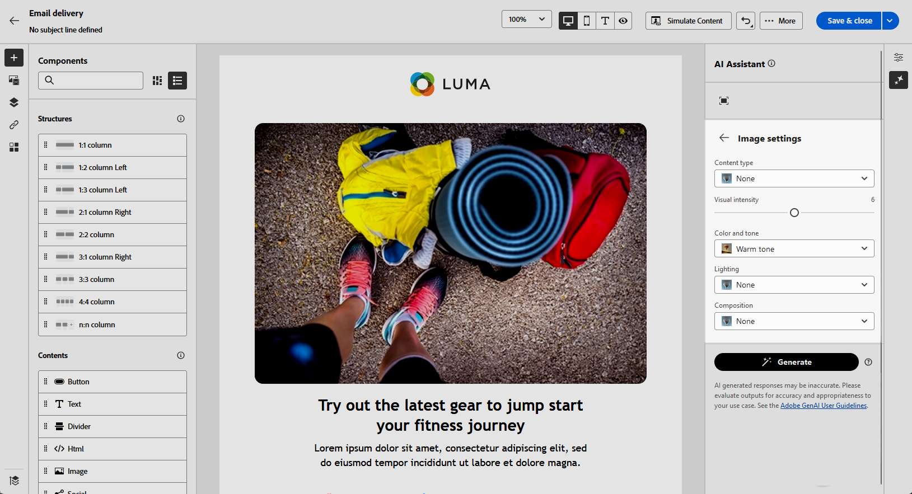
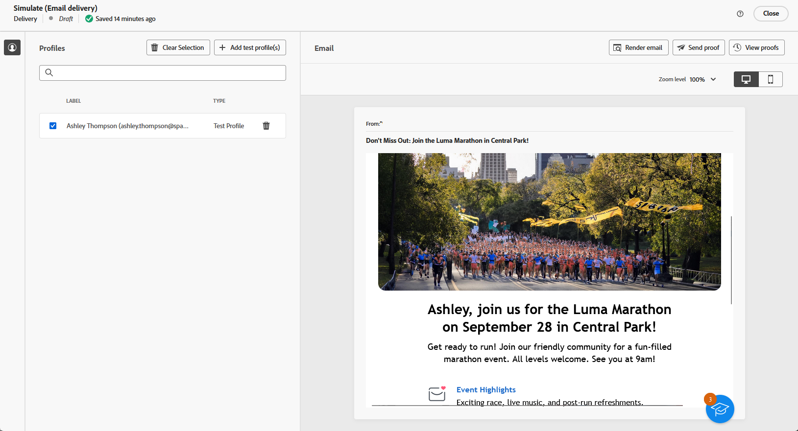
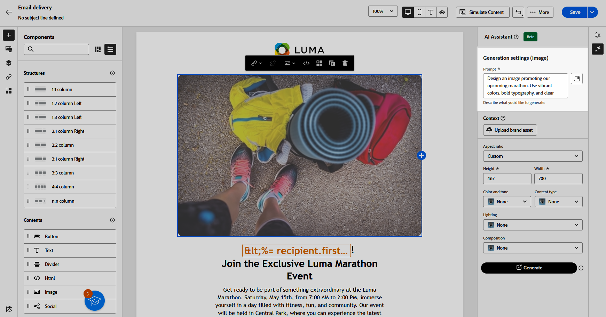
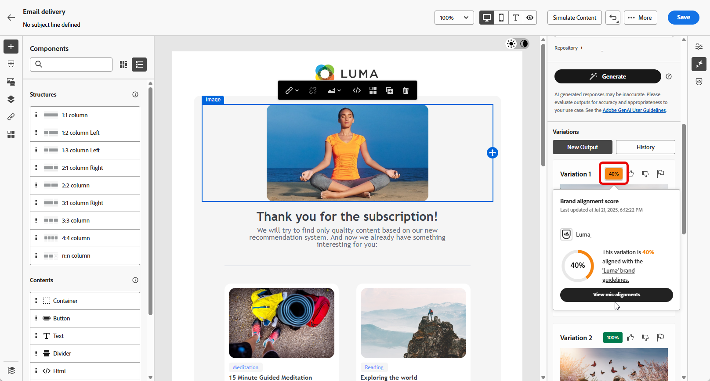

# E-postgenerering med AI Assistant i Adobe Campaign Web - Content Accelerator {#generative-content}

>[!IMPORTANT]
>
>Innan du börjar använda den här funktionen bör du läsa upp relaterade [säkerhetsutkast och begränsningar](generative-gs.md#generative-guardrails).
> 
>
>Du måste godkänna ett [användaravtal](https://www.adobe.com/legal/licenses-terms/adobe-dx-gen-ai-user-guidelines.html){target="_blank"} innan du kan använda AI-assistenten i Adobe Campaign Web för innehållsacceleration. Kontakta din Adobe-representant om du vill veta mer.

När ni har skapat och personaliserat era e-postmeddelanden kan ni använda AI Assistant i Adobe Campaign Web for Content Acceleration in Campaign, som bygger på generativ AI, för att ta innehållet till nästa nivå.

AI Assistant i Adobe Campaign Web for Content Acceleration kan hjälpa er att optimera effekten av era leveranser genom att generera hela e-postmeddelanden, riktat textinnehåll och till och med bilder som skräddarsytts för att passa er målgrupp. Detta optimerar era e-postkampanjer för bättre engagemang.

Med era e-postkampanjer kan ni använda AI-assistenten för att generera fullständig e-post, text eller bilder. Gå igenom flikarna nedan och lär dig hur du använder AI Assistant i Adobe Campaign Web for Content Acceleration in Campaign.

>[!BEGINTABS]

>[!TAB Fullständig e-postgenerering]

I följande exempel använder vi AI-assistenten i Adobe Campaign Web for Content Acceleration för att förfina ett befintligt e-postmeddelande och anpassa det för en speciell händelse.

1. När du har skapat och konfigurerat e-postleveransen klickar du på **[!UICONTROL Edit content]**.

   Mer information om hur du konfigurerar din e-postleverans finns på [den här sidan](../email/create-email-content.md).

1. Anpassa layouten efter behov och öppna menyn **[!UICONTROL AI Assistant]**.

   {zoomable="yes"}

1. Aktivera alternativet **[!UICONTROL Use original content]** för AI-assistenten för att anpassa nytt innehåll baserat på det valda innehållet.

1. Finjustera innehållet genom att beskriva vad du vill generera i fältet **[!UICONTROL Prompt]**.

   Om du vill ha hjälp med att skapa din fråga kan du få tillgång till **[!UICONTROL Prompt Library]**, som innehåller en mängd olika tips för att förbättra dina leveranser.

   {zoomable="yes"}

1. Du kan växla mellan **[!UICONTROL Subject line]** och **[!UICONTROL Preheader]** för att inkludera dem i variantgenereringen.

1. Skräddarsy din fråga med alternativet **[!UICONTROL Text settings]**:

   * **[!UICONTROL Communication strategy]**: Välj den lämpligaste kommunikationsstilen för den genererade texten.
   * **[!UICONTROL Tone]**: Tonen i ditt e-postmeddelande bör matcha med din publik. Vare sig du vill låta informativ, lekfull eller övertygande kan AI-assistenten anpassa meddelandet därefter.

   {zoomable="yes"}

1. Välj din **[!UICONTROL Image settings]**:

   * **[!UICONTROL Content type]**: Detta kategoriserar det visuella elementets karaktär och skiljer mellan olika former av visuell representation, t.ex. foton, grafik eller grafik.
   * **[!UICONTROL Visual intensity]**: Du kan styra bildens effekt genom att justera dess intensitet. En lägre inställning (2) ger ett mjukare och mer återhållsam utseende, medan en högre inställning (10) gör bilden mer levande och visuellt kraftfull.
   * **[!UICONTROL Color & tone]**: Det övergripande utseendet på färgerna i en bild och stämningen eller atmosfären som den förmedlar.
   * **[!UICONTROL Lighting]**: Det här refererar till blixten i en bild, som formar atmosfären och markerar specifika element.
   * **[!UICONTROL Composition]**: Det här refererar till elementens placering i en bilds bildruta

   {zoomable="yes"}

1. Klicka på **[!UICONTROL Upload brand asset]** på menyn **[!UICONTROL Brand assets]** om du vill lägga till en varumärkesresurs som innehåller innehåll som kan ge ytterligare kontext till AI-assistenten eller välja en som har överförts tidigare.

   Tidigare överförda filer är tillgängliga i listrutan **[!UICONTROL Uploaded brand assets]**. Du behöver bara växla mellan de resurser du vill ha med i din generation.

1. Klicka på **[!UICONTROL Generate]** när din fråga är klar.

1. Bläddra igenom den genererade **[!UICONTROL Variations]** och klicka på **[!UICONTROL Preview]** för att visa en fullskärmsversion av den valda varianten.

1. Navigera till alternativet **[!UICONTROL Refine]** i fönstret **[!UICONTROL Preview]** för att få tillgång till ytterligare anpassningsfunktioner:

   * **[!UICONTROL Rephrase]**: AI-assistenten kan omformulera ditt meddelande på olika sätt, vilket håller skrivandet aktuellt och engagerande för olika målgrupper.

   * **[!UICONTROL Use simpler language]**: Utnyttja AI-assistenten för att förenkla ditt språk och säkerställa tydlighet och tillgänglighet för en större publik.

   Du kan också ändra **[!UICONTROL Tone]** och **[!UICONTROL Communication strategy]** för texten.

   {zoomable="yes"}

1. Klicka på **[!UICONTROL Select]** när du har hittat rätt innehåll.

1. Infoga anpassningsfält för att anpassa ditt e-postinnehåll baserat på profildata. Klicka sedan på knappen **[!UICONTROL Simulate content]** för att kontrollera återgivningen och kontrollera personaliseringsinställningarna med testprofiler. [Läs mer](../preview-test/preview-content.md)

   {zoomable="yes"}

När ni har definierat ert innehåll, er målgrupp och ert schema är ni redo att förbereda er för att leverera e-post. [Läs mer](../monitor/prepare-send.md)

>[!TAB Generering av endast text]

I följande exempel använder vi AI-assistenten för att förbättra innehållet i vår e-postinbjudan till vårt kommande evenemang.

1. När du har skapat och konfigurerat e-postleveransen klickar du på **[!UICONTROL Edit content]**.

   Mer information om hur du konfigurerar din e-postleverans finns på [den här sidan](../email/create-email-content.md).

1. Välj en **[!UICONTROL Text component]** om du bara vill ha ett specifikt innehåll som mål. och gå till menyn **[!UICONTROL AI Assistant]**.

   {zoomable="yes"}

1. Aktivera alternativet **[!UICONTROL Use original content]** för AI-assistenten för att anpassa nytt innehåll baserat på det valda innehållet.

1. Finjustera innehållet genom att beskriva vad du vill generera i fältet **[!UICONTROL Prompt]**.

   Om du vill ha hjälp med att skapa din fråga kan du få tillgång till **[!UICONTROL Prompt Library]**, som innehåller en mängd olika tips för att förbättra dina leveranser.

   {zoomable="yes"}

1. Skräddarsy din fråga med alternativet **[!UICONTROL Text settings]**:

   * **[!UICONTROL Communication strategy]**: Välj den lämpligaste kommunikationsstilen för den genererade texten.
   * **[!UICONTROL Tone]**: Tonen i ditt e-postmeddelande bör matcha med din publik. Vare sig du vill låta informativ, lekfull eller övertygande kan AI-assistenten anpassa meddelandet därefter.
   * **Textlängd**: Använd reglaget för att välja önskad längd på texten.

   {zoomable="yes"}

1. Klicka på **[!UICONTROL Upload brand asset]** på menyn **[!UICONTROL Brand assets]** om du vill lägga till en varumärkesresurs som innehåller innehåll som kan ge ytterligare kontext till AI-assistenten eller välja en som har överförts tidigare.

   Tidigare överförda filer är tillgängliga i listrutan **[!UICONTROL Uploaded brand assets]**. Du behöver bara växla mellan de resurser du vill ha med i din generation.

1. Klicka på **[!UICONTROL Generate]** när din fråga är klar.

1. Bläddra igenom den genererade **[!UICONTROL Variations]** och klicka på **[!UICONTROL Preview]** för att visa en fullskärmsversion av den valda varianten.

1. Navigera till alternativet **[!UICONTROL Refine]** i fönstret **[!UICONTROL Preview]** för att få tillgång till ytterligare anpassningsfunktioner:

   * **[!UICONTROL Use as reference content]**: Den valda varianten fungerar som referensinnehåll för att generera andra resultat.

   * **[!UICONTROL Elaborate]**: AI-assistenten kan hjälpa dig att expandera specifika ämnen och ge ytterligare information för bättre förståelse och engagemang.

   * **[!UICONTROL Summarize]**: Långvarig information kan överlagra e-postmottagare. Använd AI Assistant för att dra ihop viktiga punkter till tydliga, kortfattade sammanfattningar som får dem att läsa mer.

   * **[!UICONTROL Rephrase]**:AI-assistenten kan omformulera ditt meddelande på olika sätt, vilket håller skrivandet aktuellt och engagerande för olika målgrupper.

   * **[!UICONTROL Use simpler language]**: Utnyttja AI-assistenten för att förenkla ditt språk och säkerställa tydlighet och tillgänglighet för en större publik.

   Du kan också ändra **[!UICONTROL Tone]** och **[!UICONTROL Communication strategy]** för texten.

   {zoomable="yes"}

1. Klicka på **[!UICONTROL Select]** när du har hittat rätt innehåll.

1. Infoga anpassningsfält för att anpassa ditt e-postinnehåll baserat på profildata. Klicka sedan på knappen **[!UICONTROL Simulate content]** för att kontrollera återgivningen och kontrollera personaliseringsinställningarna med testprofiler. [Läs mer](../preview-test/preview-content.md)

När ni har definierat ert innehåll, er målgrupp och ert schema är ni redo att förbereda er för att leverera e-post. [Läs mer](../monitor/prepare-send.md)

>[!TAB Bildgenerering]

I exemplet nedan kan du lära dig hur du använder AI Assistant för att optimera och förbättra dina resurser, vilket ger en mer användarvänlig upplevelse.

1. När du har skapat och konfigurerat e-postleveransen klickar du på **[!UICONTROL Edit content]**.

   Mer information om hur du konfigurerar din e-postleverans finns på [den här sidan](../email/create-email-content.md).

1. Fyll i **[!UICONTROL Basic details]** för leveransen. Klicka på **[!UICONTROL Edit email content]** när du är klar.

1. Markera den resurs som du vill ändra med AI-assistenten.

1. Välj **[!UICONTROL AI Assistant]** på den högra menyn.

   {zoomable="yes"}

1. Aktivera alternativet **[!UICONTROL Reference style]** för AI-assistenten för att anpassa nytt innehåll baserat på det valda innehållet.

1. Finjustera innehållet genom att beskriva vad du vill generera i fältet **[!UICONTROL Prompt]**.

   Om du vill ha hjälp med att skapa din fråga kan du få tillgång till **[!UICONTROL Prompt Library]**, som innehåller en mängd olika tips för att förbättra dina leveranser.

   {zoomable="yes"}

1. Skräddarsy din fråga med alternativet **[!UICONTROL Image settings]**:

   * **[!UICONTROL Aspect ratio]**: Detta avgör resursens bredd och höjd. Du kan välja mellan vanliga proportioner som 16:9, 4:3, 3:2 eller 1:1, eller ange en anpassad storlek.
   * **[!UICONTROL Content type]**: Detta kategoriserar det visuella elementets karaktär och skiljer mellan olika former av visuell representation, t.ex. foton, grafik eller grafik.
   * **[!UICONTROL Visual intensity]**: Du kan styra bildens effekt genom att justera dess intensitet. En lägre inställning (2) ger ett mjukare och mer återhållsam utseende, medan en högre inställning (10) gör bilden mer levande och visuellt kraftfull.
   * **[!UICONTROL Color & tone]**: Det övergripande utseendet på färgerna i en bild och stämningen eller atmosfären som den förmedlar.
   * **[!UICONTROL Lighting]**: Det här refererar till blixten i en bild, som formar atmosfären och markerar specifika element.
   * **[!UICONTROL Composition]**: Det här refererar till elementens placering i en bilds bildruta

   {zoomable="yes"}

1. Klicka på **[!UICONTROL Upload brand asset]** på menyn **[!UICONTROL Brand assets]** om du vill lägga till en varumärkesresurs som innehåller innehåll som kan ge ytterligare kontext till AI-assistenten eller välja en som har överförts tidigare.

   Tidigare överförda filer är tillgängliga i listrutan **[!UICONTROL Uploaded brand assets]**. Du behöver bara växla mellan de resurser du vill ha med i din generation.

1. När du är nöjd med promptkonfigurationen klickar du på **[!UICONTROL Generate]**.

1. Bläddra i **[!UICONTROL Variation suggestions]** för att hitta den önskade resursen.

   Klicka på **[!UICONTROL Preview]** om du vill visa en fullskärmsversion av den valda varianten.

   {zoomable="yes"}

1. Välj **[!UICONTROL Generate Similar]** om du vill visa relaterade bilder till den här varianten.

   {zoomable="yes"}

1. Klicka på **[!UICONTROL Select]** när du har hittat rätt innehåll.

1. När du har definierat meddelandeinnehållet klickar du på knappen **[!UICONTROL Simulate content]** för att kontrollera återgivningen och kontrollerar personaliseringsinställningarna med testprofiler.  [Läs mer](../preview-test/preview-content.md)

1. När ni har definierat ert innehåll, er målgrupp och ert schema är ni redo att förbereda er för att leverera e-post. [Läs mer](../monitor/prepare-send.md)

>[!ENDTABS]

## Instruktionsvideo {#video}

Lär dig hur du använder AI Assistant för att generera fullständigt e-postinnehåll, text och bilder.

>[!VIDEO](https://video.tv.adobe.com/v/3428984)

