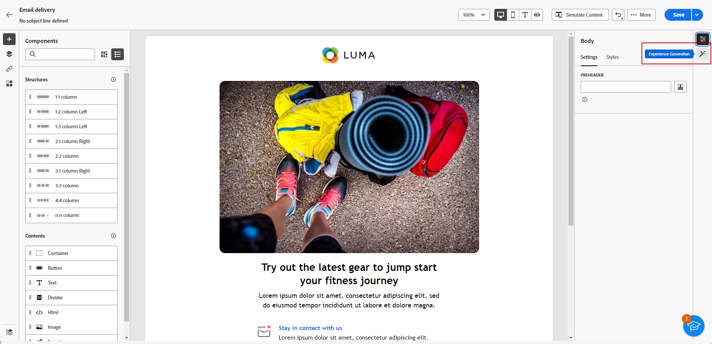
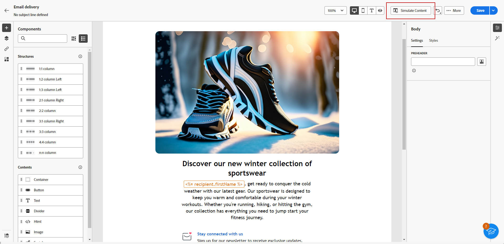

# Generera ett e-postmeddelande med AI-assistenten {#generative-email}

AI Assistant i Campaign förbättrar kommunikationens genomslag genom att automatiskt generera fullständigt e-postinnehåll, vilket sparar tid och ger en konsekvent kvalitet. Med hjälp av generativ AI kan ni enkelt skapa övertygande e-postmeddelanden som får genklang hos er målgrupp och gör kommunikationen effektivare och effektivare.

>[!NOTE]
>
>Innan du börjar använda den här funktionen bör du läsa upp relaterade [säkerhetsutkast och begränsningar](generative-gs.md#guardrails-and-limitations).

Följ stegen nedan för att generera ett e-postinnehåll med AI-assistenten. Du kan även förbättra ett befintligt innehåll med AI-assistenten, vilket beskrivs på [den här sidan](generative-content.md).

1. När du har skapat och konfigurerat din e-postleverans klickar du på **[!UICONTROL Create content]**.

   Mer information om hur du konfigurerar din e-postleverans finns på [den här sidan](../email/create-email-content.md).

1. Fyll i **[!UICONTROL Basic details]** för leveransen. Klicka på **[!UICONTROL Edit email body]** när du är klar.

1. Välj den designmall som du vill att AI-assistenten ska basera det genererade e-postmeddelandet på.

   Du kan också importera en HTML-fil.

1. Välj **[!UICONTROL Experience generation]** på den högra menyn.

   {zoomable="yes"}

1. Finjustera innehållet genom att beskriva vad du vill generera.

   Här är några exempel:

   * För ett nyhetsbrev: Generera ett månatligt nyhetsbrev med researtiklar, högdagrar och exklusiva prenumeranterbjudanden.
   * För feedback och enkäter: Skapa ett e-postmeddelande med en inbjudan till kunder att lämna feedback om sina senaste programvaruupplevelser och delta i en enkät om produktförbättringar.
   * För årsdag- och födelsedagsedelsemejl: Generera ett födelsedagsedelsemeddelande, fira kundens speciella dag och ge dem en födelsedagsrabatt.

   {zoomable="yes"}

1. Välj **[!UICONTROL Upload file]** om du vill lägga till en varumärkesresurs som innehåller innehåll som kan ge ytterligare kontext till AI-assistenten.

   Du kan också klicka på **[!UICONTROL Uploaded content]** för att hitta tidigare uppdaterade filer. Observera att det överförda innehållet endast är tillgängligt för återanvändning av den aktuella användaren.

1. Välj den **[!UICONTROL Communication strategy]** som bäst passar dina behov. Det här påverkar tonen och stilen på det genererade e-postmeddelandet.

1. Välj **[!UICONTROL Language]** och **[!UICONTROL Tone]** som du vill att den genererade texten ska ha. På så sätt säkerställs att texten passar er målgrupp och ert syfte.

   {zoomable="yes"}

1. Anpassa inställningarna för **[!UICONTROL Content type]**-resurser så att de matchar dina önskade resursegenskaper.

1. Klicka på **[!UICONTROL Generate]** när din fråga är klar.

1. Bläddra i **[!UICONTROL Variation suggestions]** för att hitta önskad e-post. Klicka på **[!UICONTROL Preview]** om du vill visa en fullskärmsversion av den valda varianten.

   {zoomable="yes"}

1. Klicka på **[!UICONTROL Select]** när du har hittat rätt innehåll.

   {zoomable="yes"}

1. Infoga anpassningsfält för att anpassa ditt e-postinnehåll baserat på profildata eller anpassa innehållet ytterligare vid behov. [Läs mer om innehållspersonalisering](../personalization/personalize.md)

1. När du har definierat ditt e-postinnehåll klickar du på knappen **[!UICONTROL Simulate content]** för att kontrollera återgivningen och kontrollerar personaliseringsinställningarna med testprofiler.  [Läs mer](../preview-test/preview-content.md)

   {zoomable="yes"}

1. När ni har definierat ert innehåll, er målgrupp och ert schema är ni redo att förbereda er för att leverera e-post. [Läs mer](../monitor/prepare-send.md)
