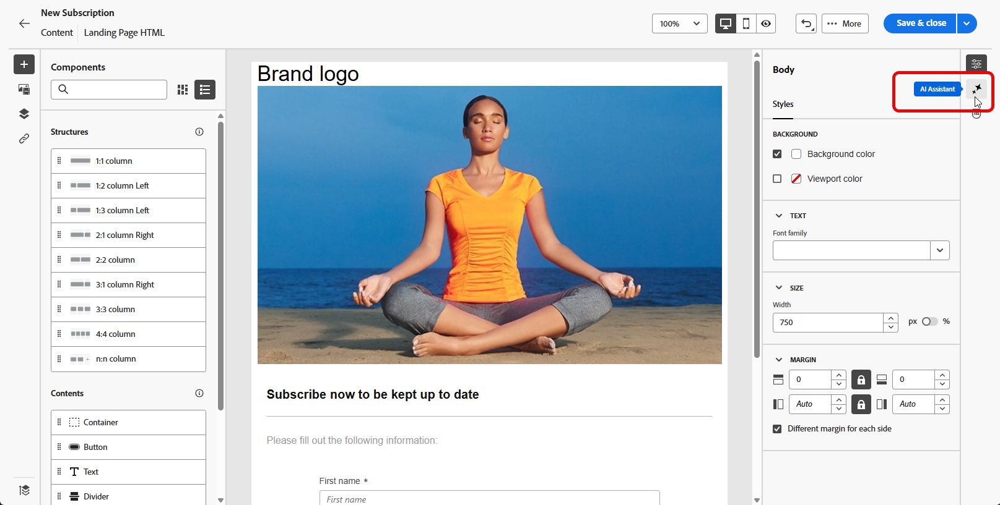
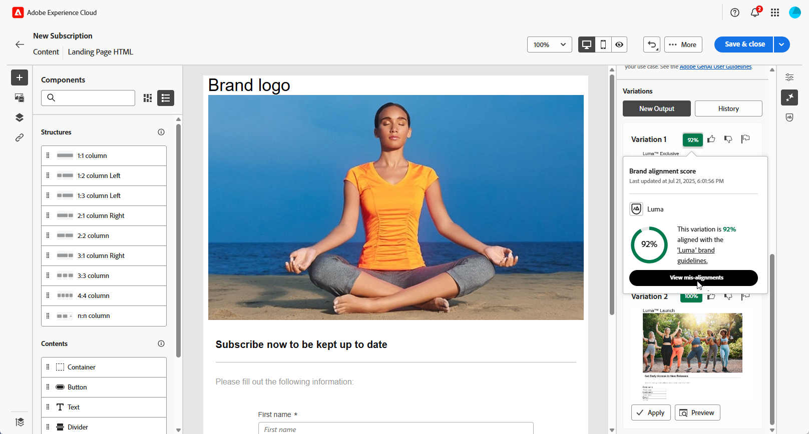

# Skapa landningssidor med AI Assistant{#generative-lp}

>[!CONTEXTUALHELP]
>id="acw_homepage_welcome_rn5"
>title="Generera landningssidor med AI"
>abstract="Nu kan du använda AI Assistant för att skapa leveranser av landningssidor, så att du kan generera text, bilder eller hela sidlayouter."
>additional-url="https://experienceleague.adobe.com/docs/campaign-web/v8/release-notes/release-notes.html" text="Se versionsinformation"

>[!IMPORTANT]
>
>Innan du börjar använda den här funktionen bör du läsa upp relaterade [säkerhetsutkast och begränsningar](generative-gs.md#generative-guardrails).
> 
>
>Du måste godkänna ett [användaravtal](https://www.adobe.com/legal/licenses-terms/adobe-dx-gen-ai-user-guidelines.html) innan du kan använda AI-assistenten på Adobe Campaign Web. Kontakta din Adobe-representant om du vill veta mer.

Omvandla landningssidorna med AI Assistant på Adobe Campaign Web, som bygger på generativ AI.

Skapa enkelt slagkraftigt innehåll, inklusive kompletta sidor, skräddarsydda textbitar och skräddarsydda bilder som passar er målgrupp, vilket ökar engagemanget och interaktionen.

Gå igenom flikarna nedan och lär dig hur du använder AI Assistant på Adobe Campaign Web.

>[!BEGINTABS]

>[!TAB Generering av hela landningssidor]

I följande exempel kommer vi att utnyttja AI Assistant för att förfina en befintlig landningssidmall.

1. När du har skapat och konfigurerat landningssidan klickar du på **[!UICONTROL Edit content]**.

   Mer information om hur du konfigurerar din landningssida finns på [den här sidan](../landing-pages/create-lp.md).

1. Anpassa layouten efter behov och öppna menyn **[!UICONTROL AI Assistant]**.

   {zoomable="yes"}

1. Aktivera alternativet **[!UICONTROL Use original content]** för AI-assistenten för att anpassa nytt innehåll baserat på det valda innehållet.

1. Finjustera innehållet genom att beskriva vad du vill generera i fältet **[!UICONTROL Prompt]**.

   Om du vill ha hjälp med att skapa din fråga kan du få tillgång till **[!UICONTROL Prompt Library]**, som innehåller en mängd olika tips för att förbättra din landningssida.

   {zoomable="yes"}

1. Skräddarsy din fråga med alternativet **[!UICONTROL Text settings]**:

   * **[!UICONTROL Communication strategy]**: Välj den lämpligaste kommunikationsstilen för den genererade texten.
   * **[!UICONTROL Tone]**: Tonen på din landningssida ska tolkas som målgruppen. Vare sig du vill låta informativ, lekfull eller övertygande kan AI-assistenten anpassa meddelandet därefter.

   {zoomable="yes"}

1. Välj din **[!UICONTROL Image settings]**:

   * **[!UICONTROL Content type]**: Detta kategoriserar det visuella elementets karaktär och skiljer mellan olika former av visuell representation, t.ex. foton, grafik eller grafik.
   * **[!UICONTROL Visual intensity]**: Du kan styra bildens effekt genom att justera dess intensitet. En lägre inställning (2) ger ett mjukare och mer återhållsam utseende, medan en högre inställning (10) gör bilden mer levande och visuellt kraftfull.
   * **[!UICONTROL Color & tone]**: Det övergripande utseendet på färgerna i en bild och stämningen eller atmosfären som den förmedlar.
   * **[!UICONTROL Lighting]**: Det här refererar till blixten i en bild, som formar atmosfären och markerar specifika element.
   * **[!UICONTROL Composition]**: Det här refererar till elementens placering i en bilds bildruta

   {zoomable="yes"}

1. Klicka på **[!UICONTROL Upload brand asset]** på menyn **[!UICONTROL Brand assets]** om du vill lägga till en varumärkesresurs som innehåller innehåll som kan ge ytterligare kontext till AI-assistenten eller välja en som har överförts tidigare.

   Tidigare överförda filer är tillgängliga i listrutan **[!UICONTROL Uploaded brand assets]**. Du behöver bara växla mellan de resurser du vill ha med i din generation.

   {zoomable="yes"}

1. Klicka på **[!UICONTROL Generate]** när din fråga är klar.

1. Bläddra igenom den genererade **[!UICONTROL Variations]** och klicka på **[!UICONTROL Preview]** för att visa en fullskärmsversion av den valda varianten.

1. Navigera till alternativet **[!UICONTROL Refine]** i fönstret **[!UICONTROL Preview]** för att få tillgång till ytterligare anpassningsfunktioner:

   * **[!UICONTROL Rephrase]**: AI-assistenten kan omformulera ditt meddelande på olika sätt, vilket håller skrivandet aktuellt och engagerande för olika målgrupper.

   * **[!UICONTROL Use simpler language]**: Utnyttja AI-assistenten för att förenkla ditt språk och säkerställa tydlighet och tillgänglighet för en större publik.

   Du kan också ändra **[!UICONTROL Tone]** och **[!UICONTROL Communication strategy]** för texten.

   {zoomable="yes"}

1. Klicka på **[!UICONTROL Select]** när du har hittat rätt innehåll.

1. Infoga anpassningsfält för att anpassa innehållet på landningssidan baserat på profildata. Klicka sedan på knappen **[!UICONTROL Simulate content]** för att kontrollera återgivningen och kontrollera personaliseringsinställningarna med testprofiler. [Läs mer](../landing-pages/create-lp.md#test-landing-page)

När landningssidan är klar kan du publicera den för att göra den tillgänglig för användning i ett meddelande. [Läs mer](../landing-pages/create-lp.md#publish-landing-page)

>[!TAB Generering av endast text]

I följande exempel kommer vi att utnyttja AI Assistant för att förbättra innehållet på vår landningssida.

1. När du har skapat och konfigurerat landningssidan klickar du på **[!UICONTROL Edit content]**.

   Mer information om hur du konfigurerar din landningssida finns på [den här sidan](../landing-pages/create-lp.md).

1. Välj en **[!UICONTROL Text component]** om du bara vill ha ett specifikt innehåll som mål. och gå till menyn **[!UICONTROL AI Assistant]**.

   {zoomable="yes"}

1. Aktivera alternativet **[!UICONTROL Use original content]** för AI-assistenten för att anpassa nytt innehåll baserat på det valda innehållet.

1. Finjustera innehållet genom att beskriva vad du vill generera i fältet **[!UICONTROL Prompt]**.

   Om du vill ha hjälp med att skapa din fråga kan du få tillgång till **[!UICONTROL Prompt Library]**, som innehåller en mängd olika tips för att förbättra dina landningssidor.

   {zoomable="yes"}

1. Skräddarsy din fråga med alternativet **[!UICONTROL Text settings]**:

   * **[!UICONTROL Communication strategy]**: Välj den lämpligaste kommunikationsstilen för den genererade texten.
   * **[!UICONTROL Tone]**: Tonen på din landningssida ska tolkas som målgruppen. Vare sig du vill låta informativ, lekfull eller övertygande kan AI-assistenten anpassa meddelandet därefter.
   * **Textlängd**: Använd reglaget för att välja önskad längd på texten.

   {zoomable="yes"}

1. Klicka på **[!UICONTROL Upload brand asset]** på menyn **[!UICONTROL Brand assets]** om du vill lägga till en varumärkesresurs som innehåller innehåll som kan ge ytterligare kontext till AI-assistenten eller välja en som har överförts tidigare.

   Tidigare överförda filer är tillgängliga i listrutan **[!UICONTROL Uploaded brand assets]**. Du behöver bara växla mellan de resurser du vill ha med i din generation.

   {zoomable="yes"}

1. Klicka på **[!UICONTROL Generate]** när din fråga är klar.

1. Bläddra igenom den genererade **[!UICONTROL Variations]** och klicka på **[!UICONTROL Preview]** för att visa en fullskärmsversion av den valda varianten.

1. Navigera till alternativet **[!UICONTROL Refine]** i fönstret **[!UICONTROL Preview]** för att få tillgång till ytterligare anpassningsfunktioner:

   * **[!UICONTROL Use as reference content]**: Den valda varianten fungerar som referensinnehåll för att generera andra resultat.

   * **[!UICONTROL Elaborate]**: AI-assistenten kan hjälpa dig att expandera specifika ämnen och ge ytterligare information för bättre förståelse och engagemang.

   * **[!UICONTROL Summarize]**: Lång information kan överlagra mottagare av landningssidor. Använd AI Assistant för att dra ihop viktiga punkter till tydliga, kortfattade sammanfattningar som får dem att läsa mer.

   * **[!UICONTROL Rephrase]**:AI-assistenten kan omformulera ditt meddelande på olika sätt, vilket håller skrivandet aktuellt och engagerande för olika målgrupper.

   * **[!UICONTROL Use simpler language]**: Utnyttja AI-assistenten för att förenkla ditt språk och säkerställa tydlighet och tillgänglighet för en större publik.

   Du kan också ändra **[!UICONTROL Tone]** och **[!UICONTROL Communication strategy]** för texten.

   {zoomable="yes"}

1. Klicka på **[!UICONTROL Select]** när du har hittat rätt innehåll.

1. Infoga anpassningsfält för att anpassa innehållet på landningssidan baserat på profildata. Klicka sedan på knappen **[!UICONTROL Simulate content]** för att kontrollera återgivningen och kontrollera personaliseringsinställningarna med testprofiler. [Läs mer](../landing-pages/create-lp.md#test-landing-page)

När landningssidan är klar kan du publicera den för att göra den tillgänglig för användning i ett meddelande. [Läs mer](../landing-pages/create-lp.md#publish-landing-page)

>[!TAB Generering av endast bild]

I exemplet nedan kan du lära dig hur du använder AI Assistant för att optimera och förbättra dina resurser, vilket ger en mer användarvänlig upplevelse.

1. När du har skapat och konfigurerat landningssidan klickar du på **[!UICONTROL Edit content]**.

   Mer information om hur du konfigurerar din landningssida finns på [den här sidan](../landing-pages/create-lp.md).

1. Markera den resurs som du vill ändra med AI-assistenten.

1. Välj **[!UICONTROL AI Assistant]** på den högra menyn.

   {zoomable="yes"}

1. Aktivera alternativet **[!UICONTROL Reference style]** för AI-assistenten för att anpassa nytt innehåll baserat på referensinnehållet. Du kan också överföra en bild för att lägga till kontext till variationen.

1. Finjustera innehållet genom att beskriva vad du vill generera i fältet **[!UICONTROL Prompt]**.

   Om du vill ha hjälp med att skapa din fråga kan du få tillgång till **[!UICONTROL Prompt Library]**, som innehåller en mängd olika tips för att förbättra dina landningssidor.

   {zoomable="yes"}

1. Skräddarsy din fråga med alternativet **[!UICONTROL Image settings]**:

   * **[!UICONTROL Aspect ratio]**: Detta avgör resursens bredd och höjd. Du kan välja mellan vanliga proportioner som 16:9, 4:3, 3:2 eller 1:1, eller ange en anpassad storlek.
   * **[!UICONTROL Content type]**: Detta kategoriserar det visuella elementets karaktär och skiljer mellan olika former av visuell representation, t.ex. foton, grafik eller grafik.
   * **[!UICONTROL Visual intensity]**: Du kan styra bildens effekt genom att justera dess intensitet. En lägre inställning (2) ger ett mjukare och mer återhållsam utseende, medan en högre inställning (10) gör bilden mer levande och visuellt kraftfull.
   * **[!UICONTROL Color & tone]**: Det övergripande utseendet på färgerna i en bild och stämningen eller atmosfären som den förmedlar.
   * **[!UICONTROL Lighting]**: Det här refererar till blixten i en bild, som formar atmosfären och markerar specifika element.
   * **[!UICONTROL Composition]**: Det här refererar till elementens placering i en bilds bildruta

   {zoomable="yes"}

1. Klicka på **[!UICONTROL Upload brand asset]** på menyn **[!UICONTROL Brand assets]** om du vill lägga till en varumärkesresurs som innehåller innehåll som kan ge ytterligare kontext till AI-assistenten eller välja en som har överförts tidigare.

   Tidigare överförda filer är tillgängliga i listrutan **[!UICONTROL Uploaded brand assets]**. Du behöver bara växla mellan de resurser du vill ha med i din generation.

1. När du är nöjd med promptkonfigurationen klickar du på **[!UICONTROL Generate]**.

1. Bläddra i **[!UICONTROL Variation suggestions]** för att hitta den önskade resursen.

   Klicka på **[!UICONTROL Preview]** om du vill visa en fullskärmsversion av den valda varianten.

1. Välj **[!UICONTROL Generate Similar]** om du vill visa relaterade bilder till den här varianten.

   {zoomable="yes"}

1. Klicka på **[!UICONTROL Select]** när du har hittat rätt innehåll.

1. När du har definierat meddelandeinnehållet klickar du på knappen **[!UICONTROL Simulate content]** för att kontrollera återgivningen och kontrollerar personaliseringsinställningarna med testprofiler. [Läs mer](../landing-pages/create-lp.md#test-landing-page)

När landningssidan är klar kan du publicera den för att göra den tillgänglig för användning i ett meddelande. [Läs mer](../landing-pages/create-lp.md#publish-landing-page)

>[!ENDTABS]
