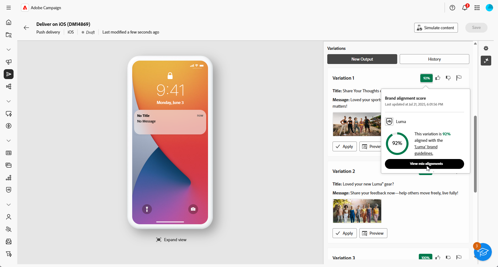

# Generering av push-meddelanden med AI-assistenten {#generative-push}

>[!BEGINSHADEBOX]

**Innehållsförteckning**

* [Kom igång med AI-assistenten](generative-gs.md)
* [E-postgenerering med AI-assistenten](generative-content.md)
* [SMS-generering med AI-assistenten](generative-sms.md)
* Generering av push-meddelanden med AI-assistenten

>[!ENDSHADEBOX]

AI Assistant kan hjälpa er att optimera effekten av era leveranser genom att föreslå olika typer av innehåll som troligtvis får genklang hos er målgrupp.

>[!NOTE]
>
>Innan du börjar använda den här funktionen bör du läsa upp relaterade [säkerhetsutkast och begränsningar](generative-gs.md#generative-guardrails).

I följande exempel kommer vi att utnyttja AI-assistenten för att skapa övertygande meddelanden för att skapa en mer engagerande kundupplevelse.

1. När du har skapat och konfigurerat leveransen av push-meddelanden klickar du på **[!UICONTROL Edit content]**.

   Mer information om hur du konfigurerar din push-leverans finns på [den här sidan](../push/create-push.md).

1. Fyll i **[!UICONTROL Basic details]** för leveransen. Klicka på **[!UICONTROL Edit content]** när du är klar.

1. Anpassa push-meddelanden efter behov. [Läs mer](../push/content-push.md)

1. Öppna menyn **[!UICONTROL Show AI Assistant]**.

   {zoomable="yes"}

1. Aktivera alternativet **[!UICONTROL Use original content]** för AI-assistenten för att anpassa nytt innehåll baserat på din leverans, leveransnamn och vald målgrupp.

   >[!IMPORTANT]
   >
   > Din fråga måste alltid vara knuten till ditt aktuella innehåll.

   {zoomable="yes"}

1. Finjustera innehållet genom att beskriva vad du vill generera i fältet **[!UICONTROL Prompt]**.

   Om du vill ha hjälp med att skapa din fråga kan du få tillgång till **[!UICONTROL Prompt Library]**, som innehåller en mängd olika tips för att förbättra dina leveranser.

   {zoomable="yes"}

1. Välj **[!UICONTROL Upload brand asset]** om du vill lägga till en varumärkesresurs som innehåller innehåll som kan ge ytterligare kontext till AI-assistenten.

1. Välj vilket fält du vill generera: **[!UICONTROL Title]**, **[!UICONTROL Subtitle]** eller **[!UICONTROL Message]**.

1. Skräddarsy uppmaningen med de olika alternativen:

   * **[!UICONTROL Communication strategy]**: Välj den lämpligaste kommunikationsstilen för den genererade texten.
   * **[!UICONTROL Language]**: Välj det språk som du vill att ditt innehåll ska genereras på.
   * **[!UICONTROL Tone]**: Tonen i ditt e-postmeddelande bör matcha med din publik. Vare sig du vill låta informativ, lekfull eller övertygande kan AI-assistenten anpassa meddelandet därefter.

   {zoomable="yes"}

1. Klicka på **[!UICONTROL Generate]** när din fråga är klar.

1. Bläddra igenom den genererade **[!UICONTROL Variations]** och klicka på **[!UICONTROL Preview]** för att visa en fullskärmsversion av den valda varianten.

1. Navigera till alternativet **[!UICONTROL Refine]** i fönstret **[!UICONTROL Preview]** för att få tillgång till ytterligare anpassningsfunktioner:

   * **[!UICONTROL Use as reference content]**: Den valda varianten fungerar som referensinnehåll för att generera andra resultat.

   * **[!UICONTROL Rephrase]**: AI-assistenten kan omformulera ditt meddelande på olika sätt, vilket håller skrivandet aktuellt och engagerande för olika målgrupper.

   * **[!UICONTROL Use simpler language]**: Utnyttja AI-assistenten för att förenkla ditt språk och säkerställa tydlighet och tillgänglighet för en större publik.

   {zoomable="yes"}

1. Klicka på **[!UICONTROL Select]** när du har hittat rätt innehåll.

1. Infoga anpassningsfält för att anpassa ditt e-postinnehåll baserat på profildata. Klicka sedan på knappen **[!UICONTROL Simulate content]** för att kontrollera återgivningen och kontrollera personaliseringsinställningarna med testprofiler. [Läs mer](../preview-test/preview-content.md)

   {zoomable="yes"}

När ni har definierat ert innehåll, er målgrupp och ert schema är ni redo att förbereda er för att leverera push-paket. [Läs mer](../monitor/prepare-send.md)

