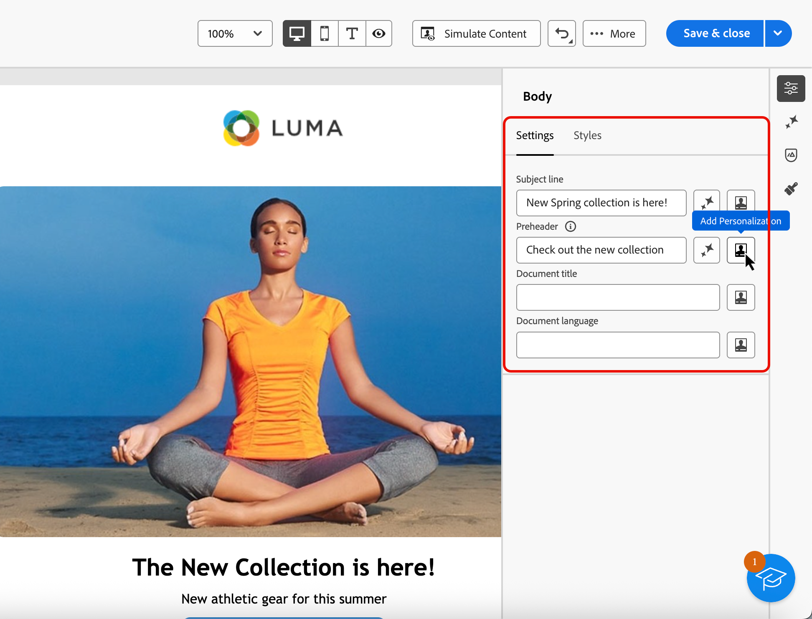

# Lägg till metadata i e-postinnehåll {#email-metadata}

>[!CONTEXTUALHELP]
>id="ac_edition_preheader"
>title="Definiera en förrubrik"
>abstract="En preheader är en kort sammanfattningstext som följer efter ämnesraden när du visar ett e-postmeddelande från din e-postklient. I många fall ger den en kort sammanfattning av e-postmeddelandet och är vanligtvis en mening lång."

När du utformar e-postmeddelanden kan du definiera ytterligare metaattribut för innehållet, så att det blir lättare att läsa och tillgängligare. Med [!DNL Journey Optimizer] [e-post-Designer](get-started-email-designer.md) kan du ange följande element:

* **[!UICONTROL Preheader]**: En förrubrik är en kort sammanfattningstext som följer ämnesraden när du visar ett e-postmeddelande från din e-postklient. I många fall ger den en kort sammanfattning av e-postmeddelandet och är vanligtvis en mening lång.

  >[!NOTE]
  >
  >Förhuvuden stöds inte av alla e-postklienter. Om det inte stöds visas inte prerubriken.

* **[!UICONTROL Document title]**: Det här fältet, som motsvarar elementet `<title>`, innehåller beskrivande information om ditt e-postinnehåll, som vanligtvis visas som ett verktygstips vid muspekaren. Den kan hjälpa användare med funktionshinder genom att ge ytterligare kontext och kan bidra till en bättre förståelse för ditt innehåll via sökmotorer.

* **[!UICONTROL Document language]**: För att säkerställa tillgänglighet kan du ange vilket språk skärmläsare ska använda för att konvertera text och bilder till tal- eller blindskriftsformat för personer med nedsatt syn eller inlärningssvårigheter. Den här inställningen motsvarar attributet `lang` i elementet `<html>`.

Följ stegen nedan för att konfigurera de här inställningarna.

1. I [e-postmeddelandet för Designer](create-email-content.md) lägger du till minst en **[!UICONTROL Structure component]** för att börja designa e-postmeddelandet.

1. Klicka på **[!UICONTROL Body]**, antingen från **[!UICONTROL Navigation tree]** till vänster eller ovanför den högra rutan.

   {width="90%"}

1. På fliken **[!UICONTROL Settings]** skriver du text i fälten **[!UICONTROL Preheader]**, **[!UICONTROL Document title]** och/eller **[!UICONTROL Document language]**.

1. Du kan också klicka på personaliseringsikonen bredvid varje fält för att anpassa ditt innehåll från profilattribut, målgrupper, sammanhangsbaserade attribut med mera. [Läs mer om personalisering](../personalization/gs-personalization.md)

   {width="70%"}

1. Klicka på **[!UICONTROL Save]** för att bekräfta ändringarna.