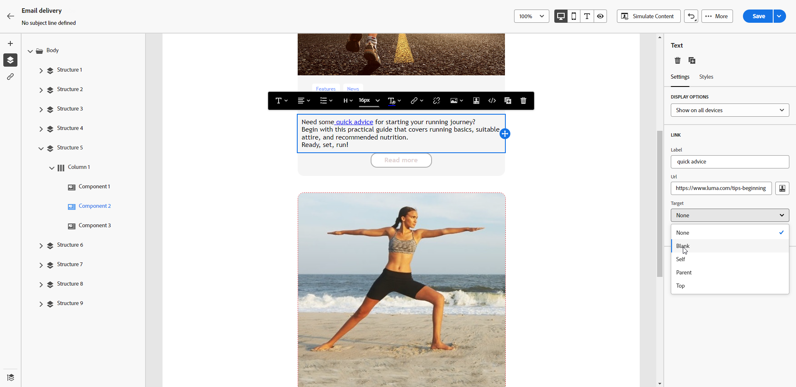

# Definiera ett format för länkar {#styling-links}

Du kan stryka under en länk och välja dess färg och mål i e-postens Designer.

1. Markera länken i en **[!UICONTROL Text]**-komponent där en länk infogas.

1. Markera **[!UICONTROL Underline link]** på fliken **[!UICONTROL Settings]** för att stryka under etiketten.

   {zoomable="yes"}

1. Välj hur målgruppen omdirigeras med listrutan **[!UICONTROL Target]**:

   * **[!UICONTROL None]**: Öppnar länken i samma ram som den klickades på (standard).
   * **[!UICONTROL Blank]**: Öppnar länken i ett nytt fönster eller på en ny flik.
   * **[!UICONTROL Self]**: Öppnar länken i samma ram som den klickades på.
   * **[!UICONTROL Parent]**: Öppnar länken i den överordnade ramen.
   * **[!UICONTROL Top]**: Öppnar länken i hela fönstret.

   {zoomable="yes"}

1. Om du vill ändra färg på länken klickar du på **[!UICONTROL Link color]** på fliken **[!UICONTROL Styles]**.

   {zoomable="yes"}

1. Spara ändringarna.