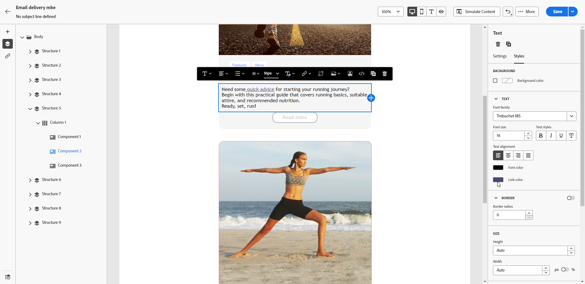

# Definiera ett format för länkar {#styling-links}

Du kan stryka under en länk och välja dess färg och mål i e-postdesignern.

1. I en **[!UICONTROL Text]** markerar du länken där en länk infogas.

1. I **[!UICONTROL Settings]** flik, kontrollera **[!UICONTROL Underline link]** om du vill att etiketten ska vara understruken.

   {zoomable=&quot;yes&quot;}

1. Välj hur er målgrupp ska omdirigeras med **[!UICONTROL Target]** nedrullningsbar lista:

   * **[!UICONTROL None]**: öppnar länken i samma ram som den klickades på (standard).
   * **[!UICONTROL Blank]**: öppnar länken i ett nytt fönster eller på en ny flik.
   * **[!UICONTROL Self]**: öppnar länken i samma ram som den klickades på.
   * **[!UICONTROL Parent]**: öppnar länken i den överordnade ramen.
   * **[!UICONTROL Top]**: öppnar länken i hela fönstret.

   {zoomable=&quot;yes&quot;}

1. Om du vill ändra färg på länken klickar du på **[!UICONTROL Link color]** från **[!UICONTROL Styles]** -fliken.

   {zoomable=&quot;yes&quot;}

1. Spara ändringarna.
