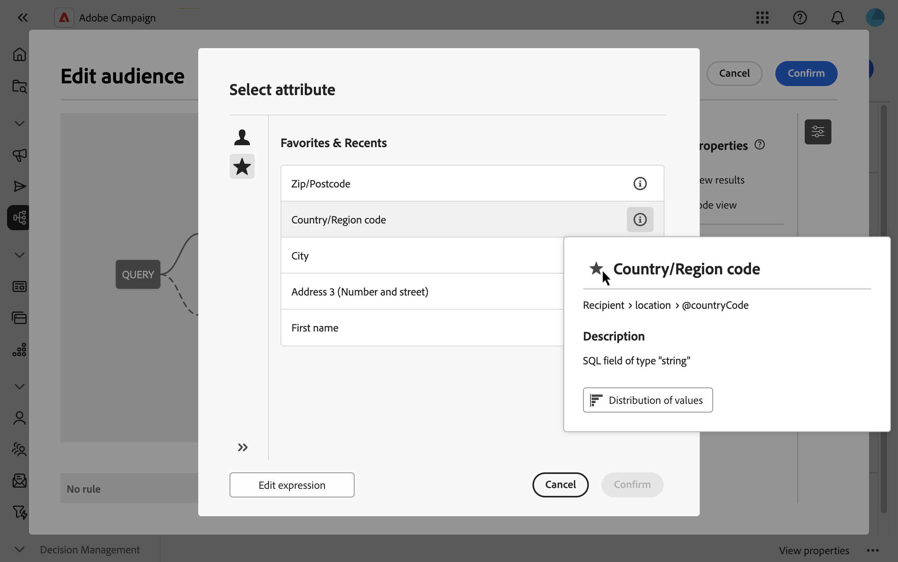
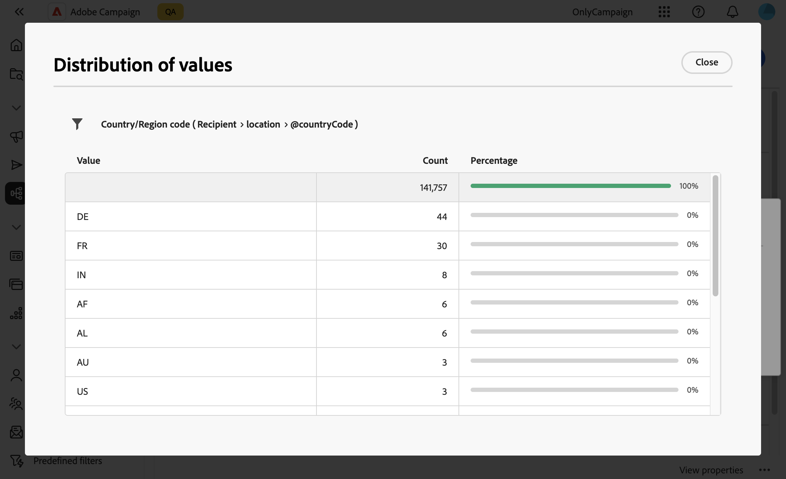

# Välj attribut och lägg till dem i favoriter {#folders}

Med användargränssnittet för Campaign-webben kan du välja attribut från databasen på olika platser, beroende på vilken åtgärd du vill utföra. Du kan t.ex. välja attribut när du definierar utdatakolumner för en direktpostleverans eller en fil som ska extraheras. På samma sätt kan du välja attribut när du använder frågemodelleraren för att skapa regler, filter eller skapa målgrupper.

Om du snabbt vill återanvända attribut som används ofta kan du lägga till dem i favoriter. Detta gör att de är lättillgängliga för framtida uppgifter. Förutom favoriter kan du även visa och använda de senast markerade attributen.

Gränssnittet innehåller också ett verktyg för värdedistribution som gör att du kan visualisera fördelningen av ett attributs värden i en tabell. Det här verktyget kan hjälpa dig att identifiera värdeintervall och värdefrekvens, vilket säkerställer att data är konsekventa när du skapar frågor eller uttryck.

## Favoriter och nyligen använda attribut {#favorites}

>[!CONTEXTUALHELP]
>id="acw_attribute_picker_favorites_recents"
>title="Favoriter och senaste"
>abstract="Menyn **[!UICONTROL Favorites & Recents]** i attributväljaren innehåller en ordnad vy över attribut som du har lagt till i favoriter, tillsammans med en lista över nyligen använda attribut. Favoritattribut visas först, följt av nyligen använda attribut, vilket gör det enkelt att hitta de attribut du behöver."

Menyn **[!UICONTROL Favorites & Recents]** i attributväljaren innehåller en ordnad vy över attribut som du har lagt till i favoriter, tillsammans med en lista över nyligen använda attribut. Favoritattribut visas först, följt av nyligen använda attribut, vilket gör det enkelt att hitta de attribut du behöver.

Om du vill lägga till ett attribut i favoriter håller du pekaren över informationsknappen och väljer stjärnikonen. Attributet läggs sedan automatiskt till i favoritlistan. Om du inte längre vill behålla ett attribut som favorit kan du ta bort det genom att markera stjärnikonen igen.

Du kan lägga till upp till 20 attributfavoriter. Favoriter och nyligen använda attribut är kopplade till varje användare i en organisation. Det innebär att de är tillgängliga från olika datorer, vilket ger en smidig upplevelse på alla enheter.

## Identifiera fördelningen av värden i en tabell {#distribution}

Knappen **Distribution av värden**, som är tillgänglig i informationsfönstret för ett attribut, gör att du kan analysera värdefördelningen för det attributet i tabellen. Den här funktionen är särskilt användbar för att förstå vilka värden som är tillgängliga, deras antal och procenttal. Det kan också hjälpa till att undvika problem som inkonsekvent skiftläge eller stavning när du skapar frågor eller skapar uttryck.

För attribut med ett stort antal värden visas endast de första tjugo. I sådana fall visas ett **[!UICONTROL Partial load]**-meddelande som indikerar den här begränsningen. Du kan använda avancerade filter för att förfina de visade resultaten och fokusera på specifika värden eller delmängder av data. Detaljerad vägledning om hur du använder filter finns [här](../get-started/work-with-folders.md#filter-the-values).

Mer information om hur du använder värdefördelningsverktyget i olika sammanhang finns i följande avsnitt:

- [Distribution av värden i en mapp](../get-started/work-with-folders.md##distribution-values-folder)
- [Distribution av värden i en fråga](../query/build-query.md#distribution-values-query)
