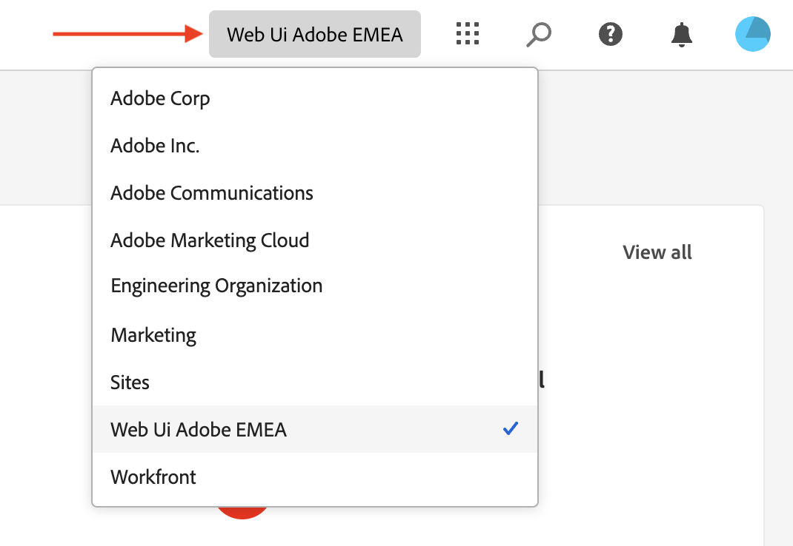
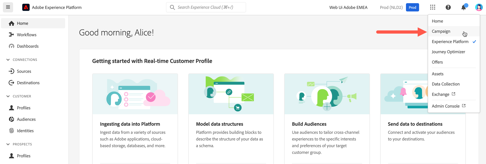

# Anslut till Adobe Campaign {#connect-to-campaign}

Experience Cloud är Adobe integrerade program, produkter och tjänster för digital marknadsföring. Från det intuitiva gränssnittet får du snabbt tillgång till dina molnprogram, produktfunktioner och tjänster. Lär dig hur du ansluter till Adobe Experience Cloud och kommer åt Adobe Campaign webbgränssnitt på den här sidan.

## Logga in på Adobe Experience Cloud {#sign-in-to-exc}

Du kan bara använda enkel inloggning (SSO) för att ansluta till Campaign. Vanligtvis ger Experience Cloud-administratörer tillgång till program och tjänster. Följ stegen i din e-postinbjudan till Experience Cloud.

Så här loggar du in på Adobe Experience Cloud:

1. Gå till [Adobe Experience Cloud](https://experience.adobe.com/){target="_blank"}.

1. Logga in med din Adobe ID eller Enterprise ID. Läs mer om identitetstyper på Adobe i [den här artikeln](https://helpx.adobe.com/se/enterprise/using/identity.html){target="_blank"}.

   När du har loggat in på Experience Cloud får du snabbt tillgång till alla dina lösningar och appar.

   {zoomable="yes"}

1. Kontrollera att du är i rätt organisation.

   {zoomable="yes"}{width="50%" align="left"}

   Läs mer om organisationer i Adobe Experience Cloud i [den här artikeln](https://experienceleague.adobe.com/docs/core-services/interface/administration/organizations.html?lang=sv){target="_blank"}.

## Tillgång till Adobe Campaign {#access-to-campaign}

Om du vill komma åt din Campaign-miljö väljer du **Campaign** i avsnittet **Snabbåtkomst** på Adobe Experience Cloud hemsida.

Om du redan är ansluten till en annan Adobe Experience Cloud-lösning bläddrar du till Campaign-miljön från lösningsväljaren längst upp till höger på skärmen.

{zoomable="yes"}

Om du har tillgång till flera miljöer, inklusive Campaign Control Panel, klickar du på knappen **Launch** för att få rätt instans.

{zoomable="yes"}

Du är nu ansluten till Campaign. Lär dig hur du börjar använda användargränssnittet på [den här sidan](user-interface.md).

### Åtkomstkontroll {#access-control}

>[!CONTEXTUALHELP]
>id="acw_explorer_permissions_create"
>title="Behörighet krävs"
>abstract="Din administratör måste ge dig behörighet innan du kan skapa det här objektet."

>[!CONTEXTUALHELP]
>id="acw_audiences_read_only"
>title="Den här målgruppen är skrivskyddad"
>abstract="Du har inte behörighet att redigera den här målgruppen. Kontakta administratören om det behövs för att ge dig åtkomst."

>[!CONTEXTUALHELP]
>id="acw_subscription_services_read_only"
>title="Tjänsten är skrivskyddad"
>abstract="Du har inte behörighet att redigera den här tjänsten. Kontakta administratören om det behövs för att ge dig åtkomst."

>[!CONTEXTUALHELP]
>id="acw_recipients_readonlyprofile"
>title="Mottagarna har skrivskyddad profil"
>abstract="Du har inte behörighet att redigera den här profilen. Kontakta administratören om det behövs för att ge dig åtkomst."

>[!CONTEXTUALHELP]
>id="acw_campaign_read_only"
>title="Den här kampanjen är skrivskyddad"
>abstract="Du har inte behörighet att redigera den här kampanjen. Kontakta administratören om det behövs för att ge dig åtkomst."

>[!CONTEXTUALHELP]
>id="acw_deliveries_read_only"
>title="Leveransen är skrivskyddad"
>abstract="Du har inte behörighet att redigera den här leveransen. Kontakta administratören om det behövs för att ge dig åtkomst."

>[!CONTEXTUALHELP]
>id="acw_wf_read_only"
>title="Arbetsflödet är skrivskyddat"
>abstract="Du har inte behörighet att redigera det här arbetsflödet. Kontakta administratören om det behövs för att ge dig åtkomst."

Åtkomstkontrollen begränsar åtkomsten till objekt och data från huvudlistor, t.ex. leveranser, mottagare eller arbetsflöden. Dessa begränsningar gäller även i Utforskarens navigeringsträd. Dessutom behöver du behörighet att skapa, ta bort, duplicera och redigera objekt från användargränssnittet.

Alla behörigheter i Campaign Web synkroniseras med behörigheter i Campaign Client Console. Endast kampanjadministratörer kan definiera och ändra användarbehörigheter.

När du bläddrar i användargränssnittet för Campaign-webben kan du komma åt data, objekt och funktioner beroende på dina behörigheter. Om du till exempel inte har åtkomstbehörighet till en mapp kan du inte se den. Dina behörigheter påverkar även objekt och datahantering. Utan skrivbehörighet för en viss mapp kan du inte skapa en leverans i den mappen, även om du kan se den i användargränssnittet.

Du kan lära dig att [visa och hantera behörigheter här](permissions.md).

## Adobe Experience Cloud toppnavigering {#top-bar}

Bläddra i gränssnittets övre fält till:

* Dela feedback om gränssnittet i Campaign Web.
* Växla mellan olika organisationer.
* Växla mellan era Adobe Experience Cloud-lösningar och appar.
* Sök efter hjälp om [Adobe Experience League](https://experienceleague.adobe.com/docs/?lang=sv-SE){target="_blank"}.
* Kontrollera dina produktmeddelanden.
* Redigera din Adobe-profil och hantera inställningar, till exempel [uppdatera ditt favoritspråk](#language-pref) eller [växla till ljust/mörkt tema](#dark-theme).

{zoomable="yes"}{width="50%" align="left"}

## Webbläsare som stöds {#browsers}

Adobe Campaign Web är utformat för att fungera optimalt i den senaste versionen av Google Chrome, Safari och Microsoft Edge. Det kan uppstå problem när du använder vissa funktioner i äldre versioner eller i andra webbläsare.

## Språkinställningar {#language-pref}

Adobe Campaign Web finns på följande språk:

* Engelska (USA) - EN-US
* Franska - FR
* Tyska - DE
* Italienska - IT
* Spanska - ES
* Portugisiska (Brasilien) - PTBR
* Japanska - JP
* Koreanska - KR
* Förenklad kinesiska - CHS
* Traditionell kinesiska - CHT

Dessutom kan språkspecifik formatering (till exempel datum, tider, kalendrar och siffror) även finnas på olika språk som stöds av användargränssnittet:

* Engelska (Israel)
* Engelska (Storbritannien)
* Spanska (Mexiko)
* Spanska (Latinamerika)
* Franska (Kanada)

Ditt standardspråk för Campaign Web avgörs av det språk du föredrar i din användarprofil. Det gäller inte språket för er Campaign-server och kundkonsol.

Så här byter du språk:

1. Klicka på din profilikon längst upp till höger och välj sedan **Inställningar**.
1. Klicka på den språklänk som visas under din e-postadress.
1. Välj önskat språk och klicka på **Spara**. Du kan välja ett andra språk om komponenten som du använder inte är lokaliserad till ditt första språk.

## Mörka och ljusa teman {#dark-theme}

Adobe Campaign finns i ljusa och mörka teman. Som standard är användargränssnittet aktiverat i ljust tema. Om du vill växla till det mörka temat klickar du på din profilikon och använder **det mörka temat** för att aktivera eller inaktivera det.

Användarprofilsinställningar och kontoinställningar beskrivs i [det här avsnittet](https://experienceleague.adobe.com/docs/core-services/interface/experience-cloud.html?lang=sv-SE#preferences){target="_blank"}.

Läs mer om Experience Cloud Central Interface Components i [den här dokumentationen](https://experienceleague.adobe.com/docs/core-services/interface/experience-cloud.html?lang=sv-SE){target="_blank"}.