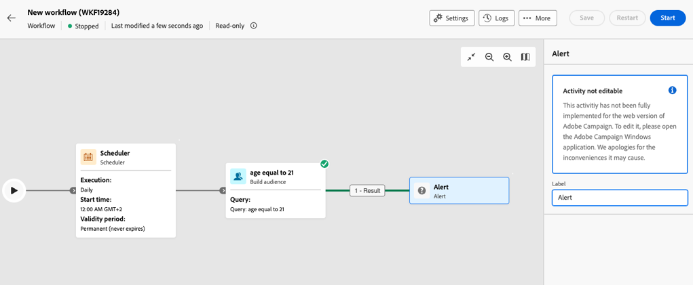
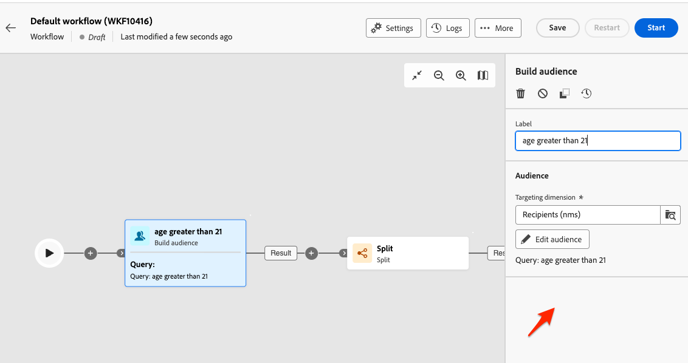
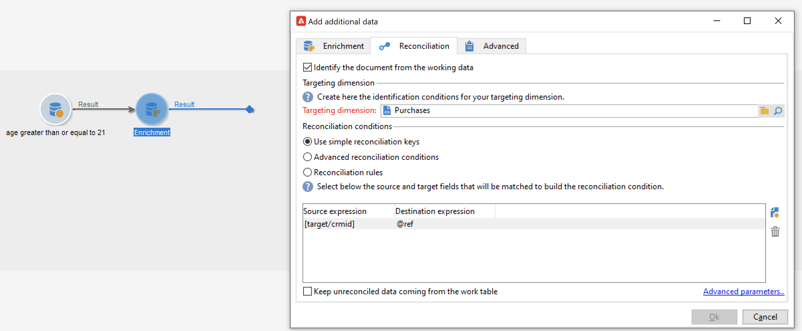
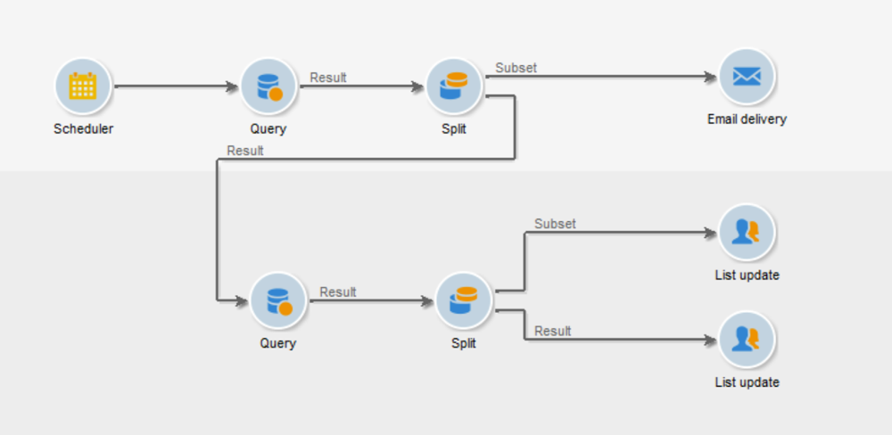

# Skyddsritningar och begränsningar {#guardrails-limitations}

När du arbetar i gränssnittet för Campaign-webben med arbetsflöden som skapats eller ändrats i klientkonsolen för Campaign gäller de skyddsmekanismer och begränsningar som anges nedan.

Observera att även om den här sidan identifierar viktiga aspekter när du arbetar med arbetsflöden i konsolen och i webbanvändargränssnittet så omfattar den inte alla möjliga inkompatibiliteter mellan de två gränssnitten.

## Arbetsflödesaktiviteter {#wkf-activities}

Arbetsflödesaktiviteter som ännu inte stöds i Campaign Web är skrivskyddade och visas som inkompatibla aktiviteter. Du kan fortfarande köra arbetsflödet, skicka meddelanden, kontrollera loggarna osv. Arbetsflödesaktiviteter som är tillgängliga både i Campaign Web och i klientkonsolen går att redigera.

Arbetsflödesaktiviteter som ännu inte stöds i gränssnittet för Campaign-webben är skrivskyddade och visas som inkompatibla aktiviteter. Du kan fortfarande köra arbetsflödet, skicka meddelanden, kontrollera loggarna osv. Arbetsflödesaktiviteter som är tillgängliga både i gränssnittet för Campaign-webben och i klientkonsolen för Campaign kan redigeras.

| Konsol | Webb |
| --- | --- |
| {width="800px" align="left" zoomable="yes"} | {width="800px" align="left" zoomable="yes"} |

När en **Fråga** eller en **Berikning** -aktiviteten har konfigurerats med ytterligare data i konsolen. Anrikningsdata beaktas i Campaign Web och skickas till den utgående övergången, men kan inte redigeras.

| Konsol | Webb |
| --- | --- |
| {width="800px" align="left" zoomable="yes"} | {width="800px" align="left" zoomable="yes"} |

I konsolen **Berikning** kan utföra både avstämning och anrikning. Om du har definierat avstämningsinställningarna i klientkonsolen i **Berikning** aktivitet, visas som en **Avstämning** i Campaign Web-användargränssnittet.

| Konsol | Webb |
| --- | --- |
| {width="800px" align="left" zoomable="yes"} | {width="800px" align="left" zoomable="yes"} |

## Arbetsyta {#wkf-canvas}

När du skapar ett nytt arbetsflöde i gränssnittet för Campaign-webben har arbetsytan bara stöd för en startpunkt. Men om du skapade ett arbetsflöde i konsolen med flera startpunkter kan du öppna och redigera det i Campaign Web-gränssnittet.

| Konsol | Webb |
| --- | --- |
| {width="800px" align="left" zoomable="yes"} | {width="800px" align="left" zoomable="yes"} |

Nodernas placering uppdateras varje gång en aktivitet läggs till eller tas bort. Om du skapar ett arbetsflöde i konsolen, ändrar det med hjälp av användargränssnittet i Campaign-webben och öppnar det igen i konsolen, kan du märka att det finns mindre brister i positioneringen. Detta påverkar inte arbetsflödets processer och uppgifter.

| Inledande arbetsflöde | Positioneringsändring |
| --- | --- |
| {width="800px" align="left" zoomable="yes"} | {width="800px" align="left" zoomable="yes"} |
