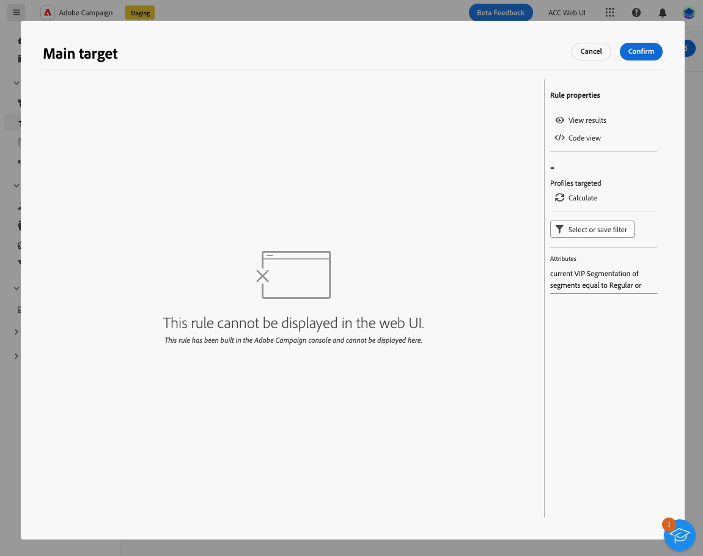

# Skyddsritningar och begränsningar {#guardrails-limitations}

När du arbetar i webbgränssnittet för Campaign med komponenter som skapats eller ändrats i klientkonsolen för Campaign gäller de skyddsmekanismer och begränsningar som anges nedan.

## Arbetsflöden {#wf-guardrails-limitations}

Samma arbetsflöde kan nås både i konsolen och i webbgränssnittet. Tänk dock på att vissa begränsningar gäller.

**Activity Edition**

* När du får åtkomst till ett konsolarbetsflöde i webbgränssnittet kan du bara ändra aktiviteter som är kompatibla.

**Canvas**

* Om ett konsolarbetsflöde har flera startnoder/grenar eller flytande aktiviteter måste du lägga till en startaktivitet och en gaffel för att ansluta startnoder till huvudnoden. Du måste också ta bort flytande aktiviteter.

**Aktivitetsposition**

* Positioneringen av noderna beräknas om (den ursprungliga positionen för aktiviteterna ändras därför) endast när en aktivitet har lagts till eller tagits bort (inte hela tiden).

**Oexponerade alternativ**

* Alternativ som inte är kompatibla visas inte i webbgränssnittet.

**Loopar**

* Arbetsflöden och slingor visas inte i webbgränssnittet. Ett felmeddelande visas.

**Avstämning och berikning**

I Campaign-klientkonsolen **Berikning** kan utföra både avstämning och anrikning. I webbgränssnittet för Campaign är avstämningsfunktionerna ännu inte tillgängliga. Om du har angett avstämning i konsolaktiviteten visas den som en icke-kompatibel aktivitet i webbgränssnittet.

* Om **Berikning** i konsolen endast utför en anrikning, **Berikning** visas på webben.
* Om **Berikning** en aktivitet i konsolen utför bara en avstämning. En inkompatibel aktivitet visas.

## Fördefinierade filter {#filters-guardrails-limitations}

Vissa fördefinierade filter är inte tillgängliga när du väljer målgrupp för en leverans eller när du skapar en målgrupp i ett arbetsflöde. Ett specifikt felmeddelande visas. Du kan fortfarande använda frågan och se: filtreringsvillkoret och resultatet, men du kan inte visa den exakta frågan i regelbyggaren och kan inte redigera filtret.

