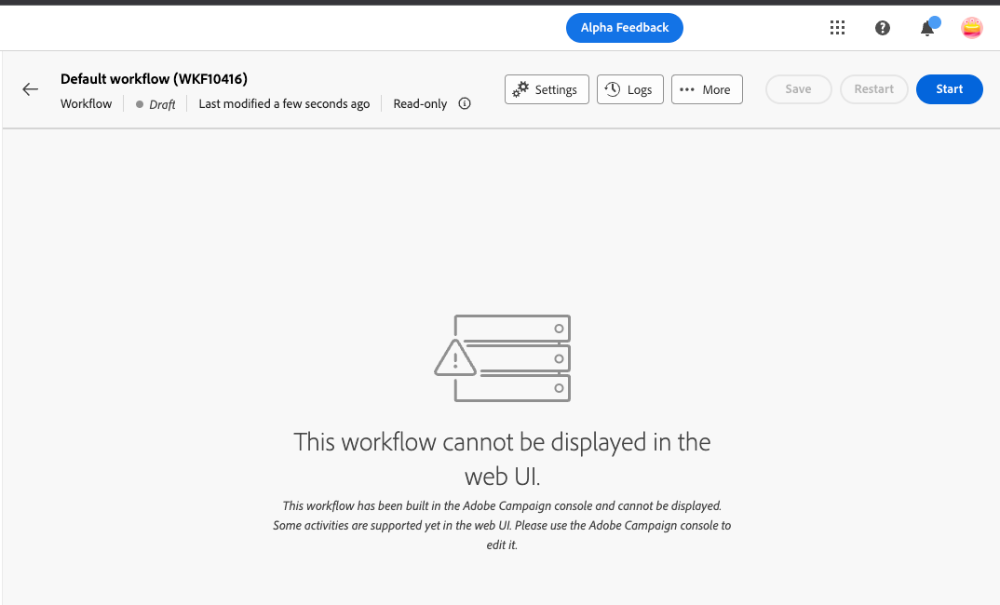

# Skyddsritningar och begränsningar {#guardrails-limitations}

När du arbetar i webbgränssnittet för Campaign med komponenter som skapats eller ändrats i klientkonsolen för Campaign gäller de skyddsmekanismer och begränsningar som anges nedan.

## Arbetsflöden {#wf-guardrails-limitations}

Samma arbetsflöde kan nås både i konsolen och i webbgränssnittet. Tänk dock på att vissa begränsningar gäller.

**Activity Edition**

* När du får åtkomst till ett konsolarbetsflöde i webbgränssnittet kan du bara ändra aktiviteter som är kompatibla.

**Canvas**

* Om ett konsolarbetsflöde har flera startnoder/grenar eller flytande aktiviteter måste du lägga till en startaktivitet och en gaffel för att ansluta startnoder till huvudnoden. Du måste också ta bort flytande aktiviteter.

**Aktivitetsposition**

* Positioneringen av noderna beräknas om (den ursprungliga positionen för aktiviteterna ändras därför) endast när en aktivitet har lagts till eller tagits bort (inte hela tiden).

**Oexponerade alternativ**

* Alternativ som inte är kompatibla visas inte i webbgränssnittet.

**Loopar**

* Loopar är ännu inte tillgängliga i webbgränssnittet. Om du har skapat ett arbetsflöde med en slinga med konsolen går det inte att komma åt det i webbgränssnittet. Ett felmeddelande visas.

<table>
<tr>
<th>Konsol</th>
<th>Webbgränssnitt</th>
</tr>
<tr>
<td></td>
<td></td>
</tr>
</table>

**Avstämning och berikning**

I Campaign-klientkonsolen **Berikning** kan utföra både avstämning och anrikning. I webbgränssnittet för Campaign är avstämningsfunktionerna ännu inte tillgängliga. Om du har angett avstämning i konsolaktiviteten visas den som en icke-kompatibel aktivitet i webbgränssnittet.

* Om **Berikning** i konsolen endast utför en anrikning, **Berikning** visas på webben.
* Om **Berikning** en aktivitet i konsolen utför bara en avstämning. En inkompatibel aktivitet visas.

## Fördefinierade filter {#filters-guardrails-limitations}

När du väljer målgrupp för en leverans, eller när du skapar en målgrupp i ett arbetsflöde, är vissa fördefinierade filter inte tillgängliga i användargränssnittet i den versionen av produkten.

Ett specifikt felmeddelande visas. Även om du inte kan visa den grafiska representationen av frågan i regelbyggaren och inte kan redigera filtret, kan du fortfarande använda det och se filtervillkoren och resultatet. Du kan även komma åt SQL-frågan för att kontrollera de exakta inställningarna.

{width="70%" align="left"}

Observera, att om du skapar ett filter i webbgränssnittet och ändrar det i konsolen med attribut som inte stöds, kan den grafiska representationen inte längre vara tillgänglig i webbgränssnittet. I alla fall kan du fortfarande använda filtret.

Attribut som inte stöds visas nedan.

### Datatyper som inte stöds {#unsupported-data-type}

Följande datatyper som är tillgängliga i klientkonsolen stöds inte när ett filter eller en regel visas i webbgränssnittet:

* datetime
* tid
* tidsintervall
* double
* float

### Filtreringsfunktioner som inte stöds {#unsupported-filtering-capabilities}

När ett filter skapas med komplexa uttryck och funktioner i klientkonsolen kan det inte redigeras i webbgränssnittet.

Dessutom stöds inte följande operatorer:

* Numerisk typ
   * ingår i
   * no in

* Strängtyp
   * större än
   * mindre än
   * större än eller lika med
   * mindre än eller lika med
   * gilla
   * inte som

* Datumtyp
   * på eller efter
   * på eller före
   * inte lika med
   * är tom
   * är inte tom
   * ingår i
   * inte i
   * senast

* 1-N-länkar
   * COUNT, SUM, AVG, MIN, MAX