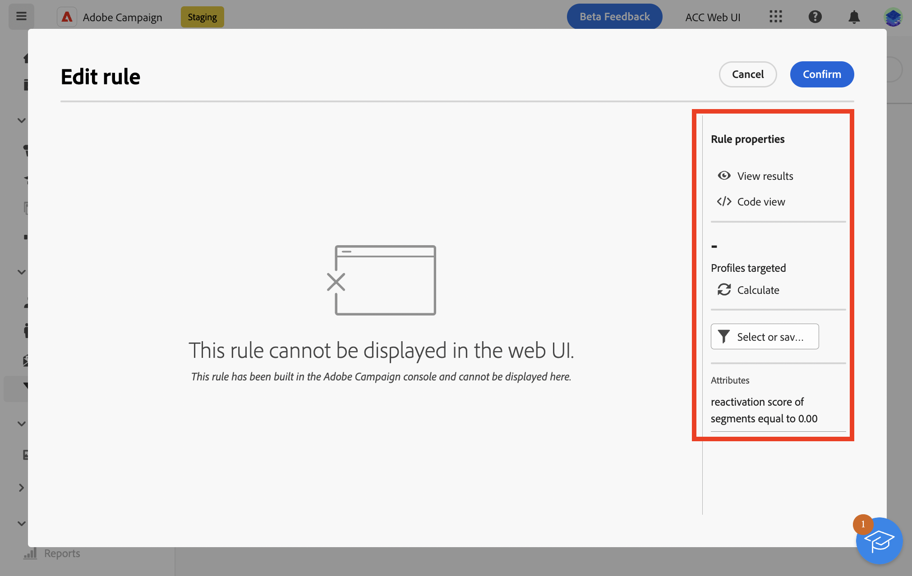
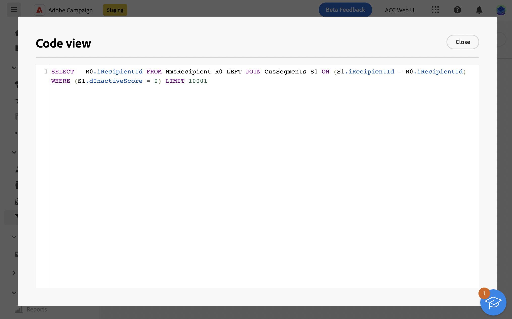
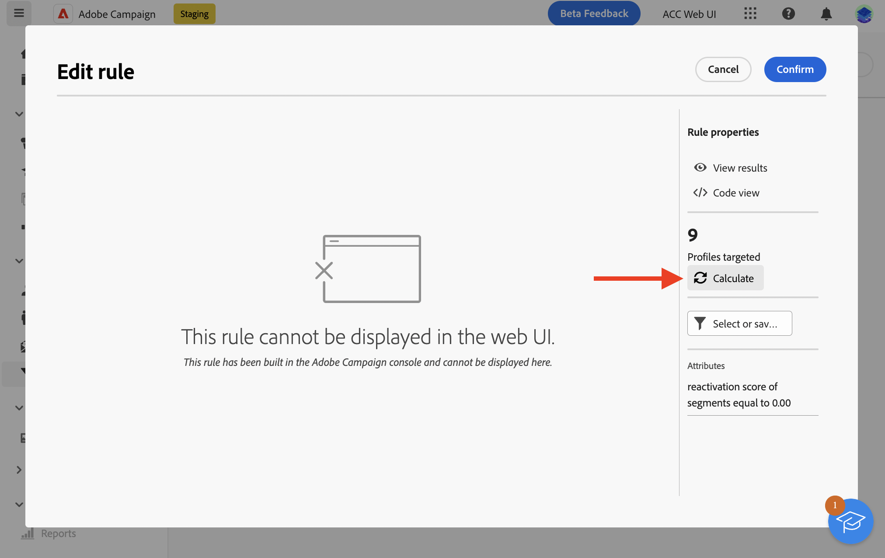
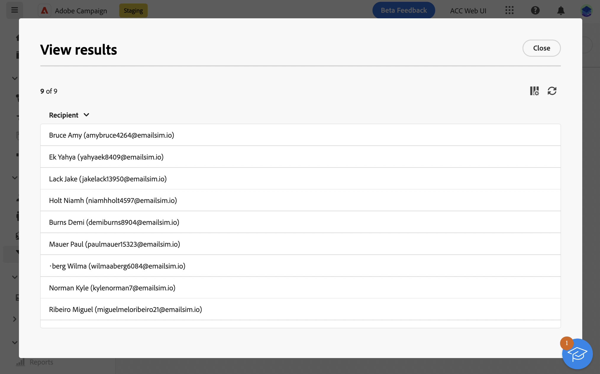

# Skyddsritningar och begränsningar {#guardrails-limitations}

När du arbetar i Campaign-webbgränssnittet med komponenter som skapats eller ändrats i Campaign-klientkonsolen gäller de skyddsmekanismer och begränsningar som anges nedan.

## Arbetsflöden {#wf-guardrails-limitations}

### Verksamhet

Arbetsflödesaktiviteter som ännu inte stöds i gränssnittet för Campaign-webben är skrivskyddade och visas som inkompatibla aktiviteter. Du kan fortfarande köra arbetsflödet, skicka meddelanden, kontrollera loggarna osv. Arbetsflödesaktiviteter som är tillgängliga både i gränssnittet för Campaign-webben och i klientkonsolen för Campaign kan redigeras.

| Konsol | Webb |
| --- | --- |
| {width="800px" align="left" zoomable="yes"} | {width="800px" align="left" zoomable="yes"} |

Inställningar för arbetsflödesaktivitet som ännu inte stöds i webbanvändargränssnittet visas inte. När arbetsflödet körs gäller dock dessa inställningar.

| Konsol | Webb |
| --- | --- |
| {width="800px" align="left" zoomable="yes"} | {width="800px" align="left" zoomable="yes"} |

I konsolen **Berikning** kan utföra både avstämning och anrikning. Avstämningsfunktionerna är ännu inte tillgängliga i Campaign Web-användargränssnittet. Om du har definierat avstämningsinställningarna i klientkonsolen i **Berikning** -aktiviteten visas som en ej kompatibel skrivskyddad aktivitet i webbgränssnittet för Campaign.

| Konsol | Webb |
| --- | --- |
| {width="800px" align="left" zoomable="yes"} | {width="800px" align="left" zoomable="yes"} |

### Arbetsyta

När du skapar ett nytt arbetsflöde i gränssnittet för Campaign-webben har arbetsytan bara stöd för en startpunkt. Men om du skapade ett arbetsflöde i konsolen med flera startpunkter kan du öppna och redigera det i Campaign Web-gränssnittet.

| Konsol | Webb |
| --- | --- |
| {width="800px" align="left" zoomable="yes"} | {width="800px" align="left" zoomable="yes"} |

Loopar är ännu inte tillgängliga i Campaign Web-användargränssnittet. Om du skapade ett arbetsflöde med en slinga med konsolen kan du inte komma åt det från webbgränssnittet i Campaign. Ett felmeddelande visas.

| Konsol | Webb |
| --- | --- |
| {width="800px" align="left" zoomable="yes"} | {width="800px" align="left" zoomable="yes"} |

Nodernas placering uppdateras varje gång en aktivitet läggs till eller tas bort. Om du skapar ett arbetsflöde i konsolen, ändrar det med hjälp av användargränssnittet i Campaign-webben och öppnar det igen i konsolen, kan du märka att det finns mindre brister i positioneringen. Detta påverkar inte arbetsflödets processer och uppgifter.

| Inledande arbetsflöde | Positioneringsändring |
| --- | --- |
| {width="800px" align="left" zoomable="yes"} | {width="800px" align="left" zoomable="yes"} |

## Fördefinierade filter {#filters-guardrails-limitations}

>[!CONTEXTUALHELP]
>id="acw_predefined_filter_read_only"
>title="Filtret är skrivskyddat"
>abstract="Vissa fördefinierade filter är inte tillgängliga i användargränssnittet i den versionen av produkten. Dessa filter är skrivskyddade. Även om du inte kan visa den grafiska representationen av frågan i frågemodelleraren, och inte kan redigera filtret, kan du fortfarande använda det och se filtervillkoren i **Attribut** på skärmen."

När du väljer målgrupp för en leverans, eller när du skapar en målgrupp i ett arbetsflöde, är vissa fördefinierade filter inte tillgängliga i användargränssnittet i den versionen av produkten. Dessa filter är skrivskyddade.

Ett specifikt felmeddelande visas.

{width="70%" align="left"}

Även om du inte kan visa den grafiska representationen av frågan i frågemodelleraren, och inte kan redigera filtret, kan du fortfarande använda det och se filtervillkoren i **Attribut** på skärmen.

{width="70%" align="left"}

Du kan även komma åt SQL-frågan för att kontrollera de exakta inställningarna. Klicka på **kodvyn** -knappen.

{width="70%" align="left"}

Klicka på **Beräkna** för att kontrollera hur många objekt som uppfyller filtervillkoren.

{width="70%" align="left"}

Använd **Visa resultat** för att visa dessa objekt.

{width="70%" align="left"}

Observera, att om du skapar ett filter i webbgränssnittet och ändrar det i konsolen med attribut som inte stöds, kan den grafiska representationen inte längre vara tillgänglig i webbgränssnittet. I alla fall kan du fortfarande använda filtret.

Attribut som inte stöds visas nedan.

### Datatyper som inte stöds {#unsupported-data-type}

Följande datatyper som är tillgängliga i klientkonsolen stöds inte när ett filter eller en regel visas i webbgränssnittet:

* datetime
* tid
* tidsintervall
* double
* float

### Filtreringsfunktioner som inte stöds {#unsupported-filtering-capabilities}

När ett filter skapas med komplexa uttryck och funktioner i klientkonsolen kan det inte redigeras i webbgränssnittet.

Dessutom stöds inte följande operatorer:

* Numerisk typ
   * ingår i
   * no in

* Strängtyp
   * större än
   * mindre än
   * större än eller lika med
   * mindre än eller lika med
   * gilla
   * inte som

* Datumtyp
   * på eller efter
   * på eller före
   * inte lika med
   * är tom
   * är inte tom
   * ingår i
   * inte i
   * senast

* 1-N-länkar
   * COUNT, SUM, AVG, MIN, MAX
