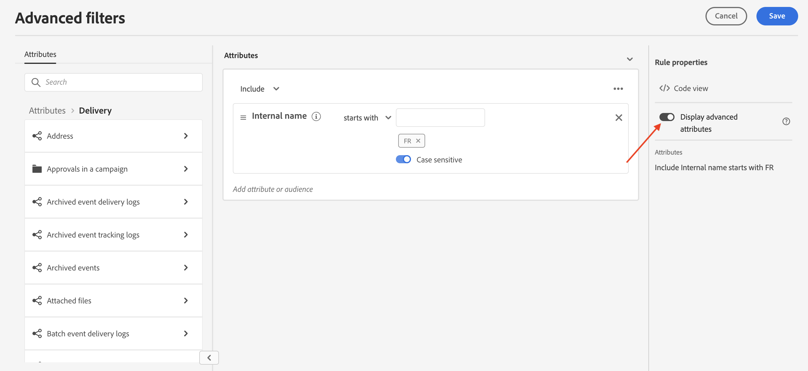

# Bläddra bland, söka i och filtrera listor {#list-screens}

De flesta länkar från den vänstra navigeringsmenyn visar listor med objekt, t.ex. listan med **Leveranser** eller **Kampanjer**. Vissa av dessa listskärmar är skrivskyddade. Du kan anpassa listvisningen och filtrera listorna enligt nedan.

Om du vill ta bort ett filter klickar du på **Rensa alla** -knappen.

## Anpassa listskärmar {#custom-lists}

Listorna visas i kolumner. Du kan visa ytterligare information genom att ändra kolumnkonfigurationen. Om du vill göra det klickar du på **Konfigurera kolumn för en anpassad layout** -ikonen i det övre högra hörnet av listan.

{width="70%" align="left" zoomable="yes"}

I **Konfigurera kolumner** rastrera, lägga till eller ta bort kolumner och ändra visningsordningen.

Exempel:

{width="70%" align="left" zoomable="yes"}

I listan visas följande kolumner:

{width="70%" align="left" zoomable="yes"}

Använd **Visa avancerade attribut** om du vill visa alla attribut för den aktuella listan. [Läs mer](#adv-attributes)

## Sortera data {#sort-lists}

Du kan också sortera objekt i listan genom att klicka på en kolumnrubrik. En pil visas (Upp eller Ned) som anger att listan är sorterad i den kolumnen.

För numeriska kolumner och datumkolumner finns **Upp** anger att listan är sorterad i stigande ordning medan **Ned** pil anger en fallande ordning. För strängar eller alfanumeriska kolumner visas värdena i alfabetisk ordning.

## Inbyggda filter {#list-built-in-filters}

Om du vill hitta objekt snabbare kan du använda sökfältet eller filtrera listan baserat på sammanhangsberoende kriterier.

{width="70%" align="left" zoomable="yes"}

Du kan till exempel filtrera leveranser efter status, kanal, kontaktdatum eller mapp. Du kan också dölja tester.

## Egna filter{#list-custom-filters}

Om du vill skapa anpassade filter för data bläddrar du längst ned i filtren och klickar på **Lägg till regler** -knappen.

Dra och släpp attribut för att skapa filtervillkor i **Avancerade filter** skärm.

{width="70%" align="left" zoomable="yes"}

Använd **Visa avancerade attribut** om du vill visa alla attribut för den aktuella listan. [Läs mer](#adv-attributes)

## Använd avancerade attribut {#adv-attributes}

>[!CONTEXTUALHELP]
>id="acw_attributepicker_advancedfields"
>title="Visa avancerade attribut"
>abstract="Endast de vanligaste attributen visas som standard i attributlistan. Använd den här växeln för att skapa ett filter med avancerade attribut."

>[!CONTEXTUALHELP]
>id="acw_rulebuilder_advancedfields"
>title="Avancerade fält för regelbyggaren"
>abstract="Konfigurera kolumner med avancerade fält."

>[!CONTEXTUALHELP]
>id="acw_rulebuilder_properties_advanced"
>title="Avancerade attribut i regelbyggaren"
>abstract="Använd avancerade attribut för att definiera regeln."

Endast de vanligaste attributen visas som standard i attributlistan och på filterkonfigurationsskärmar. Attribut som angetts som `advanced` attribut i dataschemat döljs från konfigurationsskärmarna.

Aktivera **Visa avancerade attribut** om du vill visa alla tillgängliga attribut för den aktuella listan: attributlistan uppdateras omedelbart.

{width="70%" align="left" zoomable="yes"}
