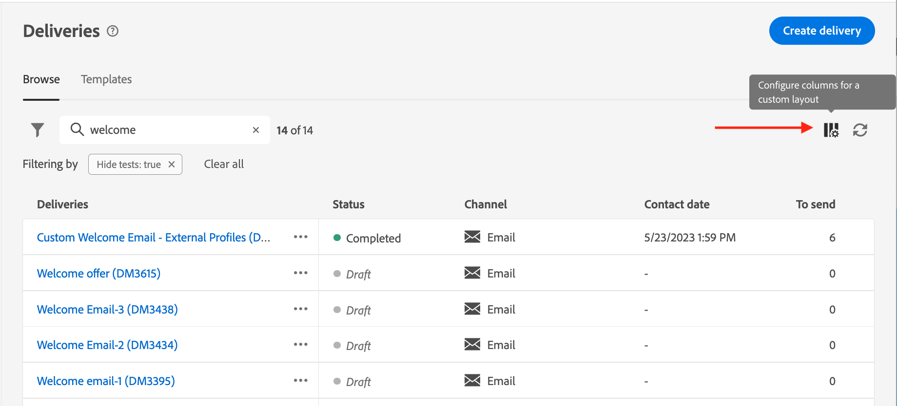

# Bläddra i och filtrera listor {#list-screens}

De flesta länkar från den vänstra navigeringsmenyn visar listor med objekt, t.ex. listan med **Leveranser** eller **Kampanjer**. Vissa av dessa listskärmar är skrivskyddade. Du kan anpassa listvisningen och filtrera listorna enligt nedan.

## Anpassa listskärmar {#custom-lists}

Listorna visas i kolumner. Du kan visa ytterligare information genom att ändra kolumnkonfigurationen. Klicka på **Konfigurera kolumn för en anpassad layout** -ikonen i det övre högra hörnet av listan.

{zoomable=&quot;yes&quot;}{width="70%" align="left" zoomable="yes"}

I **Konfigurera kolumner** rastrera, lägga till eller ta bort kolumner och ändra visningsordningen.

För dessa inställningar:

{zoomable=&quot;yes&quot;}{width="70%" align="left" zoomable="yes"}

I listan visas följande kolumner:

{zoomable=&quot;yes&quot;}{width="70%" align="left" zoomable="yes"}

## Sortera data {#sort-lists}

Du kan också sortera objekt i listan genom att klicka på en kolumnrubrik. En pil visas (Upp eller Ned) som anger att listan är sorterad i den kolumnen.

För numeriska kolumner och datumkolumner finns **Upp** anger att listan är sorterad i stigande ordning medan **Ned** pil anger en fallande ordning. För strängar eller alfanumeriska kolumner visas värdena i alfabetisk ordning.

## Filter {#list-built-in-filters}

Om du vill hitta objekt snabbare kan du använda sökfältet eller inbyggda och anpassade filter för att anpassa listan baserat på sammanhangsberoende kriterier.

{zoomable=&quot;yes&quot;}{width="70%" align="left" zoomable="yes"}

Detaljerad information om hur du använder filter och skapar egna filter finns i [det här avsnittet](../query/filter.md).

<!--
## Use advanced attributes {#adv-attributes}

>[!CONTEXTUALHELP]
>id="acw_attributepicker_advancedfields"
>title="Display advanced attributes"
>abstract="Only the most common attributes are displayed by default in the attribute list. Activate the **Display advanced attributes** toggle to see all available attributes for the current list in the left palette of the rule builder, such as nodes, groupings, 1-1 links, 1-N links."

>[!CONTEXTUALHELP]
>id="acw_rulebuilder_advancedfields"
>title="Rule builder advanced fields"
>abstract="Only the most common attributes are displayed by default in the attribute list. Activate the **Display advanced attributes** toggle to see all available attributes for the current list in the left palette of the rule builder, such as nodes, groupings, 1-1 links, 1-N links."

>[!CONTEXTUALHELP]
>id="acw_rulebuilder_properties_advanced"
>title="Rule builder advanced attributes"
>abstract="Only the most common attributes are displayed by default in the attribute list. Activate the **Display advanced attributes** toggle to see all available attributes for the current list in the left palette of the rule builder, such as nodes, groupings, 1-1 links, 1-N links."

Only most common attributes are displayed by default in the attribute list and filter configuration screens. Attributes which were set as `advanced` attributes in the data schema are hidden from the configuration screens. 

Activate the **Display advanced attributes** toggle to see all available attributes for the current list in the left palette of the rule builder, such as nodes, groupings, 1-1 links, 1-N links. The attribute list is updated instantly.

{zoomable="yes"}{width="70%" align="left" zoomable="yes"}
-->