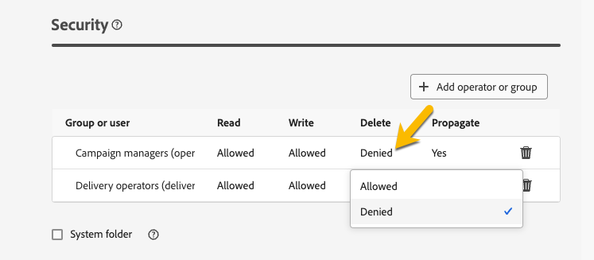

# Behörigheter {#permissions}

Varje användare i Adobe Campaign har särskilda behörigheter och begränsningar i programmet. Användaren kan tillhöra en operatorgrupp och ärva gruppens behörigheter.

Baserat på deras behörigheter kan en operator:

* Åtkomst till vissa funktioner
* Åtkomst till vissa data
* Åtkomst till vissa åtgärder (skapa, ändra, ta bort)

En detaljerad procedur för att konfigurera behörigheter i Adobe Campaign finns i [Adobe Campaign v8-dokumentationen (konsolen)](https://experienceleague.adobe.com/en/docs/campaign/campaign-v8/admin/permissions/gs-permissions){target="_blank"}.

## Behörigheter för mappar {#folder-permissions}

Beroende på dina rättigheter kan du visa och hantera behörigheter för mappar i **[!UICONTROL Folder settings]**.

Nedan visas ett exempel på en leveransmapp:

{zoomable="yes"}

I avsnittet **[!UICONTROL Security]** i **[!UICONTROL Folder settings]** kan du visa och hantera operatorer eller grupper som kan komma åt mappen.

{zoomable="yes"}

Du kan klicka direkt på behörigheterna och ändra dem till antingen **[!UICONTROL Allowed]** eller **[!UICONTROL Denied]**.

{zoomable="yes"}

Om alternativet **[!UICONTROL Propagate]** är aktiverat gäller alla behörigheter som definierats för en mapp för alla dess undermappar. Dessa behörigheter kan åsidosättas för varje undermapp.

Om alternativet **[!UICONTROL System folder]** är markerat tillåts åtkomst till alla operatorer, oavsett deras behörigheter.

Du kan också [hantera behörigheter för mappar i Adobe Campaign-konsolen](https://experienceleague.adobe.com/en/docs/campaign/campaign-v8/admin/permissions/folder-permissions){target="_blank"}.

Alla behörigheter i gränssnittet för Campaign-webben synkroniseras med behörigheterna för Campaign-klientkonsolen.