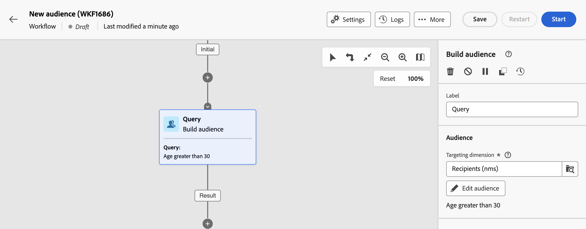

# Arbeta med fördefinierade filter {#predefined-filters}

>[!CONTEXTUALHELP]
>id="acw_homepage_learning_card4"
>title="Fördefinierad filterhantering"
>abstract="Campaign Web-gränssnittet har ett användarvänligt gränssnitt där du enkelt kan hantera och anpassa fördefinierade filter efter just dina behov. Skapa en gång och spara för framtida bruk."

>[!CONTEXTUALHELP]
>id="acw_predefined-filters-dashboard"
>title="Fördefinierade filter"
>abstract="Campaign Web-gränssnittet är ett användarvänligt gränssnitt där du enkelt kan hantera och anpassa fördefinierade filter efter just dina behov. Skapa en gång och spara för framtida bruk."

Fördefinierade filter är anpassade filter som skapas och sparas för att vara tillgängliga för framtida bruk. De kan användas som genvägar under alla filtreringsåtgärder med frågemodelleraren, t.ex. när en lista med data filtreras eller när målgruppen för en leverans skapas.

Du kan använda befintliga inbyggda filter för att få tillgång till en viss delmängd av dina data, eller skapa egna fördefinierade filter och spara dem.

{zoomable="yes"}{zoomable="yes"}

## Skapa ett fördefinierat filter {#create-predefined-filter}

>[!CONTEXTUALHELP]
>id="acw_predefined-filters-creation"
>title="Skapa ett fördefinierat filter"
>abstract="Ange en etikett för det fördefinierade filtret och markera den tabell det gäller. Öppna de andra alternativen för att lägga till en beskrivning och ange det här filtret som en favorit. Använd sedan knappen Skapa regel för att definiera filtervillkoren."

>[!CONTEXTUALHELP]
>id="acw_predefined-filters-rules"
>title="Skapa fördefinierade filterregler"
>abstract="Om du vill definiera filtervillkoren för det anpassade filtret klickar du på knappen Skapa regel."

### Skapa ett filter från frågemodelleraren {#create-from-rule-builder}

Du kan spara ett anpassat filter från [frågemodelleraren](../query/query-modeler-overview.md) om du vill att det ska vara tillgängligt för framtida bruk. Följ de här stegen:

1. Öppna frågemodelleraren och definiera filtervillkoren. I exemplet nedan filtrerar du mottagare som bor i Madrid och prenumererar på ett nyhetsbrev.
1. Klicka på knappen **Markera eller spara filter** och välj **Spara som filter**.

   {zoomable="yes"}

1. Välj **Skapa ett nytt filter** och ange ett namn och en beskrivning för det filtret.

   {zoomable="yes"}

   Du kan spara filtret som en favorit om det behövs. Läs mer i [det här avsnittet](#fav-filter).

1. Klicka på **Bekräfta** för att spara ändringarna.

Ditt anpassade filter är nu tillgängligt i listan **Fördefinierade filter** och tillgängligt för alla Campaign-användare.

### Skapa ett filter från filterlistan {#create-filter-from-list}

Du kan skapa ett filter från posten **Fördefinierade filter** i den vänstra menyn. Gör så här:

1. Bläddra i posten **Fördefinierade filter** på den vänstra menyn.
1. Klicka på knappen **Skapa filter** .
1. Ange filternamnet och välj det schema som det gäller i fältet **Dokumenttyp**. Standardschemat är `Recipients(nms)`.

1. Definiera regeln för filtret. Till exempel profiler äldre än 30.

   {zoomable="yes"}

1. Spara ändringarna.

   {zoomable="yes"}

Filtret läggs till i den fördefinierade filterlistan. Du kan spara filtret som en favorit om det behövs. Läs mer i [det här avsnittet](#fav-filter).

## Spara filtret som en favorit {#fav-filter}

När du skapar ett fördefinierat filter kan du aktivera alternativet **Spara som favorit** om du vill se det här fördefinierade filtret i dina favoriter.

När ett filter sparas som en favorit är det tillgängligt för alla användare i avsnittet **Favoritfilter** i listan för att skapa filter, vilket visas nedan:

{zoomable="yes"}{width="30%" align="left"}

## Använda ett fördefinierat filter {#use-predefined-filter}

Fördefinierade filter är tillgängliga när du definierar regelegenskaper. Om du vill komma åt fördefinierade filter väljer du alternativet **Välj eget filter** i listrutan för frågemodelleraren.

Du kan sedan komma åt den fullständiga listan med fördefinierade filter som är tillgängliga för den aktuella kontexten och använda kortkommandon som är tillgängliga i avsnittet **Favoritfilter** i listrutan. Läs mer om favoriter i [det här avsnittet](#fav-filter).

Om du till exempel vill skapa en målgrupp från ett fördefinierat filter följer du de här stegen:

1. Bläddra till posten **Publiker** i den vänstra menyn och klicka på knappen **Skapa publik** i det övre vänstra hörnet av målgruppslistan.
1. Ange målgruppens namn och klicka på knappen **Skapa publik** .
1. Välj aktiviteten **Fråga** och klicka på knappen **Skapa målgrupp** i den högra rutan.

   {zoomable="yes"}

1. Välj alternativet **Välj eget filter** från knappen **Markera eller spara filter**.

   {zoomable="yes"}

1. Bläddra till det fördefinierade filtret som du vill använda för att skapa målgruppen, markera det och bekräfta.

   {zoomable="yes"}

1. Kontrollera regelegenskaperna för det här filtret och bekräfta.

   Filtret används nu som en fråga i aktiviteten **Fråga**.

   {zoomable="yes"}

1. Spara ändringarna och klicka på knappen **Start** för att skapa målgruppen och göra den tillgänglig i målgruppslistan.

## Hantera dina fördefinierade filter {#manage-predefined-filter}

Alla fördefinierade filter grupperas tillsammans i den dedikerade posten på den vänstra navigeringsmenyn.

{zoomable="yes"}

I den här listan kan du skapa ett nytt filter enligt beskrivningen ovan och utföra följande åtgärder:

* Redigera ett befintligt filter, ändra dess regler och egenskaper.
* Duplicera ett fördefinierat filter.
* Ta bort ett fördefinierat filter.

Du kan också lägga till ett fördefinierat filter som favorit för att få snabb åtkomst när du skapar målgrupper. Läs mer i [det här avsnittet](#fav-filter).

<!--
## Built-in predefined filters {#ootb-predefined-filter}

Campaign comes with a set of predefined filters, built from the client console. These filters can be used to define your audiences, and rules. They must not be modified.
-->
