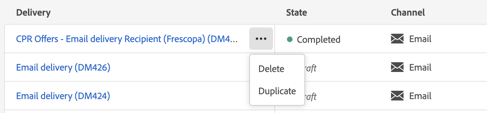
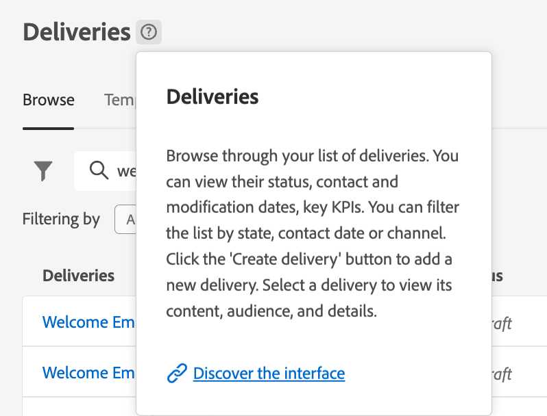

# Upptäck gränssnittet {#user-interface}

Det nya webbgränssnittet Campaign v8 erbjuder en modern och intuitiv användarupplevelse som förenklar utformningen och leveransen av marknadsföringskampanjer. Det nya gränssnittet är integrerat med Adobe Experience Cloud program och lösningar.

>[!NOTE]
>
>Den här dokumentationen uppdateras ofta för att återspegla de senaste ändringarna i produktanvändargränssnittet. Vissa skärmbilder kan dock skilja sig något från användargränssnittet.

## Navigeringsmeny till vänster {#user-interface-left-nav}

Bläddra bland länkarna till vänster för att få tillgång till webbfunktionerna i Campaign v8. Flera länkar visar listor med objekt som kan sorteras och filtreras. Du kan också konfigurera kolumner så att all information som du behöver visas. Se det här [section](#list-screens). Vissa listskärmar är skrivskyddade. Vilka alternativ som visas på den vänstra navigeringsmenyn och i listorna beror på dina användarbehörigheter. Läs mer om behörigheter i [det här avsnittet](permissions.md).

### Startsida {#user-interface-home}

Skärmen innehåller länkar och resurser som gör att du snabbt kommer åt de viktigaste webbfunktionerna i Campaign v8.

>[!CONTEXTUALHELP]
>id="acw_homepage_recent"
>title="Senaste"
>abstract="The **Senaste** listan innehåller genvägar till de nyligen skapade och ändrade leveranserna. Den här listan visar deras kanal, status, ägare, datum för skapande och ändring."

The **Senaste** listan innehåller genvägar till de nyligen skapade och ändrade leveranserna. Den här listan visar deras kanal, status, ägare, datum för skapande och ändring. Klicka på **Visa mer** för att ladda fler leveranser.

The **Viktiga resultatindikatorer** gör att du kan kontrollera plattformens effektivitet med hjälp av gemensamma nyckeltal. Läs mer om dessa KPI:er i [den här sidan](../reporting/kpis.md).

Få åtkomst till hjälpsidorna för webbnyckel v8 från **Utbildning** på startsidan.

### Explorer {#user-interface-explorer}

>[!CONTEXTUALHELP]
>id="acw_explorer"
>title="Explorer"
>abstract="The **Explorer** På -menyn visas alla Campaign-komponenter och -objekt med samma mapphierarki som på klientkonsolen. Bläddra bland alla komponenter, mappar och scheman i Campaign v8, kontrollera tillhörande behörigheter och skapa mappar och undermappar på den här menyn."

The **Explorer** I visas alla Campaign-resurser och -objekt med samma mapphierarki som i klientkonsolen. Bläddra bland alla komponenter, mappar och scheman i Campaign v8 och skapa leveranser, arbetsflöden och kampanjer.

Objekten som visas i **Explorer** beroende på dina användarbehörigheter. Du kan också lägga till mappar och undermappar om du har rätt behörighet. Läs mer om behörigheter i [det här avsnittet](permissions.md).

Du kan konfigurera kolumner för att anpassa visningen så att all information du behöver visas. Se det här [section](#list-screens). Du kan också lägga till mappar och undermappar, enligt informationen i [det här avsnittet](permissions.md#folders).

Mer information om Campaign Explorer, mapphierarkin och resurser finns i [Kampanjdokumentation v8 (konsol)](https://experienceleague.adobe.com/docs/campaign/campaign-v8/new/campaign-ui.html#ac-explorer-ui){target="_blank"}.

### Campaign Management {#user-interface-campaign-management}

I CAMPAIGN MANAGEMENT-delen får ni tillgång till marknadsföringskampanjer, leveranser och arbetsflöden.

* **Kampanjer** - Det här är listan över era kampanjer och kampanjmallar. Som standard kan du för varje kampanj visa datum för start/slut/skapande/senaste ändring, aktuell status och namnet på den kampanjoperator som skapade den. Du kan filtrera listan efter status, start-/slutdatum, mapp eller skapa ett avancerat filter för att definiera egna filtervillkor. Läs mer om kampanjer [i det här avsnittet](../campaigns/gs-campaigns.md).

* **Leveranser** - Bläddra i listan över leveranser. Som standard kan du visa deras status, senaste ändringsdatum och nyckeltal för nyckeltal. Du kan filtrera listan efter status, kontaktdatum eller kanal. Klicka på en e-postleverans för att öppna instrumentpanelen och få en översikt över leveransinformationen. Leveranser i andra kanaler är skrivskyddade. Läs mer om leveranser [i det här avsnittet](../msg/gs-messages.md).

  Använd **Fler åtgärder** för att ta bort eller duplicera en leverans.

  {width="70%" align="left"}

* **Arbetsflöden** - På den här skärmen har du tillgång till den fullständiga listan över arbetsflöden och arbetsflödesmallar. Du kan kontrollera deras status, senaste/nästa körningsdatum och skapa ett nytt arbetsflöde eller en ny arbetsflödesmall. Du kan filtrera listan med samma villkor som för andra objekt. Dessutom kan du filtrera arbetsflöden som tillhör en kampanj eller inte. Läs mer om arbetsflöden [i det här avsnittet](../workflows/gs-workflows.md).

### Kundhantering {#user-interface-customer-management}

I avsnittet KUNDHANTERING kan du visa dina mottagare, målgrupper och prenumerationer. De här listorna är skrivskyddade.

* **Mottagare** - Få åtkomst till din mottagardatabas. Som standard kan du visa deras e-postadress, förnamn och efternamn. Läs mer om mottagare i [det här avsnittet](../audience/about-recipients.md).
* **Målgrupper** - Det här är er lista över målgrupper. Som standard kan du visa deras typ, ursprung, datum och etikett för senaste ändring. Du kan filtrera listan efter ursprung. Läs mer om målgrupper och listor i [det här avsnittet](../audience/about-recipients.md).
* **Prenumerationer** - Bläddra igenom prenumerationslistorna. Som standard kan du visa deras typ, läge och etikett. Lär dig hur du hanterar prenumerationer och avbeställningar i [Adobe Campaign v8-dokumentation (konsol)](https://experienceleague.adobe.com/docs/campaign/campaign-v8/campaigns/send/subscriptions.html){target="_blank"}.

### Beslutshantering {#decision-management}

>[!CONTEXTUALHELP]
>id="acw_offers_list"
>title="Erbjudanden"
>abstract="Bläddra igenom listorna med erbjudanden och erbjudandemallar som har skapats i konsolen med **Interaktion** -modul. De här listorna är skrivskyddade."
>additional-url="https://experienceleague.adobe.com/docs/campaign-web/v8/msg/offers.html" text="Lägg till erbjudanden till en leverans"

I avsnittet BESLUTSHANTERING kan du visa erbjudandemallar. De här listorna är skrivskyddade.

* **Erbjudanden** - Bläddra igenom listan över erbjudanden och erbjudandemallar som har skapats i konsolen med **Interaktion** -modul. Som standard kan du visa deras status, start-/slutdatum och miljö. Du kan filtrera listan efter status och start-/slutdatum. Det finns även mallar för erbjudandet.

Lär dig hur du skapar och skickar erbjudanden i e-postmeddelanden och SMS i [det här avsnittet](../content/offers.md).

## Sammanhangsberoende hjälp {#user-interface-help}

Det finns sammanhangsberoende hjälp i gränssnittet. Klicka på `?` om du vill visa hjälpinformation och relaterade dokumentationslänkar.

{width="40%" align="left"}

Med den nya betaversionen är **AI-driven Knowledge Assistant** som är inbäddat i sammanhangsbaserad hjälp revolutionerar dokumentsökning och besvarar frågor utan problem genom att smidigt gå igenom stora dokumentationsarkiv och snabbt hitta exakt den information du behöver.

Tack vare Campaign Gen AI:s funktioner kan den här assistenten förvandla din upplevelse till en oöverträffad informationshämtning och problemlösning. Vare sig du vill ha vägledning i komplexa uppgifter eller navigera i stora dokument är vår AI-baserade Knowledge Assistant den ultimata partnern som ger oöverträffad effektivitet och precision i varje interaktion.

Läs mer i [det här avsnittet](using-ai.md).

## Läs mer {#learn-more}

Lär dig hur du bläddrar bland, söker efter och filtrerar listor som finns i Campaign-miljön [på den här sidan](list-filters.md).

<!--
######## This part stores the contextualHelp definition for WebUI BETA ###########
######## These blocks should be dispatched in the appropriate pages when available ###########
######## PLEASE DO NOT DELETE ###########
REFER TO 
https://wiki.corp.adobe.com/pages/viewpage.action?spaceKey=neolane&title=v8+WebUI+Contextual+Help+%3CALPHA%3E-+Official+list
-->

>[!CONTEXTUALHELP]
>id="acw_push_permission_for_segment"
>title="Behörighet krävs"
>abstract="Administratören måste ge dig behörighet innan du kan skapa ett segment."

>[!CONTEXTUALHELP]
>id="acw_push_overview_edit"
>title="Behörighet krävs"
>abstract="Administratören måste ge dig behörighet innan du kan skapa ett segment."

<!-- Workflows-->

<!-- delivery template settings-->

>[!CONTEXTUALHELP]
>id="acw_global_reporting_sending"
>title="Globala rapporter skickar"
>abstract="Mätvärden för spårningsrapportering visas på den här skärmen"

>[!CONTEXTUALHELP]
>id="acw_global_reporting_tracking"
>title="Spårning av globala rapporter"
>abstract="Mätvärden för spårningsrapportering visas på den här skärmen"

>[!CONTEXTUALHELP]
>id="acw_campaign_workflow_list"
>title="Arbetsflödeslista i en kampanj"
>abstract="Arbetsflödeslista i en kampanj"

<!-- delivery settings-->

<!-- FOR BETA (alignment) -->
<!--https://wiki.corp.adobe.com/display/neolane/v8+WebUI+Contextual+Help+%3CBETA%3E-+Official+list-->

<!-- FOR GA -->
<!-- Aligned with https://wiki.corp.adobe.com/display/neolane/v8+WebUI+Contextual+Help+%3CGA%3E-+Official+list -->

>[!CONTEXTUALHELP]
>id="acw_recipients_creation_list"
>title="Skapa mottagare"
>abstract="Skapa mottagare"

>[!CONTEXTUALHELP]
>id="acw_recipients_creation_details"
>title="Mottagarinformation"
>abstract="Mottagarinformation"

>[!CONTEXTUALHELP]
>id="acw_recipients_creation_contactinformation"
>title="Mottagarens kontaktinformation"
>abstract="Mottagarens kontaktinformation"

>[!CONTEXTUALHELP]
>id="acw_recipients_creation_address"
>title="Mottagaradress"
>abstract="Mottagaradress"

>[!CONTEXTUALHELP]
>id="acw_recipients_creation_account"
>title="Mottagarkonto"
>abstract="Mottagarkonto"

>[!CONTEXTUALHELP]
>id="acw_recipients_creation_customfields"
>title="Anpassade fält för mottagare"
>abstract="Anpassade fält för mottagare"

>[!CONTEXTUALHELP]
>id="acw_recipients_creation_cardoverview"
>title="Översikt över mottagarkort"
>abstract="Översikt över mottagarkort"

>[!CONTEXTUALHELP]
>id="acw_recipients_creation_touchpoints"
>title="Mottagarens kontaktytor"
>abstract="Mottagarens kontaktytor"

>[!CONTEXTUALHELP]
>id="acw_recipients_subscription_list"
>title="Mottagarens prenumerationslista"
>abstract="Mottagarens prenumerationslista"

>[!CONTEXTUALHELP]
>id="acw_recipients_subscription_selection"
>title="Val av mottagarprenumerationer"
>abstract="Val av mottagarprenumerationer"

>[!CONTEXTUALHELP]
>id="acw_recipients_offers_eligible_list"
>title="Mottagarna erbjuder en lista över berättigade"
>abstract="Mottagarna erbjuder en lista över berättigade"

>[!CONTEXTUALHELP]
>id="acw_recipients_offers_preview_proposition"
>title="Mottagarna erbjuder förhandsgranskning"
>abstract="Mottagarna erbjuder förhandsgranskning"

>[!CONTEXTUALHELP]
>id="acw_subscriptions_delivery_template"
>title="Leveransmall för prenumerationer"
>abstract="Leveransmall för prenumerationer"

>[!CONTEXTUALHELP]
>id="acw_landingpages_menu"
>title="Landningssidor"
>abstract="Landningssidor"

>[!CONTEXTUALHELP]
>id="acw_landingpages_properties"
>title="Egenskaper för landningssidor"
>abstract="Egenskaper för landningssidor"

>[!CONTEXTUALHELP]
>id="acw_landingpages_pages_list"
>title="Landningssidor"
>abstract="Landningssidor"

>[!CONTEXTUALHELP]
>id="acw_landingpages_schedule"
>title="Schema för landningssidor"
>abstract="Schema för landningssidor"

>[!CONTEXTUALHELP]
>id="acw_landingpages_primarypage"
>title="Huvudsida för landningssidor"
>abstract="Huvudsida för landningssidor"

>[!CONTEXTUALHELP]
>id="acw_landingpages_subscription"
>title="Prenumeration på landningssidor"
>abstract="Prenumeration på landningssidor"

>[!CONTEXTUALHELP]
>id="acw_landingpages_calltoaction"
>title="Anrop till åtgärd av landningssidor"
>abstract="Anrop till åtgärd av landningssidor"

>[!CONTEXTUALHELP]
>id="acw_landingpages_simulate"
>title="Landing Pages simulate"
>abstract="Landing Pages simulate"

>[!CONTEXTUALHELP]
>id="acw_orchestration_query_enrichment_noneditable"
>title="Aktiviteten är inte redigerbar"
>abstract="Aktiviteten är inte redigerbar"

>[!CONTEXTUALHELP]
>id="acw_fragments_menu"
>title="Fragment"
>abstract="Fragment"

>[!CONTEXTUALHELP]
>id="acw_fragments_save"
>title="Spara fragment"
>abstract="Spara fragment"

>[!CONTEXTUALHELP]
>id="acw_fragments_create"
>title="Skapa fragment"
>abstract="Skapa fragment"

>[!CONTEXTUALHELP]
>id="acw_fragments_properties"
>title="Fragmentegenskaper"
>abstract="Fragmentegenskaper"

>[!CONTEXTUALHELP]
>id="acw_fragments_type"
>title="Fragmenttyp"
>abstract="Fragmenttyp"

>[!CONTEXTUALHELP]
>id="acw_fragments_list"
>title="Fragmentlista"
>abstract="Fragmentlista"

>[!CONTEXTUALHELP]
>id="acw_fragments_details"
>title="Fragmentdetaljer"
>abstract="Fragmentdetaljer"

>[!CONTEXTUALHELP]
>id="acw_contenttemplate_menu"
>title="Innehållsmall"
>abstract="Innehållsmall"

>[!CONTEXTUALHELP]
>id="acw_contenttemplate_properties"
>title="Egenskaper för innehållsmall"
>abstract="Egenskaper för innehållsmall"

>[!CONTEXTUALHELP]
>id="acw_contenttemplate_design"
>title="Design av innehållsmall"
>abstract="Design av innehållsmall"

>[!CONTEXTUALHELP]
>id="acw_contenttemplate_selection"
>title="Val av innehållsmall"
>abstract="Val av innehållsmall"

>[!CONTEXTUALHELP]
>id="acw_orchestration_reconciliation"
>title="Avstämningsaktivitet"
>abstract="Använd **Avstämning** aktivitet för att länka oidentifierade data till befintliga resurser."

>[!CONTEXTUALHELP]
>id="acw_orchestration_reconciliation_targeting"
>title="Avstämningsmål"
>abstract="Avstämningsmål"

>[!CONTEXTUALHELP]
>id="acw_orchestration_reconciliation_rules"
>title="Avstämningsregler"
>abstract="Avstämningsregler"

>[!CONTEXTUALHELP]
>id="acw_orchestration_reconciliation_targeting_selection"
>title="Måldimension för avstämning"
>abstract="Måldimension för avstämning"

>[!CONTEXTUALHELP]
>id="acw_orchestration_reconciliation_field"
>title="Avstämningsmarkeringsfält"
>abstract="Avstämningsmarkeringsfält"

>[!CONTEXTUALHELP]
>id="acw_orchestration_reconciliation_attribute"
>title="Avstämningsmarkeringsattribut"
>abstract="Avstämningsmarkeringsattribut"

>[!CONTEXTUALHELP]
>id="acw_orchestration_reconciliation_condition"
>title="Avstämning skapa villkor"
>abstract="Avstämning skapa villkor"

>[!CONTEXTUALHELP]
>id="acw_orchestration_reconciliation_complement"
>title="Avstämning genererar komplementtal"
>abstract="Avstämning genererar komplementtal"

>[!CONTEXTUALHELP]
>id="acw_orchestration_keep_unreconciled_data"
>title="Avstämning av ej avstämda dataalternativ"
>abstract="Avstämning av ej avstämda dataalternativ"

>[!CONTEXTUALHELP]
>id="acw_orchestration_combine_complement"
>title="Kombinera skapa komplementfärger"
>abstract="Kombinera skapa komplementfärger"

>[!CONTEXTUALHELP]
>id="acw_orchestration_split_segments"
>title="Segment för delad aktivitet"
>abstract="Segment för delad aktivitet"

>[!CONTEXTUALHELP]
>id="acw_conditionalcontent_savefilter"
>title="Filtret Spara villkorligt innehåll"
>abstract="Filtret Spara villkorligt innehåll"

>[!CONTEXTUALHELP]
>id="acw_conditionalcontent_selectfilter"
>title="Filter för val av villkorligt innehåll"
>abstract="Filter för val av villkorligt innehåll"

>[!CONTEXTUALHELP]
>id="acw_conditionalcontent_subjectline"
>title="Villkorligt innehåll på ämnesraden"
>abstract="Villkorligt innehåll på ämnesraden"

>[!CONTEXTUALHELP]
>id="acw_conditionalcontent_subjectlinecondition"
>title="Villkorligt villkor för subjektiv"
>abstract="Villkorligt villkor för subjektiv"

>[!CONTEXTUALHELP]
>id="acw_audiences_properties"
>title="Målgruppsegenskaper"
>abstract="Målgruppsegenskaper"

>[!CONTEXTUALHELP]
>id="acw_audiences_count"
>title="Antal målgrupper"
>abstract="Antal målgrupper"

>[!CONTEXTUALHELP]
>id="acw_deliveries_simulate_testprofiles"
>title="Simulera testprofiler"
>abstract="Simulera testprofiler"

>[!CONTEXTUALHELP]
>id="acw_deliveries_simulate_profiles_selection"
>title="Simulera valet av testprofiler"
>abstract="Simulera valet av testprofiler"

>[!CONTEXTUALHELP]
>id="acw_deliveries_simulate_send_testprofiles"
>title="Simulera testprofiler som skickar"
>abstract="Simulera testprofiler som skickar"

>[!CONTEXTUALHELP]
>id="acw_deliveries_simulate_email_log"
>title="Simulera e-postlogg"
>abstract="Simulera e-postlogg"

>[!CONTEXTUALHELP]
>id="acw_subscriptions_totalnumber_subscribers"
>title="Totalt antal prenumerationer"
>abstract="Totalt antal prenumerationer"

>[!CONTEXTUALHELP]
>id="acw_subscriptions_overtheperiod_subscribers"
>title="Prenumerationer under perioden"
>abstract="Prenumerationer under perioden"

>[!CONTEXTUALHELP]
>id="acw_subscriptions_overallevolution_subscribers"
>title="Generell utveckling av prenumerationer"
>abstract="Generell utveckling av prenumerationer"

>[!CONTEXTUALHELP]
>id="acw_directmail_content"
>title="Innehåll för direktreklam"
>abstract="Innehåll för direktreklam"

>[!CONTEXTUALHELP]
>id="acw_directmail_properties_file"
>title="Filegenskaper för direktreklam"
>abstract="Filegenskaper för direktreklam"

>[!CONTEXTUALHELP]
>id="acw_directmail_properties_content"
>title="Innehållsegenskaper för direktreklam"
>abstract="Innehållsegenskaper för direktreklam"

>[!CONTEXTUALHELP]
>id="acw_orchestration_loadfile"
>title="Läs in filaktivitet"
>abstract="Läs in filaktivitet"

>[!CONTEXTUALHELP]
>id="acw_orchestration_loadfile_samplefile"
>title="Exempelfil"
>abstract="Exempelfil"

>[!CONTEXTUALHELP]
>id="acw_orchestration_loadfile_nameofthefile"
>title="Filens namn"
>abstract="Filens namn"

>[!CONTEXTUALHELP]
>id="acw_orchestration_loadfile_targetdb"
>title="Måldatabas"
>abstract="Måldatabas"

>[!CONTEXTUALHELP]
>id="acw_orchestration_loadfile_rejectmgt"
>title="Avvisa hantering för Läs in filaktivitet"
>abstract="Avvisa hantering för Läs in filaktivitet"

>[!CONTEXTUALHELP]
>id="acw_orchestration_loadfile_outboundtransition"
>title="Avvisa utgående övergång för hantering"
>abstract="Avvisa utgående övergång för hantering"

>[!CONTEXTUALHELP]
>id="acw_orchestration_loadfile_outboundtransition_reject"
>title="Avvisa utgående övergång för hantering av avslag"
>abstract="Avvisa utgående övergång för hantering av avslag"

>[!CONTEXTUALHELP]
>id="acw_orchestration_loadfile_formatting"
>title="Formatering för aktiviteten Läs in fil"
>abstract="Formatering för aktiviteten Läs in fil"

