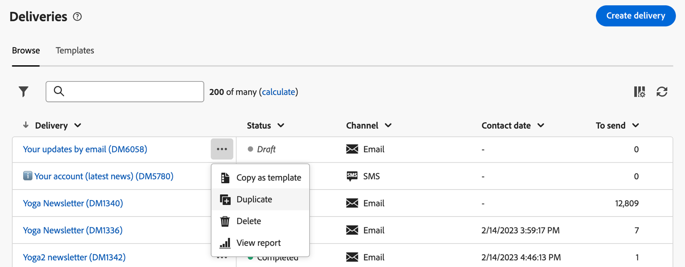

# Upptäck gränssnittet {#user-interface}

>[!CONTEXTUALHELP]
>id="acw_homepage_learnmore"
>title="Upptäck gränssnittet"
>abstract="Det nya webbgränssnittet Campaign v8 erbjuder en integrerad, intuitiv och enhetlig användarupplevelse."

Det nya webbgränssnittet Campaign v8 erbjuder en modern och intuitiv användarupplevelse som förenklar utformningen och leveransen av marknadsföringskampanjer. Det nya gränssnittet är integrerat med Adobe Experience Platform.

<!--
Key concepts when browsing the user interface are common with Adobe Experience Platform. Refer to [Adobe Experience Platform documentation](https://experienceleague.adobe.com/docs/experience-platform/landing/platform-ui/ui-guide.html#adobe-experience-platform-ui-guide) for more details.
-->

>[!NOTE]
>
>Den här dokumentationen uppdateras ofta för att återspegla de senaste ändringarna i produktanvändargränssnittet. Vissa skärmbilder kan dock skilja sig något från användargränssnittet.

<!--
* console + web interface (overview, why use each of them)
* web UI made up of read-only lists that can be configured, show how to add columns
-->

## Navigeringsmeny till vänster

Bläddra bland länkarna till vänster för att få tillgång till webbfunktionerna i Campaign v8. Flera länkar visar listor med objekt som kan sorteras och filtreras. Du kan också konfigurera kolumner så att all information som du behöver visas. Se det här [section](#list-screens). Alla listskärmar är skrivskyddade, förutom leveranslistan för e-post. Det går inte att klicka på ett listobjekt för utgåva/visning i Alpha. Alla listor kan redigeras i framtida versioner. Vilka alternativ som visas på den vänstra navigeringsmenyn beror på dina användarbehörigheter.

### Startsida

Skärmen innehåller länkar och resurser som gör att du snabbt kommer åt de viktigaste webbfunktionerna i Campaign v8. The **Senaste** listan innehåller genvägar till de nyligen skapade och ändrade leveranserna. Den här listan visar datum och status för när de skapades och ändrades.

<!--
* Banner
* KPIs on email channel (cross-deliveries): open rate, delivery rate, etc
* Recent items
* Learning cards
-->

Få åtkomst till hjälpsidor för webbnyckel v8 från startsidans nedre del.

<!--
show global KPIs, recent items + left menu to access features)
CONTROL PANEL not alpha
Global report not alpha
-->

### Utforskaren

>[!CONTEXTUALHELP]
>id="acw_explorer"
>title="Utforskaren"
>abstract="The **Utforskaren** -menyn visar samma mapphierarki som i klientkonsolen. Bläddra bland alla komponenter, mappar och scheman i Campaign v8. Alla listskärmar är skrivskyddade, förutom leveranslistan för e-post."

The **Utforskaren** -menyn visar samma mapphierarki som i klientkonsolen. Bläddra bland alla komponenter, mappar och scheman i Campaign v8. Alla listskärmar är skrivskyddade, förutom leveranslistan för e-post.

Vilka objekt som visas i Utforskaren beror på dina användarbehörigheter.

Precis som i alla listskärmar kan du konfigurera kolumner så att de anpassas för visningen så att du kan se all information du behöver. Se det här [section](#list-screens).

Mer information om Campaign Explorer finns i [dokumentation](https://experienceleague.adobe.com/docs/campaign/campaign-v8/new/ac-ui/campaign-ui.html#ac-explorer-ui){target="_blank"}.
<!--
Explorer' menu in web UI to navigate through console content: console navtree second view in addition to the left menu lists with filters. The Explorer gives the real folder hierarchy from the console. Make sure you find your deliveries in sub-folders. All lists can be accessed in read-only. No Create/Edit. You can configure lists (colums). All schema fields, linked tables are available. 

If you need to view your lists of recipients (age, gender), transactions or live transactional messages. To view each/edit -> console.

Navtree view depends on permissions (same as console).
-->

### Campaign Management

>[!CONTEXTUALHELP]
>id="acw_campaigns_list"
>title="Kampanjer"
>abstract="Det här är listan över era kampanjer. Du kan visa användbar information som start-/slutdatum/sista ändringsdatum samt status för dem. Du kan filtrera listan efter status eller start-/slutdatum. Kampanjmallar finns också tillgängliga. De här listorna är skrivskyddade."

>[!CONTEXTUALHELP]
>id="acw_deliveries_list"
>title="Leveranser"
>abstract="Bläddra igenom listan över leveranser. Du kan visa deras status, senaste ändringsdatum och nyckeltal för nyckeltal. Du kan filtrera listan efter tillstånd, kontaktdatum eller kanal. Klicka på en e-postleverans för att öppna kontrollpanelen. Andra objekt är skrivskyddade. Leveransmallar finns också."

* **Kampanjer** - Det här är listan över era kampanjer. Som standard kan du visa deras start-/slutdatum/sista ändringsdatum samt deras status. Du kan filtrera listan efter status eller start-/slutdatum. Kampanjmallar finns också tillgängliga. De här listorna är skrivskyddade.

* **Leveranser** - Bläddra i listan över leveranser. Som standard kan du visa deras status, senaste ändringsdatum och nyckeltal för nyckeltal. Du kan filtrera listan efter tillstånd, kontaktdatum eller kanal. Klicka på en e-postleverans för att öppna instrumentpanelen och få en översikt över leveransinformationen. Leveranser i andra kanaler är skrivskyddade. Leveransmallar finns också i skrivskyddat läge. Du kan använda klientkonsolen för att redigera dem. Se det här [dokumentation](https://experienceleague.adobe.com/docs/campaign/campaign-v8/campaigns/send/create-templates.html){target="_blank"}.

   Använd **Fler åtgärder** för att ta bort eller duplicera en leverans.

   {width="70%" align="left"}

### Kundhantering

>[!CONTEXTUALHELP]
>id="acw_recipients_list"
>title="Mottagare"
>abstract="Få åtkomst till din mottagardatabas. Du kan visa användbar information som e-postadress, förnamn och efternamn. Den här listan är skrivskyddad."

>[!CONTEXTUALHELP]
>id="acw_audiences_list"
>title="Målgrupper"
>abstract="Det här är er lista över målgrupper. Du kan visa typ, ursprung, datum och etikett för senaste ändringsdatum och skapandedatum. Du kan filtrera listan efter ursprung. Den här listan är skrivskyddad."

>[!CONTEXTUALHELP]
>id="acw_subscriptions_list"
>title="Prenumerationslistor"
>abstract="Bläddra bland prenumerationslistorna. Du kan visa deras typ, läge och etikett. Den här listan är skrivskyddad."

* **Mottagare** - Få åtkomst till din mottagardatabas. Som standard kan du visa deras e-postadress, förnamn och efternamn. Den här listan är skrivskyddad.
* **Målgrupper** - Det här är er lista över målgrupper. Som standard kan du visa deras typ, ursprung, datum och etikett för senaste ändring. Du kan filtrera listan efter ursprung. Den här listan är skrivskyddad.
* **Prenumerationslistor** - Bläddra igenom prenumerationslistorna. Som standard kan du visa deras typ, läge och etikett. Den här listan är skrivskyddad.
* **Målarbetsflöden** - Få tillgång till din lista över Kampanjarbetsflöden. Som standard kan du visa deras tillstånd, senaste/nästa bearbetningsdatum och miljö. Du kan filtrera listan efter tillstånd, senaste bearbetningsdatum och arbetsflödestyp. Det finns också arbetsflödesmallar. De här listorna är skrivskyddade.

### Beslutshantering

>[!CONTEXTUALHELP]
>id="acw_offers_list"
>title="Erbjudanden"
>abstract="Bläddra igenom listan med interaktionserbjudanden. Som standard kan du visa deras status, start-/slutdatum och miljö. Du kan filtrera listan efter status och start-/slutdatum. Det finns även mallar för erbjudandet. De här listorna är skrivskyddade."

* **Erbjudanden** - Bläddra igenom listan med interaktionserbjudanden. Som standard kan du visa deras status, start-/slutdatum och miljö. Du kan filtrera listan efter status och start-/slutdatum. Det finns även mallar för erbjudandet. De här listorna är skrivskyddade.

## Övre fält

I gränssnittets övre fält kan du:

* dela med dig av dina synpunkter som en alfakonstant
* växla mellan organisationer och instanser
* växla mellan olika Adobe Experience Cloud-program
* få tillgång till hjälpsidor, kontakta support och dela feedback. Du kan söka efter hjälpartiklar och videoklipp i sökfältet.

{width="70%" align="left"}
<!--
Org / Sub-org switcher to switch between instances. Only one for Alpha. Later: intermerdiate screen with Control Panel (beta). if v8 + ACS with one card per ACS instance. Maybe quickly explain the menu for Alpha?
-->

## Konfigurera listskärmar {#list-screens}

Flera länkar från den vänstra navigeringsmenyn, till exempel **Leveranser** eller **Kampanjer**, visas listor med objekt. De här listskärmarna är skrivskyddade, förutom leveranslistan för e-post.

Om du vill hitta objekt snabbare kan du använda sökfältet eller filtrera listan baserat på sammanhangsberoende kriterier.

{width="70%" align="left"}

Listorna visas i kolumner. Du kan visa ytterligare information genom att ändra kolumnkonfigurationen. Det gör du genom att klicka på ikonen i det övre högra hörnet av listan. Du kan lägga till eller ta bort kolumner och ändra visningsordningen.

{width="70%" align="left"}

Du kan sortera objekt i listan genom att klicka på en kolumnrubrik. En pil visas (Upp eller Ned) som anger att listan är sorterad i den kolumnen. För numeriska kolumner och datumkolumner anger uppilen att listan är sorterad i stigande ordning och nedpilen anger en fallande ordning. För strängar eller alfanumeriska kolumner visas värdena i alfabetisk ordning.

## Kontextuell hjälp och introduktionshandbok

Det finns sammanhangsberoende hjälp i gränssnittet. Klicka på **?** om du vill visa hjälpinformation och relaterade dokumentationslänkar.

{width="70%" align="left"}

Det finns också en introduktionshandbok som hjälper dig att komma igång med Campaign v8 Web. Klicka på ikonen i det nedre högra hörnet, välj ett av de tillgängliga stegvisa scenarierna och följ instruktionerna.

{width="70%" align="left"}

## Webbläsare som stöds {#browsers}

Campaign v8 Web är utformat för att fungera optimalt i den senaste versionen av Google Chrome, Safari och Microsoft Edge. Du kan ha problem med att använda vissa funktioner i äldre versioner eller i andra webbläsare.

## Språkinställningar {#language-pref}

Campaign v8 Web finns för närvarande på följande språk:

<table>
<tr>
<td>

Engelska (USA) - EN-US

Franska - FR

Tyska - DE

Italienska - IT

</td>
<td>

Spanska - ES

Portugisiska (Brasilien) - PTBR

Japanska - JP

</td>
<td>

Koreanska - KR

Förenklad kinesiska - CHS

Traditionell kinesiska - CHT

</td>
</tr>
</table>

Standardspråket för gränssnittet avgörs av det språk du föredrar i användarprofilen.

Så här byter du språk:

1. Klicka på din profilikon, längst upp till höger och välj sedan **Inställningar**.

   {width="70%" align="left"}

1. Klicka sedan på det språk som visas under din e-postadress.

   

1. Välj önskat språk och klicka på **Spara**. Du kan välja ett andra språk om komponenten som du använder inte är lokaliserad på ditt första språk.

   

<!--
## Supported browsers {#browsers}

Adobe Campaign interface is designed to work optimally in the latest version of Google Chrome. You might have trouble using certain features on older versions or other browsers.
-->

<!--
######## This part stores the contextualHelp definition for WebUI BETA ###########
######## These blocks should be dispatched in the appropriate pages when available ###########
######## PLEASE DO NOT DELETE ###########
REFER TO 
https://wiki.corp.adobe.com/pages/viewpage.action?spaceKey=neolane&title=v8+WebUI+Contextual+Help+%3CALPHA%3E-+Official+list
-->

>[!CONTEXTUALHELP]
>id="acw_sms_report_overview"
>title="Sammanfattning av SMS-rapport"
>abstract="Upptäck rapporteringsstatistik för SMS-leverans."

>[!CONTEXTUALHELP]
>id="acw_push_report_overview"
>title="Sammanfattning av push-rapport"
>abstract="Upptäck rapporteringsstatistik för push-leverans."

>[!CONTEXTUALHELP]
>id="acw_push_notification_template"
>title="Push-meddelandemall"
>abstract="TBD"

>[!CONTEXTUALHELP]
>id="acw_rulebuilder_properties_advanced"
>title="Avancerade attribut i regelbyggaren"
>abstract="Använd avancerade attribut för att definiera regeln."

>[!CONTEXTUALHELP]
>id="acw_deliveries_email_metrics_sent"
>title="Skickade mått"
>abstract="Antal levererade e-postmeddelanden."

>[!CONTEXTUALHELP]
>id="acw_deliveries_email_metrics_errors"
>title="Felmått"
>abstract="Antal e-postmeddelanden med felstatus."

>[!CONTEXTUALHELP]
>id="acw_deliveries_push_android_content"
>title="Push-innehåll för Android"
>abstract="Definiera push-innehåll för Android."

>[!CONTEXTUALHELP]
>id="acw_deliveries_push_ios_content"
>title="Push iOS content"
>abstract="Definiera push-iOS-innehåll."

>[!CONTEXTUALHELP]
>id="acw_sms_preview_option_app_target"
>title="Appprenumeranter"
>abstract="Förhandsgranska och testa meddelandet genom att lägga till programprenumeranter i huvudmålet. "

>[!CONTEXTUALHELP]
>id="acw_email_preview_option_test_target"
>title="Testpopulation"
>abstract="Välj ett testpopulationsläge."

>[!CONTEXTUALHELP]
>id="acw_email_preview_mode"
>title="Förhandsgranskningsläge"
>abstract="Förhandsgranska och testa meddelandet genom att inkludera testpopulationen i huvudmålet."

>[!CONTEXTUALHELP]
>id="acw_targetdata_personalization_enrichmentdata"
>title="Anrikningsdata"
>abstract="TBD"

>[!CONTEXTUALHELP]
>id="acw_targetdata_personalization_dashboard"
>title="Personalisering"
>abstract="TBD"

>[!CONTEXTUALHELP]
>id="acw_campaign_reporting_sending"
>title="Rapportering skickas"
>abstract="Se utskicksindikatorerna för kampanjrapporteringen."

>[!CONTEXTUALHELP]
>id="acw_campaign_reporting_tracking"
>title="Rapporteringsspårning"
>abstract="Se spårningsindikatorerna för kampanjrapporten."

>[!CONTEXTUALHELP]
>id="acw_campaign_reporting_deliveries_overview"
>title="Rapportöversikt"
>abstract="Viktiga mätvärden för leveransen."

>[!CONTEXTUALHELP]
>id="acw_campaign_reporting_deliveries_target"
>title="Rapportera målstatistik"
>abstract="I det här avsnittet visas specifika mätvärden beroende på målgrupper."

>[!CONTEXTUALHELP]
>id="acw_campaign_reporting_deliveries_selection"
>title="Aggregerad rapportering för leveranser"
>abstract="Välj minst två leveranser för att visa en sammanställd datarapport."

>[!CONTEXTUALHELP]
>id="acw_orchestration_deduplication_fields"
>title="Dedupliceringsfält"
>abstract="TBD"

>[!CONTEXTUALHELP]
>id="acw_orchestration_deduplication_settings"
>title="Inställningar för borttagning av dubbletter"
>abstract="TBD"

>[!CONTEXTUALHELP]
>id="acw_orchestration_deduplication_complement"
>title="Dedupliceringskomplementet"
>abstract="TBD"

>[!CONTEXTUALHELP]
>id="acw_orchestration_dimension_complement"
>title="Komplementfärg till Dimension"
>abstract="TBD"

>[!CONTEXTUALHELP]
>id="acw_push_permission_for_segment"
>title="Behörighet krävs"
>abstract="Administratören måste ge dig behörighet innan du kan skapa ett segment."

>[!CONTEXTUALHELP]
>id="acw_push_overview_edit"
>title="Behörighet krävs"
>abstract="Administratören måste ge dig behörighet innan du kan skapa ett segment."

>[!CONTEXTUALHELP]
>id="acw_attributepicker_advancedfields"
>title="Avancerade fält för attributväljaren"
>abstract="Konfigurera kolumner med avancerade fält."

>[!CONTEXTUALHELP]
>id="acw_rulebuilder_advancedfields"
>title="Avancerade fält för regelbyggaren"
>abstract="Konfigurera kolumner med avancerade fält."

>[!CONTEXTUALHELP]
>id="acw_deliveries_push_properties"
>title="Push-leveransegenskaper"
>abstract="Hantera egenskaperna för push-leverans."

>[!CONTEXTUALHELP]
>id="acw_deliveries_metrics_newquarantines"
>title="Nytt karantänmätvärde"
>abstract="Nytt karantänmått."

>[!CONTEXTUALHELP]
>id="acw_deliveries_sms_template_selection"
>title="Val av SMS-mall"
>abstract="Välj en fördefinierad mall för att starta SMS-leveransen."
