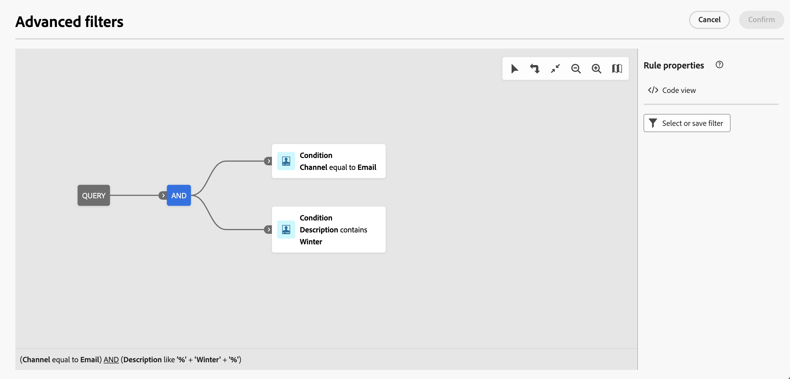

# Upptäck gränssnittet {#user-interface}

>[!CONTEXTUALHELP]
>id="acw_homepage_learnmore"
>title="Upptäck gränssnittet"
>abstract="Det nya webbgränssnittet Campaign v8 erbjuder en integrerad, intuitiv och enhetlig användarupplevelse."

Det nya webbgränssnittet Campaign v8 erbjuder en modern och intuitiv användarupplevelse som förenklar utformningen och leveransen av marknadsföringskampanjer. Det nya gränssnittet är integrerat med Adobe Experience Platform.

>[!NOTE]
>
>Den här dokumentationen uppdateras ofta för att återspegla de senaste ändringarna i produktanvändargränssnittet. Vissa skärmbilder kan dock skilja sig något från användargränssnittet.

## Navigeringsmeny till vänster {#user-interface-left-nav}

Bläddra bland länkarna till vänster för att få tillgång till webbfunktionerna i Campaign v8. Flera länkar visar listor med objekt som kan sorteras och filtreras. Du kan också konfigurera kolumner så att all information som du behöver visas. Se det här [section](#list-screens). Alla listskärmar är skrivskyddade, förutom leveranslistan för e-post. Det går inte att klicka på ett listobjekt för utgåva/visning i Alpha. Alla listor kan redigeras i framtida versioner. Vilka alternativ som visas på den vänstra navigeringsmenyn beror på dina användarbehörigheter.

### Startsida {#user-interface-home}

Skärmen innehåller länkar och resurser som gör att du snabbt kommer åt de viktigaste webbfunktionerna i Campaign v8.

The **Senaste** listan innehåller genvägar till de nyligen skapade och ändrade leveranserna. Den här listan visar deras kanal, status, ägare, datum för skapande och ändring.

Få åtkomst till hjälpsidorna för webbnyckel v8 från **Utbildning** på startsidan.

### Utforskaren {#user-interface-explorer}

>[!CONTEXTUALHELP]
>id="acw_explorer"
>title="Utforskaren"
>abstract="The **Utforskaren** På -menyn visas alla Campaign-komponenter och -objekt med samma mapphierarki som på klientkonsolen. Bläddra bland alla komponenter, mappar och scheman i Campaign v8 och skapa leveranser, arbetsflöden och kampanjer. Alla andra listor är skrivskyddade."

The **Utforskaren** I visas alla Campaign-resurser och -objekt med samma mapphierarki som i klientkonsolen. Bläddra bland alla komponenter, mappar och scheman i Campaign v8 och skapa leveranser, arbetsflöden och kampanjer. Alla andra listor är skrivskyddade.

Vilka objekt som visas i Utforskaren beror på dina användarbehörigheter.

Precis som i alla listskärmar kan du konfigurera kolumner så att de anpassas för visningen så att du kan se all information du behöver. Se det här [section](#list-screens).

Mer information om Campaign Explorer, mapphierarkin och resurser finns i [Kampanjdokumentation v8 (konsol)](https://experienceleague.adobe.com/docs/campaign/campaign-v8/new/campaign-ui.html#ac-explorer-ui){target="_blank"}.

### Campaign Management {#user-interface-campaign-management}

>[!CONTEXTUALHELP]
>id="acw_campaigns_list"
>title="Kampanjer"
>abstract="Det här är listan över era kampanjer. Du kan visa användbar information som start-/slutdatum/sista ändringsdatum samt status för dem. Du kan filtrera listan efter status eller start-/slutdatum. Klicka på knappen Skapa kampanj för att lägga till en ny kampanj. Välj en kampanj för att visa dess innehåll, leveranser och detaljer. Bläddra till fliken Mallar för att visa och skapa mallar."

>[!CONTEXTUALHELP]
>id="acw_deliveries_list"
>title="Leveranser"
>abstract="Bläddra igenom listan över leveranser. Du kan visa status, kontaktdatum och ändringsdatum samt nyckeltal för nyckeltal. Du kan filtrera listan efter tillstånd, kontaktdatum eller kanal. Klicka på knappen Skapa leverans för att lägga till en ny leverans. Välj en leverans för att visa dess innehåll, målgrupp och detaljer."

I CAMPAIGN MANAGEMENT-delen får ni tillgång till marknadsföringskampanjer, leveranser och arbetsflöden.

* **Kampanjer** - Det här är listan över era kampanjer och kampanjmallar. Som standard kan du för varje kampanj visa datum för start/slut/skapande/senaste ändring, aktuell status och namnet på den kampanjoperator som skapade den. Du kan filtrera listan efter status, start-/slutdatum, mapp eller skapa ett avancerat filter för att definiera egna filtervillkor. Läs mer om kampanjer [i det här avsnittet](../campaigns/gs-campaigns.md).

* **Leveranser** - Bläddra i listan över leveranser. Som standard kan du visa deras status, senaste ändringsdatum och nyckeltal för nyckeltal. Du kan filtrera listan efter tillstånd, kontaktdatum eller kanal. Klicka på en e-postleverans för att öppna instrumentpanelen och få en översikt över leveransinformationen. Leveranser i andra kanaler är skrivskyddade. Läs mer om leveranser [i det här avsnittet](../msg/gs-messages.md).

  Använd **Fler åtgärder** för att ta bort eller duplicera en leverans.

  {width="70%" align="left"}

* **Arbetsflöden** - På den här skärmen har du tillgång till den fullständiga listan över arbetsflöden och arbetsflödesmallar. Du kan kontrollera deras status, senaste/nästa körningsdatum och skapa ett nytt arbetsflöde eller en ny arbetsflödesmall. Du kan filtrera listan med samma villkor som för andra objekt. Dessutom kan du filtrera arbetsflöden som tillhör en kampanj eller inte. Läs mer om arbetsflöden [i det här avsnittet](../workflows/gs-workflows.md).

### Kundhantering {#user-interface-customer-management}

>[!CONTEXTUALHELP]
>id="acw_recipients_list"
>title="Mottagare"
>abstract="Få åtkomst till din mottagardatabas. Du kan visa användbar information som e-postadress, förnamn och efternamn. Den här listan är skrivskyddad."

>[!CONTEXTUALHELP]
>id="acw_audiences_list"
>title="Målgrupper"
>abstract="Det här är er lista över målgrupper. Du kan visa typ, ursprung, datum och etikett för senaste ändringsdatum och skapandedatum. Du kan filtrera listan efter ursprung. Den här listan är skrivskyddad."

>[!CONTEXTUALHELP]
>id="acw_subscriptions_list"
>title="Prenumerationslistor"
>abstract="Bläddra bland prenumerationslistorna. Du kan visa deras typ, läge och etikett. Den här listan är skrivskyddad."

I avsnittet KUNDHANTERING kan du visa dina mottagare, målgrupper och prenumerationer. De här listorna är skrivskyddade.

* **Mottagare** - Få åtkomst till din mottagardatabas. Som standard kan du visa deras e-postadress, förnamn och efternamn. Läs mer om mottagare i [Adobe Campaign v8-dokumentation (konsol)](https://experienceleague.adobe.com/docs/campaign/campaign-v8/audience/gs-audiences.html){target="_blank"}.
* **Målgrupper** - Det här är er lista över målgrupper. Som standard kan du visa deras typ, ursprung, datum och etikett för senaste ändring. Du kan filtrera listan efter ursprung. Läs mer om målgrupper och listor i [Adobe Campaign v8-dokumentation (konsol)](https://experienceleague.adobe.com/docs/campaign/campaign-v8/audience/create-audiences/create-audiences.html){target="_blank"}.
* **Prenumerationer** - Bläddra igenom prenumerationslistorna. Som standard kan du visa deras typ, läge och etikett. Lär dig hur du hanterar prenumerationer och avbeställningar i [Adobe Campaign v8-dokumentation (konsol)](https://experienceleague.adobe.com/docs/campaign/campaign-v8/campaigns/send/subscriptions.html){target="_blank"}.

### Beslutshantering

>[!CONTEXTUALHELP]
>id="acw_offers_list"
>title="Erbjudanden"
>abstract="Bläddra igenom listan med interaktionserbjudanden. Som standard kan du visa deras status, start-/slutdatum och miljö. Du kan filtrera listan efter status och start-/slutdatum. Det finns även mallar för erbjudandet. De här listorna är skrivskyddade."

* **Erbjudanden** - Bläddra igenom listan med interaktionserbjudanden. Som standard kan du visa deras status, start-/slutdatum och miljö. Du kan filtrera listan efter status och start-/slutdatum. Det finns även mallar för erbjudandet. De här listorna är skrivskyddade.

Lär dig hur du skapar hanterade erbjudanden i [Adobe Campaign v8-dokumentation (konsol)](https://experienceleague.adobe.com/docs/campaign/campaign-v8/offers/interaction.html){target="_blank"}.

## Övre fält

Använd gränssnittets övre fält för att:

* dela med dig av dina synpunkter som en alfakonstant
* växla mellan organisationer och instanser
* växla mellan olika Adobe Experience Cloud-program
* få tillgång till hjälpsidor, kontakta support och dela feedback. Du kan söka efter hjälpartiklar och videoklipp i sökfältet.

{width="70%" align="left"}
<!--
Org / Sub-org switcher to switch between instances. Only one for Alpha. Later: intermerdiate screen with Control Panel (beta). if v8 + ACS with one card per ACS instance. Maybe quickly explain the menu for Alpha?
-->

## Bläddra i och filtrera listor {#list-screens}

De flesta länkar från den vänstra navigeringsmenyn visar listor med objekt, t.ex. listan med **Leveranser** eller **Kampanjer**. Vissa av dessa listskärmar är skrivskyddade. Du kan anpassa listvisningen och filtrera listorna enligt nedan.

Om du vill ta bort ett filter klickar du på **Rensa alla** -knappen.

### Anpassa listskärmar {#custom-lists}

Listorna visas i kolumner. Du kan visa ytterligare information genom att ändra kolumnkonfigurationen. Om du vill göra det klickar du på **Konfigurera kolumn för en anpassad layout** -ikonen i det övre högra hörnet av listan.

{width="70%" align="left"}

I **Konfigurera kolumner** rastrera, lägga till eller ta bort kolumner och ändra visningsordningen.

Exempel:

{width="70%" align="left"}

I listan visas följande kolumner:

{width="70%" align="left"}

Använd **Visa avancerade attribut** om du vill visa alla attribut för den aktuella listan. [Läs mer](#adv-attributes)

### Sortera data {#sort-lists}

Du kan också sortera objekt i listan genom att klicka på en kolumnrubrik. En pil visas (Upp eller Ned) som anger att listan är sorterad i den kolumnen.

För numeriska kolumner och datumkolumner finns **Upp** anger att listan är sorterad i stigande ordning medan **Ned** pil anger en fallande ordning. För strängar eller alfanumeriska kolumner visas värdena i alfabetisk ordning.

### Inbyggda filter {#list-built-in-filters}

Om du vill hitta objekt snabbare kan du använda sökfältet eller filtrera listan baserat på sammanhangsberoende kriterier.

{width="70%" align="left"}

Du kan till exempel filtrera leveranser efter status, kanal, kontaktdatum eller mapp. Du kan också dölja tester.

### Egna filter{#list-custom-filters}

Om du vill skapa anpassade filter för data bläddrar du längst ned i filtren och klickar på **Lägg till regler** -knappen.

Dra och släpp attribut för att skapa filtervillkor i **Avancerade filter** skärm.

{width="70%" align="left"}

Använd **Visa avancerade attribut** om du vill visa alla attribut för den aktuella listan. [Läs mer](#adv-attributes)

### Använd avancerade attribut {#adv-attributes}

>[!CONTEXTUALHELP]
>id="acw_attributepicker_advancedfields"
>title="Visa avancerade attribut"
>abstract="Endast de vanligaste attributen visas som standard i attributlistan. Använd den här växeln för att skapa ett filter med avancerade attribut."

Endast de vanligaste attributen visas som standard i attributlistan och på filterkonfigurationsskärmar.

Använd **Visa avancerade attribut** om du vill visa alla tillgängliga attribut för den aktuella listan kan du växla under listan.

## Sammanhangsberoende hjälp {#contextual-help}

Det finns sammanhangsberoende hjälp i gränssnittet. Klicka på `?` om du vill visa hjälpinformation och relaterade dokumentationslänkar.

{width="70%" align="left"}

<!--An on-boarding guide is also available to help you get started with Campaign v8 Web. Click the icon in the bottom right corner, choose one of the available step-by-step scenarios, and simply follow the instructions.

{width="70%" align="left"}-->

## Webbläsare som stöds {#browsers}

Campaign v8 Web är utformat för att fungera optimalt i den senaste versionen av Google Chrome, Safari och Microsoft Edge. Du kan ha problem med att använda vissa funktioner i äldre versioner eller i andra webbläsare.

## Språkinställningar {#language-pref}

Campaign v8 Web finns för närvarande på följande språk:

<table>
<tr>
<td>

Engelska (USA) - EN-US

Franska - FR

Tyska - DE

Italienska - IT

</td>
<td>

Spanska - ES

Portugisiska (Brasilien) - PTBR

Japanska - JP

</td>
<td>

Koreanska - KR

Förenklad kinesiska - CHS

Traditionell kinesiska - CHT

</td>
</tr>
</table>

Standardspråket för gränssnittet avgörs av det språk du föredrar i användarprofilen.

Så här byter du språk:

1. Klicka på din profilikon, längst upp till höger och välj sedan **Inställningar**.
1. Klicka sedan på den språklänk som visas under din e-postadress.
1. Välj önskat språk och klicka på **Spara**. Du kan välja ett andra språk om komponenten som du använder inte är lokaliserad på ditt första språk.

<!--
######## This part stores the contextualHelp definition for WebUI BETA ###########
######## These blocks should be dispatched in the appropriate pages when available ###########
######## PLEASE DO NOT DELETE ###########
REFER TO 
https://wiki.corp.adobe.com/pages/viewpage.action?spaceKey=neolane&title=v8+WebUI+Contextual+Help+%3CALPHA%3E-+Official+list
-->

>[!CONTEXTUALHELP]
>id="acw_rulebuilder_advancedfields"
>title="Avancerade fält för regelbyggaren"
>abstract="Konfigurera kolumner med avancerade fält."

>[!CONTEXTUALHELP]
>id="acw_rulebuilder_properties_advanced"
>title="Avancerade attribut i regelbyggaren"
>abstract="Använd avancerade attribut för att definiera regeln."

>[!CONTEXTUALHELP]
>id="acw_deliveries_email_metrics_sent"
>title="Skickade mått"
>abstract="Antal levererade e-postmeddelanden."

>[!CONTEXTUALHELP]
>id="acw_deliveries_email_metrics_errors"
>title="Felmått"
>abstract="Antal e-postmeddelanden med felstatus."

>[!CONTEXTUALHELP]
>id="acw_email_preview_option_test_target"
>title="Testpopulation"
>abstract="Välj ett testpopulationsläge."

>[!CONTEXTUALHELP]
>id="acw_email_preview_mode"
>title="Förhandsgranskningsläge"
>abstract="Förhandsgranska och testa meddelandet genom att inkludera testpopulationen i huvudmålet."

>[!CONTEXTUALHELP]
>id="acw_targetdata_personalization_enrichmentdata"
>title="Anrikningsdata"
>abstract="TBD"

>[!CONTEXTUALHELP]
>id="acw_targetdata_personalization_dashboard"
>title="Personalisering"
>abstract="TBD"

>[!CONTEXTUALHELP]
>id="acw_campaign_reporting_sending"
>title="Rapportering skickas"
>abstract="Se utskicksindikatorerna för kampanjrapporteringen."

>[!CONTEXTUALHELP]
>id="acw_campaign_reporting_tracking"
>title="Rapporteringsspårning"
>abstract="Se spårningsindikatorerna för kampanjrapporten."

>[!CONTEXTUALHELP]
>id="acw_campaign_reporting_deliveries_overview"
>title="Rapportöversikt"
>abstract="Viktiga mätvärden för leveransen."

>[!CONTEXTUALHELP]
>id="acw_campaign_reporting_deliveries_target"
>title="Rapportera målstatistik"
>abstract="I det här avsnittet visas specifika mätvärden beroende på målgrupper."

>[!CONTEXTUALHELP]
>id="acw_campaign_reporting_deliveries_selection"
>title="Aggregerad rapportering för leveranser"
>abstract="Välj minst två leveranser för att visa en sammanställd datarapport."

>[!CONTEXTUALHELP]
>id="acw_orchestration_deduplication_fields"
>title="Dedupliceringsfält"
>abstract="TBD"

>[!CONTEXTUALHELP]
>id="acw_orchestration_deduplication_settings"
>title="Inställningar för borttagning av dubbletter"
>abstract="TBD"

>[!CONTEXTUALHELP]
>id="acw_orchestration_deduplication_complement"
>title="Dedupliceringskomplementet"
>abstract="TBD"

>[!CONTEXTUALHELP]
>id="acw_orchestration_dimension_complement"
>title="Komplementfärg till Dimension"
>abstract="TBD"

>[!CONTEXTUALHELP]
>id="acw_push_permission_for_segment"
>title="Behörighet krävs"
>abstract="Administratören måste ge dig behörighet innan du kan skapa ett segment."

>[!CONTEXTUALHELP]
>id="acw_push_overview_edit"
>title="Behörighet krävs"
>abstract="Administratören måste ge dig behörighet innan du kan skapa ett segment."

>[!CONTEXTUALHELP]
>id="acw_deliveries_metrics_newquarantines"
>title="Nytt karantänmätvärde"
>abstract="Nytt karantänmått."

>[!CONTEXTUALHELP]
>id="acw_keyindicators_delivered"
>title="Levererat"
>abstract="Levererad KPI"

>[!CONTEXTUALHELP]
>id="acw_keyindicators_opens"
>title="Öppnar"
>abstract="Öppnar KPI"

>[!CONTEXTUALHELP]
>id="acw_keyindicators_clicks"
>title="Klickningar"
>abstract="Klicka på KPI"

>[!CONTEXTUALHELP]
>id="acw_keyindicators_unsubscriptions"
>title="Avprenumerationer"
>abstract="KPI för prenumerationsavbrott"

>[!CONTEXTUALHELP]
>id="acw_keyindicators_spam"
>title="Spam"
>abstract="Skräppost-KPI"

>[!CONTEXTUALHELP]
>id="acw_keyindicators_errors"
>title="Fel"
>abstract="KPI-fel"
