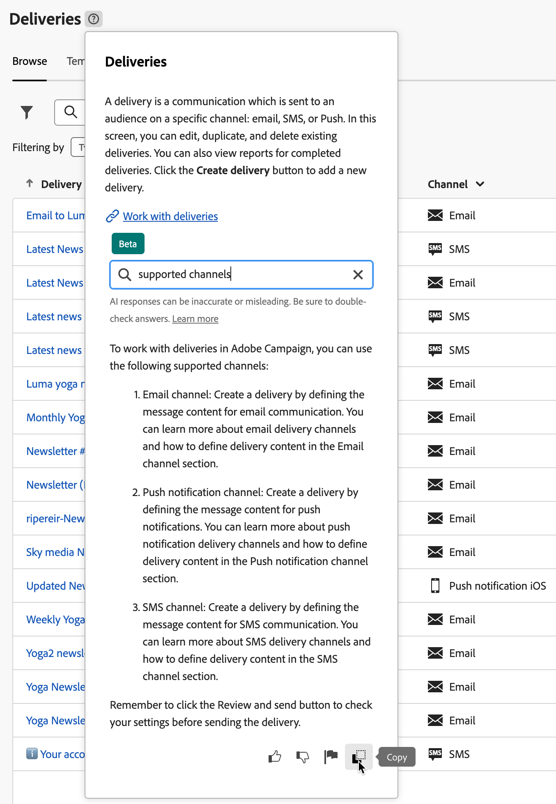

# AI-baserad sammanhangsbaserad hjälp {#using-ai}

Få snabba, AI-genererade svar baserat på produktdokumentationen och ditt nuvarande produktsammanhang med hjälp av den AI-baserade sammanhangsbaserade Q&amp;A-hjälpen som finns i produktens sammanhangsbaserade hjälprutor.

The **Sammanhangsbaserad hjälp med Gen AI** som är inbäddat i sammanhangsbaserad hjälp revolutionerar dokumentsökning och besvarar frågor utan problem genom att smidigt gå igenom stora dokumentationsarkiv och snabbt hitta exakt den information du behöver.

Tack vare Campaign Gens AI-funktioner kan den här komponenten förvandla din upplevelse till en oöverträffad informationshämtning och problemlösning. Vare sig du vill ha hjälp med komplicerade arbetsuppgifter eller navigera i stora dokument är den AI-baserade sammanhangsbaserade hjälpen din ultimata partner, vilket ger oöverträffad effektivitet och precision vid all interaktion.

>[!AVAILABILITY]
>
>* Kontextuell hjälp med AI-funktioner finns i betaversionen och kan ändras utan föregående meddelande.
>
>* Den här funktionen är bara tillgänglig i **Engelska**. Andra språk stöds inte i den här versionen. Därför bör du se till att [ditt språk](connect-to-campaign.md#language-pref) är inställt på engelska innan den här funktionen används.
>
>* Kontextuell hjälp som bygger på AI är för närvarande inte tillgänglig i e-postdesignern för Campaign.

<!--
## Consent {#consent-ai}

Campaign knowledge assistant embeeded in the contextual help boxes uses AI. Your use of this capability constitutes consent that the information you provide in your session will be collected, used, disclosed, and retained by Adobe in accordance with the terms of Adobe's Customer Feedback Program. Please do not provide any personal information about yourself or other parties (including your name or contact information) in the knowledge assistant.

## Privacy {#privacy-ai}

Your data is encrypted and private following our standard data protection practices. Learn more about [Adobe Privacy Policies](https://www.adobe.com/privacy/policy.html){target="_blank"}.

The knowledge assistant AI capability does not use your data to train our models. We do not allow any partners or 3rd parties to use your data for training their models or any other purpose.

For information specific to Adobe AI policies in Experience Cloud apps and solutions, refer to [this page](https://business.adobe.com/products/sensei/adobe-sensei.html){target="_blank"}.
-->

## Föreslagna frågor {#questions-ai}

I inmatningsfältet ger Adobe Campaign AI-baserad sammanhangsbaserad hjälp tre föreslagna frågor. Dessa frågor genereras av AI och gäller hjälprutan och det aktuella produktsammanhanget. Välj en fråga för att få svaret.

{width="600" align="left"}{zoomable="yes"}

## Svar {#answers-ai}

Adobe Campaign AI-baserad sammanhangsbaserad hjälp är till hjälp, men du bör kontrollera fakta. Den kan ge felaktiga uppgifter, felaktiga eller vilseledande svar. Kontrollera produktdokumentationen som är länkad i varje hjälpruta.

Du kan kopiera ett svar till Urklipp med **Kopiera** ikonen längst ned i hjälpleveransen.

{width="600" align="left"}{zoomable="yes"}

## Feedback {#feedback-ai}

Artificiell intelligens och maskininlärningsmodeller förbättras över tid för att bättre kunna hantera specifika användningsfall. Den AI-baserade sammanhangsbaserade hjälpen för Campaign kommer att fortsätta att bli bättre under de närmaste månaderna. Vi rekommenderar att du använder  när du läser ett svar, för att flagga olämpliga svar till våra tekniker.

## Rekommendationer  {#recommendations-ai}

När du ställer en fråga i den AI-baserade sammanhangsberoende hjälpen, beaktas den aktuella produktkontexten, dvs. den skärm du befinner dig i och innehållet i den aktuella hjälprutan.

Därför är det bäst att ställa frågor om användargränssnittskontexten. Om du till exempel behöver lära dig hur du skickar en push-leverans i ett arbetsflöde går du till **Arbetsflöde** vänster menypost och använd en sammanhangsberoende hjälpruta i just det sammanhanget. Om du vill veta mer om hur du rapporterar mätvärden går du till kampanj- eller leveransrapporterna och börjar där.

För att få ut det bästa av den AI-baserade sammanhangsbaserade hjälpen rekommenderar vi dig att:

* Var så exakt och specifik som möjligt och undvik tvetydighet. Svaret blir mer korrekt och användbart.
* För att hjälpa den AI-baserade sammanhangsbaserade hjälpen att hitta rätt information lägger du till så mycket information som möjligt om vad du försöker lära dig.
* Rätta till och förfina dina frågor för att få bättre svar. Om svaret inte är korrekt eller användbart kan du testa olika metoder och lägga till sammanhang för att få bättre resultat.
* Använd lämpliga termer och formuleringar, med en neutral ton.
* Betygsätt svaren och ge feedback så att våra tekniker kan lära sig av era erfarenheter och förbättra resultaten.
