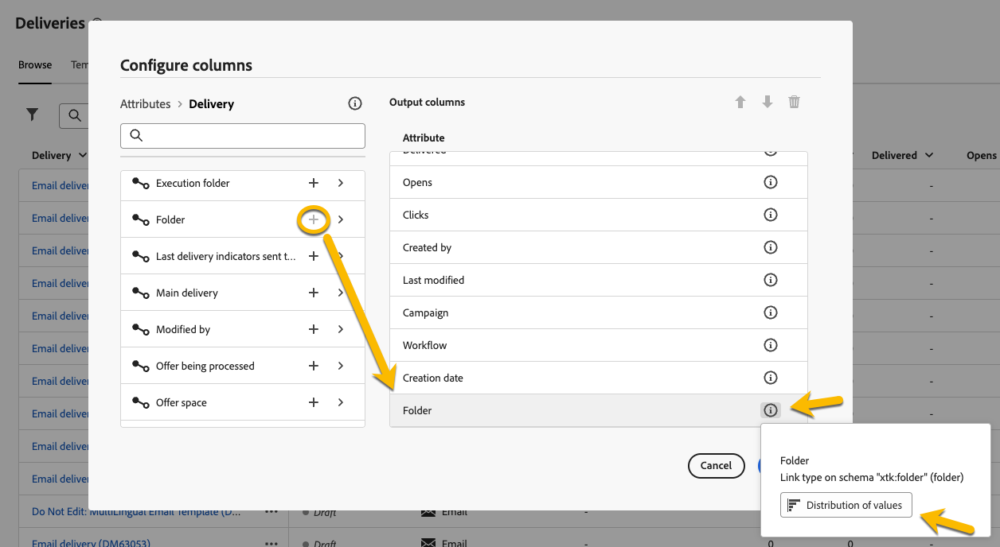
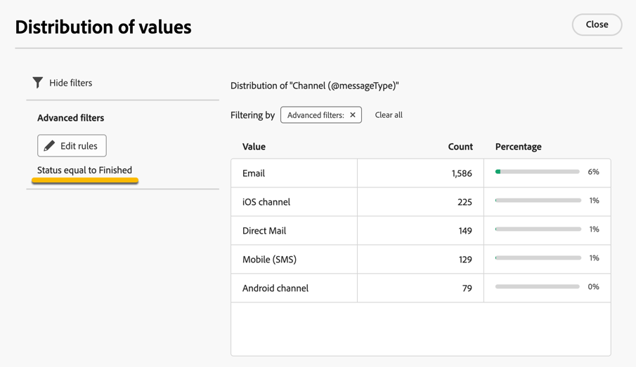

# Arbeta med mappar {#folders}

>[!CONTEXTUALHELP]
>id="acw_folder_properties"
>title="Mappegenskaper"
>abstract="Mappegenskaper"

>[!CONTEXTUALHELP]
>id="acw_folder_security"
>title="Mappsäkerhet"
>abstract="Mappsäkerhet"

>[!CONTEXTUALHELP]
>id="acw_folder_schedule"
>title="Mappschema"
>abstract="Mappschema"

## Om mappar {#about-folders}

Mappar är objekt i Adobe Campaign som gör att du kan ordna komponenter och data.

Du kan skapa, byta namn på, ordna om och flytta mappar i navigeringsträdet. Du kan även ta bort dem baserat på dina rättigheter.

{zoomable="yes"}

Du kan ställa in en mapptyp. Till exempel en mapp med leveranser. Mappikonen ändras beroende på dess typ.

>[!CONTEXTUALHELP]
>id="acw_folder_restrictions"
>title="Mappbegränsningar"
>abstract="Mapparna Objekt som skapas automatiskt och Tekniska arbetsflöden är begränsade och kan inte visas på den vänstra panelen."

>[!IMPORTANT]
>
>Mapparna **[!UICONTROL Objects created automatically]** och **[!UICONTROL Technical workflows]** är begränsade och kan inte visas på den vänstra panelen.

## Skapa en ny mapp {#create-a-folder}

Så här skapar du en ny mapp i Adobe Campaign Web UI:

1. I **[!UICONTROL Explorer]** går du till den mapp där du vill skapa den nya mappen. Välj **[!UICONTROL ...]** på menyn **[!UICONTROL Create new folder]**.

{zoomable="yes"}

När du skapar en ny mapp används som standard den överordnade mappens typ. I det här exemplet skapas en mapp i mappen **[!UICONTROL Deliveries]**.

{zoomable="yes"}

1. Ändra mapptyp genom att klicka på mapptypsikonen om det behövs och välj önskad typ i listan som visas nedan:

{zoomable="yes"}

Konfigurera mapptypen genom att klicka på knappen **[!UICONTROL Confirm]**.

Om du vill skapa en mapp utan någon specifik typ väljer du typen **[!UICONTROL Generic Folder]**.

Du kan även [skapa och hantera mappar i Adobe Campaign-konsolen](https://experienceleague.adobe.com/en/docs/campaign/campaign-v8/config/configuration/folders-and-views).

## Ordna om mappar {#reorder-folders}

Du kan ändra ordning på mapparna utifrån dina behov. Om du vill göra det klickar du på **[!UICONTROL Reorder folders]**, så som visas nedan.

I det här exemplet innehåller mappen **Leveranser** fyra undermappar.

{zoomable="yes"}

Du kan ändra mappordningen antingen genom att **dra och släppa** eller genom att använda **upp- och nedpilarna**.

{zoomable="yes"}

### Favoritmappar {#favorite-folders}

>[!CONTEXTUALHELP]
>id="acw_folder_favorites"
>title="Favoriter"
>abstract="Dina favoritmappar visas högst upp på den vänstra fliken."

De mappar som har markerats som &quot;Favorit&quot; visas alltid överst på den vänstra fliken.

Du kan lägga till mappar som favoriter genom att klicka på stjärnknappen i det övre högra hörnet när du visar en mapp.

{zoomable="yes"}

## Ta bort en mapp {#delete-a-folder}

>[!CAUTION]
>
>När du tar bort en mapp tas även alla data som lagras i mappen bort.

Om du vill ta bort en mapp markerar du den i ditt **[!UICONTROL Explorer]**-träd och klickar på menyn **[!UICONTROL ...]**. Välj **[!UICONTROL Delete folder]**.

{zoomable="yes"}

## Distribution av värden i en mapp {#distribution-values-folder}

Värdefördelningen hjälper dig att förstå procentandelen av ett värde i en kolumn i en tabell.

Om du vill visa fördelningen av värden i en mapp fortsätter du enligt anvisningarna nedan.

Du kanske vill veta fördelningen av värden i kolumnen **Kanal** bland leveranserna.

Om du vill hämta den här informationen går du till mappen **[!UICONTROL Deliveries]** och klickar på ikonen **[!UICONTROL Configure columns]** .

I fönstret **[!UICONTROL Configure columns]** klickar du på ikonen **[!UICONTROL Information]** för den kolumn som du vill analysera. Klicka sedan på knappen **[!UICONTROL Distribution of values]**.

{zoomable="yes"}

Procentandelen värden visas i kolumnen **[!UICONTROL Channel]**.

{zoomable="yes"}

>[!NOTE]
>
>För kolumner med många värden visas bara de första tjugo värdena. Ett meddelande **[!UICONTROL Partial load]** varnar dig.

Du kan också visa fördelningen av värden för en länk.

Klicka på knappen **+** bredvid den önskade länken i attributlistan, enligt nedan. Detta lägger till länken till **[!UICONTROL Output columns]**. Nu kan du komma åt ikonen **[!UICONTROL Information]** och visa hur dess värden är fördelade. Om du inte vill behålla länken i **[!UICONTROL Output columns]** klickar du på knappen **[!UICONTROL Cancel]**.

{zoomable="yes"}

Det går också att visa värdefördelningen i en frågemodellerare. [Läs mer här](../query/build-query.md#distribution-of-values-in-a-query).

### Filtrera värdena {#filter-values}

Genom att använda **[!UICONTROL Advanced filters]** i fönstret för värdedistribution kan du filtrera resultat baserat på angivna villkor.

I exemplet med leveranslistan ovan, som visar fördelningen per kanal, kan du filtrera den så att endast leveranser med statusen **Slutförd** visas.

{zoomable="yes"}