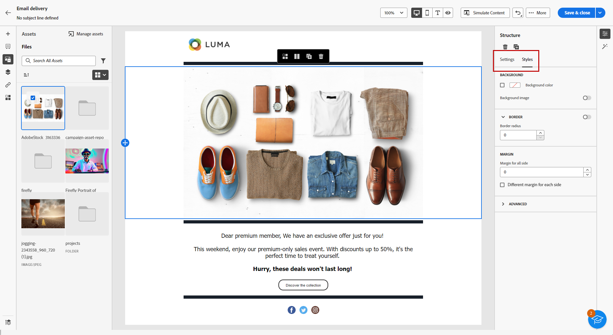

# Hantera resurser med [!DNL Adobe Experience Manager Assets as a Cloud Service]{#aem-assets}

## Kom igång med [!DNL Adobe Experience Manager Assets as a Cloud Service] {#get-started-assets-essentials}

[!DNL Adobe Experience Manager Assets as a Cloud Service] är en integrerad, samarbetsplattform som utformats för att effektivisera ditt kreativa arbetsflöde och centralisera digitala resurser för smidig leverans av upplevelser. Det förenklar organisationen, taggningen och hämtningen av godkända produktionsresurser, vilket säkerställer att alla team har ett enhetligt varumärke. Med det användarvänliga gränssnittet i [!DNL Assets as Cloud Service] kan du direkt få åtkomst till och dela resurser i dina Adobe Creative- och Experience Cloud-program.

Läs mer i [Adobe Experience Manager Assets as a Cloud Service documentation](https://experienceleague.adobe.com/docs/experience-manager-cloud-service/content/assets/home.html){target="_blank"}.

## Överföra och infoga resurser{#add-asset}

Om du vill importera filer till [!DNL Assets as Cloud Service] måste du först bläddra i eller skapa den mapp som filen ska lagras i. Du kan sedan infoga dem i ditt e-postinnehåll.

Mer information om hur du överför resurser finns i [Adobe Experience Manager Assets as a Cloud Service documentation](https://experienceleague.adobe.com/docs/experience-manager-cloud-service/content/assets/assets-view/add-delete-assets-view.html){target="_blank"}.

1. Gå till den avancerade menyn på din hemsida och välj [!DNL Experience Manager Assets].

   {zoomable="yes"}

1. Klicka på **Assets** under **Assets Management** och välj databas för din Assets i Adobe Campaign.

1. Klicka på en mapp från det centrala avsnittet eller från trädvyn för att öppna den.

   Du kan också klicka på **[!UICONTROL Create folder]** om du vill skapa en ny mapp.

1. Klicka på **[!UICONTROL Add Assets]** i den valda eller skapade mappen för att överföra den nya resursen till din mapp.

   {zoomable="yes"}

1. Klicka på **[!UICONTROL Browse]** i **[!UICONTROL Upload files]** och välj om du vill **[!UICONTROL Browse files]** eller **[!UICONTROL Browse folders]**.

1. Markera filen som du vill överföra. När du är klar klickar du på **[!UICONTROL Upload]**.

   {zoomable="yes"}

1. Om du vill komma åt den avancerade resurshanteringsmenyn väljer du den resurs du just överförde.

   Mer information om hur du hanterar dina resurser finns på [sidan](https://experienceleague.adobe.com/docs/experience-manager-cloud-service/content/assets/assets-view/manage-organize-assets-view.html).

   {zoomable="yes"}

1. Om du vill redigera dina resurser ytterligare med Adobe Photoshop Express dubbelklickar du på resurserna. Välj sedan ikonen **[!UICONTROL Edit mode]** på den högra menyn. [Läs mer](https://experienceleague.adobe.com/docs/experience-manager-cloud-service/content/assets/assets-view/edit-images-assets-view.html#edit-using-express){target="_blank"}.

1. I [!DNL Adobe Campaign] väljer du menyn **[!UICONTROL Asset picker]** i den vänstra rutan i e-postdesignern.

   {zoomable="yes"}

1. Välj den **[!UICONTROL Assets]**-mapp du skapat tidigare. Du kan också söka efter resursen eller mappen i sökfältet.

   Om det behövs klickar du på **[!UICONTROL Manage assets]** för att få direkt åtkomst till arbetsytan i [!DNL Adobe Experience Manager Assets].

1. Dra och släpp mediefilen i e-postinnehållet.

   {zoomable="yes"}

1. Du kan anpassa dina resurser ytterligare, till exempel lägga till en extern länk eller en text med flikarna **[!UICONTROL Settings]** och **[!UICONTROL Styles]**. [Läs mer om komponentinställningar](../email/content-components.md)

   {zoomable="yes"}
