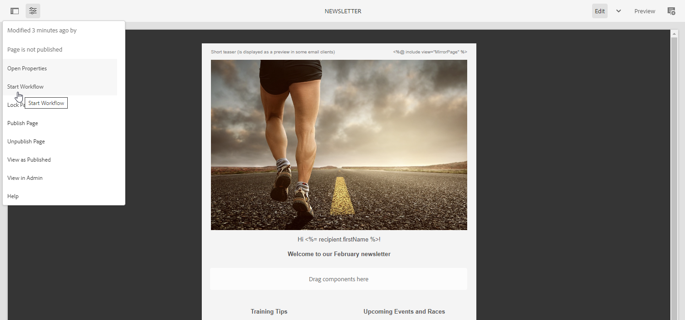
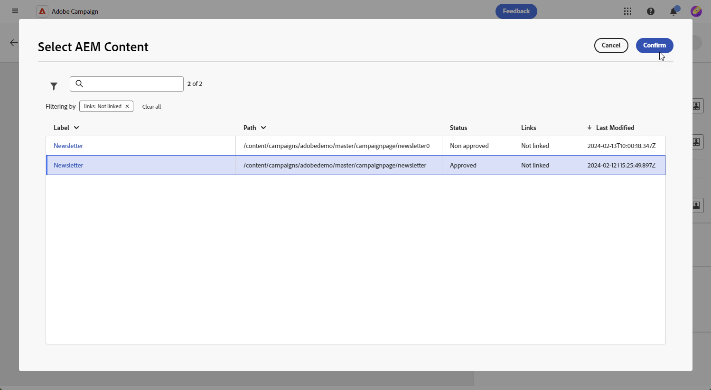

# Hantera mallar med [!DNL Adobe Experience Manager as a Cloud Service]{#aem-assets}

## Kom igång med [!DNL Adobe Experience Manager as a Cloud Service]{#create-aem}

Integreringen av Adobe Campaign webbgränssnitt med Adobe Experience Manager möjliggör smidig hantering av e-postmaterial och formulär direkt i Adobe Experience Manager.

 [Läs mer om Adobe Experience Manager as a Cloud Service](https://experienceleague.adobe.com/docs/experience-manager-cloud-service/content/sites/authoring/getting-started/quick-start.html?lang=en)

## Skapa en mall i [!DNL Adobe Experience Manager as a Cloud Service]{#create-aem-template}

1. Navigera till [!DNL Adobe Experience Manager]-författarinstansen och klicka på Adobe Experience längst upp till vänster på sidan. Välj **[!UICONTROL Sites]** på menyn.

1. Åtkomst till **[!UICONTROL Campaigns > Name of your brand > Main Area > Name of your page]**.

1. Klicka på **[!UICONTROL Create]** och välj **[!UICONTROL Page]** i listrutan.

   

1. Välj mallen **[!UICONTROL Adobe Campaign Email]** och ge nyhetsbrevet ett namn.

   ![[Skärmbild som visar mallmarkerings- och namnfält för Adobe Campaign-e-post.]](assets/aem_2.png)

1. Anpassa e-postinnehållet genom att lägga till komponenter, till exempel anpassningsfält från Adobe Campaign. [Läs mer](https://experienceleague.adobe.com/docs/experience-manager-65/content/sites/authoring/aem-adobe-campaign/campaign.html?lang=en#editing-email-content)

1. När e-postmeddelandet är klart går du till menyn **[!UICONTROL Page information]** och klickar på **[!UICONTROL Start workflow]**.

   

1. I den första listrutan väljer du **[!UICONTROL Approve Adobe Campaign]** som arbetsflödesmodell och klickar på **[!UICONTROL Start workflow]**.

1. En ansvarsfriskrivning visas högst upp på sidan med datumet `This page is subject to the workflow Approve for Adobe Campaign`. Klicka på **[!UICONTROL Complete]** bredvid ansvarsfriskrivningen för att bekräfta granskningen och klicka på **[!UICONTROL Ok]**.

   

1. Klicka på **[!UICONTROL Complete]** igen och välj **[!UICONTROL Newsletter approval]** i listrutan **[!UICONTROL Next Step]**.

Nyhetsbrevet är nu klart och synkroniserat i Adobe Campaign.

## Importera en Adobe Experience Manager as a Cloud Service-mall{#aem-templates-perso}

När Experience Manager-mallen finns tillgänglig på Adobe Campaign Web som innehållsmall kan du identifiera och lägga in det innehåll som behövs för e-postmeddelandet, inklusive personalisering.

1. Klicka på **[!UICONTROL Create delivery]** på menyn **[!UICONTROL Deliveries]** i Campaign Web.

1. Välj den inbyggda mallen **[!UICONTROL Email delivery with AEM content]** i e-postmallfönstret.

   

1. Ange en **[!UICONTROL Label]** för leveransen och konfigurera ytterligare alternativ baserat på dina behov:

   * **[!UICONTROL Internal name]**: Tilldela en unik identifierare till leveransen.
   * **[!UICONTROL Folder]**: Lagra leveransen i en specifik mapp.
   * **[!UICONTROL Delivery code]**: Använd det här fältet för att ordna leveranser baserat på din egen namnkonvention.
   * **[!UICONTROL Description]**: Ange en beskrivning för leveransen.
   * **[!UICONTROL Nature]**: Ange typ av e-post för klassificeringssyften.

1. Definiera en **[!UICONTROL Audience]** för din e-post. [Läs mer](../email/create-email.md#define-audience)

1. Klicka på **[!UICONTROL Edit content]**.

1. Klicka på **[!UICONTROL Select AEM content]** på menyn **[!UICONTROL Edit content]**.

   

1. Bläddra igenom din AEM-mall och välj den som ska importeras till Campaign Web.

   

1. Observera att innehåll inte synkroniseras automatiskt. Om mallarna ändras direkt i Adobe Experience Manager väljer du **[!UICONTROL Refresh AEM content]** för att uppdatera till den senaste versionen av mallen.

1. Klicka på **[!UICONTROL Unlink AEM content]** om du vill ta bort länken mellan Experience Manager och Campaign, eller om du vill anpassa din Experience Manager-mall ytterligare i e-postdesignern.

   

1. Om du har lagt till anpassat innehåll i din Experience Manager-mall klickar du på **[!UICONTROL Simulate Content]** för att förhandsgranska hur det kommer att visas i meddelandet med testprofiler.

[Läs mer om förhandsgranskning och testprofiler](../preview-test/preview-content.md)

1. När du visar förhandsgranskningen av meddelandet ersätts alla anpassade element automatiskt med motsvarande data från den valda testprofilen.

   Lägg till ytterligare testprofiler med knappen **[!UICONTROL Manage test profiles]** om det behövs.

Leveransen är nu klar att skickas.