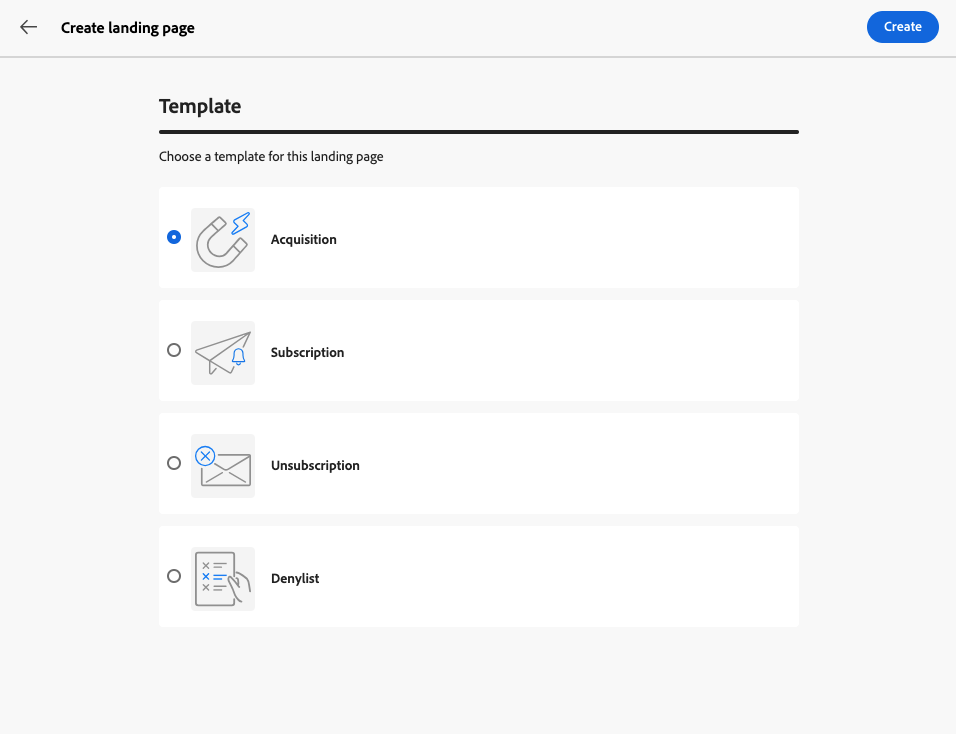
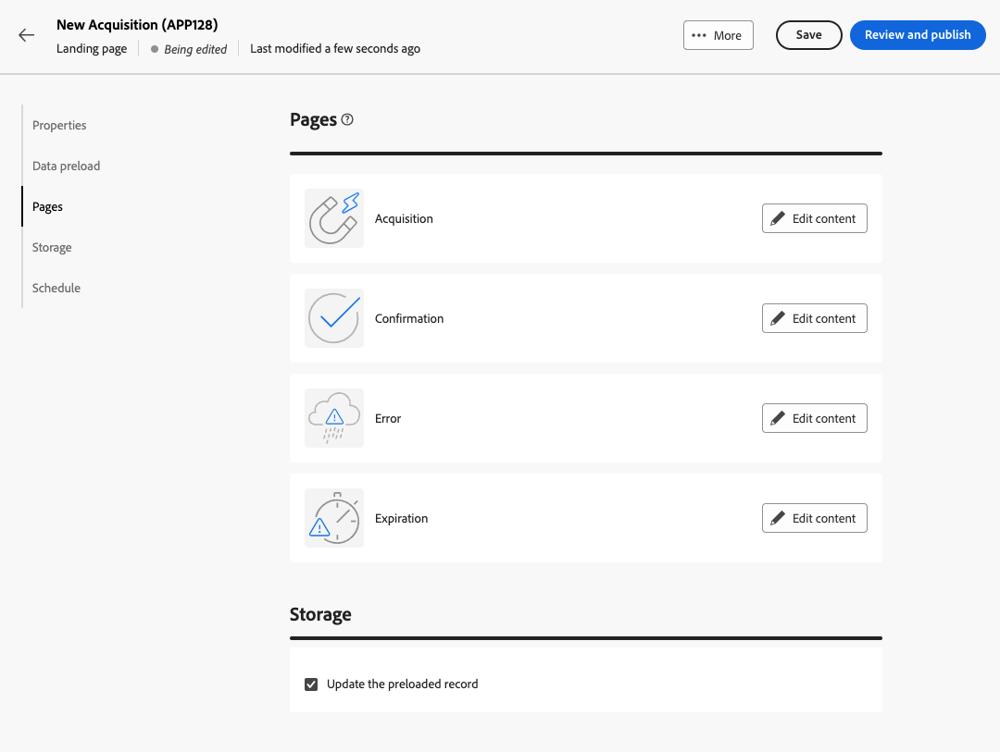
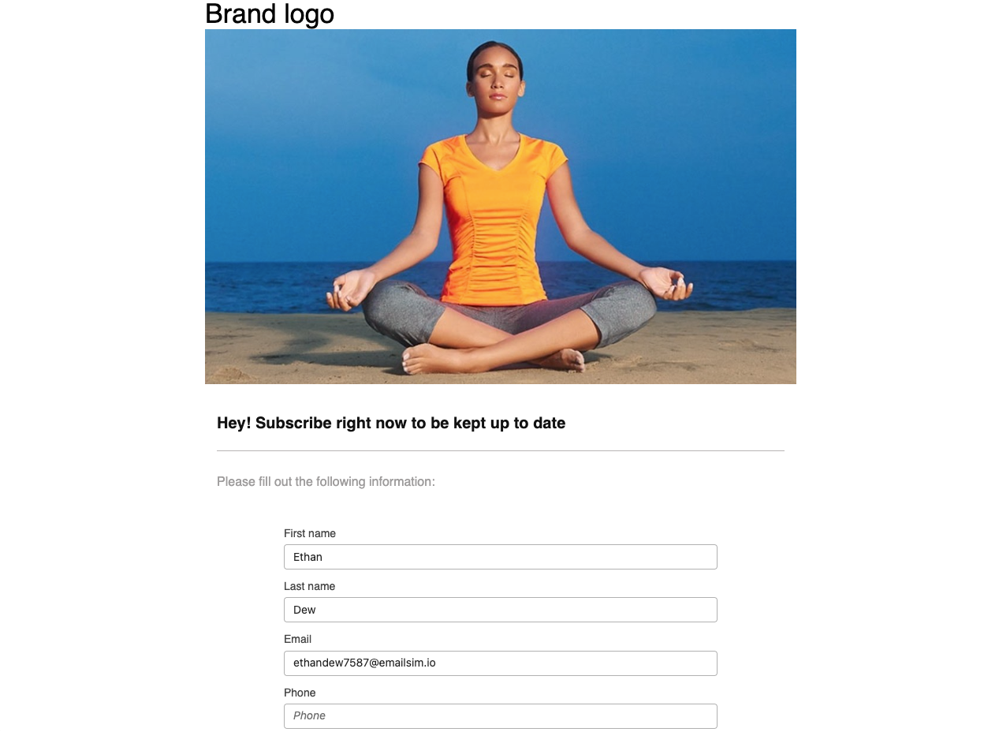

# Skapa och publicera landningssidor {#create-lp}

>[!CONTEXTUALHELP]
>id="acw_landingpages_menu"
>title="Skapa och hantera landningssidor"
>abstract="Med Adobe Campaign kan du skapa, designa och dela landningssidor som dirigerar dina användare till webbsidor på webben där du kan hantera kundvärvning, prenumeration/avprenumeration och blocklist användningsfall, baserat på inbyggda mallar."

Med användargränssnittet för Campaign-webben kan du skapa, designa och publicera landningssidor. När formuläret har publicerats kan du infoga en länk till det i en leverans. När mottagarna klickar på länken dirigeras de till motsvarande landningssida.

[!DNL Adobe Campaign] innehåller fyra mallar för att hantera följande användningsområden: **förvärv**, **prenumeration**, **unsubscription** och **blockeringslista**. [Läs mer](lp-use-cases.md)

## Åtkomst till landningssidor {#access-landing-pages}

Om du vill få åtkomst till landningssidans lista väljer du **[!UICONTROL Campaign management]** > **[!UICONTROL Landing pages]** från den vänstra menyn.

{zoomable=&quot;yes&quot;}

The **[!UICONTROL Landing pages]** lager visar alla skapade artiklar. Du kan använda **Visa filter** -knappen. Du kan begränsa resultatet till en viss [mapp](../get-started/permissions.md#folders) använda listrutan eller lägga till regler med [frågemodellerare](../query/query-modeler-overview.md).

{zoomable=&quot;yes&quot;}

<!--From this list, you can access the [landing page Live report](../reports/lp-report-live.md) or [landing page Global report](../reports/lp-report-global.md) for published items.-->

>[!CAUTION]
>
>Du kan inte visa eller redigera landningssidor som skapats från klientkonsolen (webbformulär) i gränssnittet för Campaign-webben. Läs mer i [Dokumentation för kampanjkonsol](https://experienceleague.adobe.com/docs/campaign/campaign-v8/content/webapps.html){target="_blank"}.

<!--If you unpublish a landing page which is referenced in a message, the link to the landing page will be broken and an error page will be displayed. You cannot delete a published landing page. To delete it, you must first unpublish it.-->

Du kan duplicera eller ta bort en landningssida. Klicka på ellipsen bredvid en landningssida för att välja önskad åtgärd.

## Skapa en landningssida {#create-landing-page}

>[!CONTEXTUALHELP]
>id="acw_landingpages_properties"
>title="Definiera egenskaperna för landningssidan"
>abstract="Fyll i egenskapsfälten, till exempel etiketten, och ändra schemat om det behövs. Dessutom kan du redigera det interna namnet, ändra mappen där landningssidan lagras och ange en beskrivning."

>[!CONTEXTUALHELP]
>id="acw_landingpages_pages_list"
>title="Definiera innehållet på varje sida"
>abstract="Justera innehållet på varje sida som är en del av landningssidan, t.ex. själva formuläret, bekräftelsesidan som visas när formuläret skickas eller så dirigeras sidanvändarna till om ett fel inträffar."

>[!CONTEXTUALHELP]
>id="acw_landingpages_schedule"
>title="Schemalägg din landningssida"
>abstract="Du kan definiera ett startdatum och ett slutdatum för landningssidan. När sidan når slutet av giltighetsperioden är formuläret inte längre tillgängligt. The **Förfallotid** sidan visas i stället."

>[!CONTEXTUALHELP]
>id="acw_landingpages_preload"
>title="Definiera förinläsningsalternativ"
>abstract="När **Fyll i förväg med de data som formuläret refererar till** Om besökaren på landningssidan matchar en profil från databasen, är alternativet markerat och profilens information automatiskt förinläst i formuläret. Med **Hoppa över förinläsning om ID saknas** om du väljer det här alternativet läggs alla profiler som anges till i databasen när formuläret har godkänts."

>[!CONTEXTUALHELP]
>id="acw_landingpages_storage"
>title="Definiera lagringsalternativ"
>abstract="I avsnittet med förinläsning kan du ange hur du ska hitta den post som ska uppdateras i databasen."

<!--The main steps to create landing pages are as follows:

{zoomable="yes"}-->

Så här skapar du en landningssida:

1. Från **[!UICONTROL Landing pages]** lager, klicka **[!UICONTROL Create landing page]**.

   {zoomable=&quot;yes&quot;}

1. Välj en mall:
   * **[!UICONTROL Acquisition]**: Det här är standardmallen för landningssidor, som gör att du kan hämta och uppdatera profildata.
   * **[!UICONTROL Subscription]**: Använd den här mallen för att göra det möjligt för användare att prenumerera på en viss [service](../audience/manage-services.md).
   * **[!UICONTROL Unsubscription]**: Den här mallen kan användas i en leverans som skickas till prenumeranterna av en tjänst, så att de kan avbryta prenumerationen på tjänsten [service](../audience/manage-services.md).
   * **[!UICONTROL Denylist]**: Den här mallen ska användas när en profil klickar på en länk för avanmälan i en leverans och inte längre vill bli kontaktad.

   {zoomable=&quot;yes&quot;}

   >[!NOTE]
   >
   >Lär dig hur du implementerar de olika användningsfall som motsvarar de olika mallarna i [den här sidan](lp-use-cases.md).

1. Klicka på **[!UICONTROL Create]**.

1. Fyll i **[!UICONTROL Properties]** fält som etiketten.

   Som standard lagras landningssidor i **[!UICONTROL Web applications]** mapp. Du kan ändra den genom att bläddra till önskad plats i dialogrutan **[!UICONTROL Additional options]**. [Lär dig hur du arbetar med mappar](../get-started/permissions.md#folders)

   {zoomable=&quot;yes&quot;}

1. I **[!UICONTROL Data preload]** är de två alternativen nedan markerade som standard:

   * När **[!UICONTROL Pre-fill with the data referenced in the form]** Om besökaren på landningssidan matchar en profil från databasen, är alternativet markerat och profilens information automatiskt förinläst i formuläret. Användaren behöver bara fylla i de fält som saknas och uppdatera de befintliga värdena om det behövs. Detta gör att du kan sammanfoga data för befintliga profiler i stället för att skapa dubbletter.

   * The **[!UICONTROL Skip preloading if no ID]** Du måste markera det här alternativet om du inte vill uppdatera profiler. I det här fallet läggs alla profiler som anges till i databasen när formuläret har godkänts. Det här alternativet används till exempel när formuläret publiceras på en webbplats.

1. En landningssida kan ha efterföljande sidor. Om du vill lägga till sidor bläddrar du till **[!UICONTROL Pages]** och klickar på **[!UICONTROL Edit content]** för varje sida som du vill utforma för den här landningssidan. Innehållet på varje sida är redan förfyllt. Redigera dem efter behov. [Läs mer](lp-content.md)

   {zoomable=&quot;yes&quot;}

1. The **[!UICONTROL Update the preloaded record]** är markerat som standard. Det gör det möjligt att uppdatera de profiler som lagras i databasen via landningssidan. I rutan för förinläsning kan du ange hur posten ska uppdateras i databasen.

   Du kan också välja bland fälten i den aktuella kontexten på landningssidan, de som ska användas för att hitta motsvarande profil i databasen. Om du vill göra det avmarkerar du **[!UICONTROL Update the preloaded record]** och kontrollera fälten under **[!UICONTROL Reconciliation options]**.

   {zoomable=&quot;yes&quot;}

1. Du kan definiera ett startdatum och ett slutdatum för landningssidan. Välj **[!UICONTROL Enable scheduling]** och ange datum.

   {zoomable=&quot;yes&quot;}

   * Landningssidan publiceras automatiskt på det angivna startdatumet/den angivna starttiden.

     >[!NOTE]
     >
     >Om inget startdatum definieras blir landningssidan live så snart den har publicerats.

   * När sidan når slutdatumet, <!--the landing page is automatically unpublished and -->formuläret inte längre är tillgängligt. The **[!UICONTROL Expiration]** sidan visas i stället.

     >[!NOTE]
     >
     >Av säkerhetsskäl och av plattformsprestanda rekommenderar Adobe att du anger ett slutdatum.

1. Klicka på **[!UICONTROL Review and publish]**.

När du har definierat alla inställningar och [designad](lp-content.md) alla sidor kan du [test](#test-landing-page) och [publicera](#publish-landing-page) din landningssida så som beskrivs nedan.

## Testa landningssidan {#test-landing-page}

>[!CONTEXTUALHELP]
>id="acw_landingpages_simulate"
>title="Simulera landningssidan"
>abstract="Du kan se en förhandsgranskning av landningssidan i gränssnittet för webben i Campaign eller öppna den på en ny webbläsarflik."

>[!CONTEXTUALHELP]
>id="ac_preview_lp_profiles"
>title="Förhandsgranska och testa landningssidan"
>abstract="När du har definierat inställningarna för landningssidan och innehållet kan du använda testprofiler för att förhandsgranska den."

När inställningarna för landningssidan och innehållet har definierats kan du använda testprofiler för att förhandsgranska den. Om du infogade [personaliserat innehåll](../personalization/gs-personalization.md)kan du med hjälp av testprofildata kontrollera hur det här innehållet visas på landningssidan.

>[!CAUTION]
>
>Du måste ha testprofiler tillgängliga för att kunna förhandsgranska dina meddelanden och skicka korrektur. [Läs mer om testprofiler](../audience/test-profiles.md)

Så här testar du landningssidan:

1. När du klickat **[!UICONTROL Review and publish]** väljer du **[!UICONTROL Simulate content]** från kontrollpanelen för landningssidan för att komma åt valet av testprofil.

   {zoomable=&quot;yes&quot;}

1. Från **[!UICONTROL Simulate]** väljer du en eller flera testprofiler.

   Stegen för att välja testprofiler är desamma som när du testar ett meddelande. De beskrivs i [Förhandsgranska och testa](../preview-test/preview-test.md) -avsnitt.

1. Välj **[!UICONTROL Open preview]** för att testa landningssidan.

   {zoomable=&quot;yes&quot;}

1. Förhandsgranskningen av landningssidan öppnas på en ny flik. Personaliserade element ersätts med valda testprofildata.

   Om du valde **[!UICONTROL Pre-fill with the data referenced in the form]** i inställningarna för landningssidan fylls formulärfälten automatiskt i med motsvarande data för testprofilen.<!--TBC-->

   {zoomable=&quot;yes&quot;}

1. Välj andra testprofiler om du vill förhandsgranska återgivningen för varje variant av landningssidan.

<!--Can you preview Confirmation/Error/Expiration pages?-->

## Publicera landningssidan {#publish-landing-page}

När landningssidan är klar och validerad publicerar du den för att göra den tillgänglig för användning i en leverans med motsvarande knapp.

Publicerad:

* Landningssidan läggs till i landningssidans lista med **[!UICONTROL Published]** status. Den är nu live och klar att refereras till i innehållet.

* Du kan kopiera och klistra in **[!UICONTROL Landing page URL]** som visas överst på sidan i en webbläsare för att förhandsgranska din landningssida.

>[!CAUTION]
>
>Om du vill testa eller utnyttja landningssidan fullt ut kan du inte kopiera och klistra in länken direkt i en webbläsare eller i leveranser. Använd i stället [Simulera innehåll](#test-landing-page) för att testa den och följa stegen i [det här avsnittet](lp-use-cases.md) för att använda landningssidan på rätt sätt.

{zoomable=&quot;yes&quot;}

Du kan övervaka hur landningssidan påverkas via loggar<!--and specific reports-->. Klicka på knappen **[!UICONTROL Logs]**.
