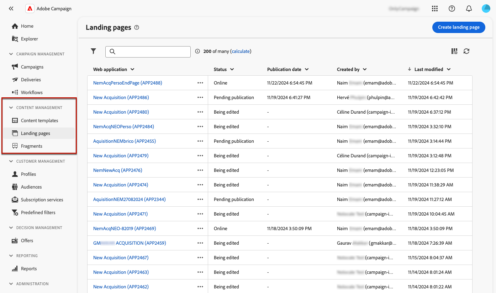
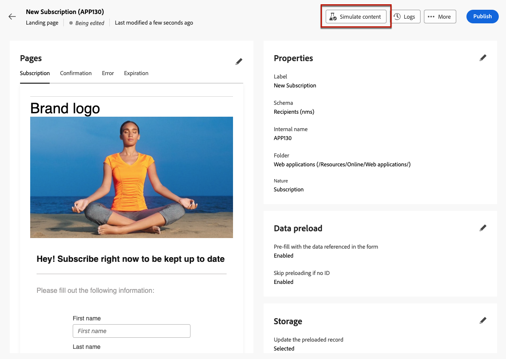

# Skapa och publicera landningssidor {#create-lp}

>[!CONTEXTUALHELP]
>id="acw_landingpages_menu"
>title="Skapa och hantera landningssidor"
>abstract="Med Adobe Campaign kan du skapa, utforma och dela landningssidor som dirigerar dina användare till webbsidor på webben där du kan hantera kundvärvning, prenumerationer/uppsägningar och blocklist användningsexempel, baserat på inbyggda mallar."

Med Adobe Campaign kan du skapa, designa och dela landningssidor. När det gäller marknadsföringskampanjer är en landningssida en fristående webbsida där en besökare dirigeras efter att ha klickat på en länk i ett e-postmeddelande, SMS, push-leverans eller på en webbplats. Adobe Campaign har fyra mallar för hantering **förvärv**, **prenumerationer**, **avbeställa** och **blockeringslista** användningsfall.

## Åtkomst till landningssidor {#access-landing-pages}

Om du vill få åtkomst till landningssidans lista väljer du **[!UICONTROL Campaign management]** > **[!UICONTROL Landing pages]** från den vänstra menyn.

The **[!UICONTROL Landing pages]** lager visar alla skapade artiklar. Du kan använda **Visa filter** -knappen. Du kan begränsa resultatet till en viss [mapp](../get-started/permissions.md#folders) använda listrutan eller lägga till regler med [frågemodellerare](../query/query-modeler-overview.md).

<!--From this list, you can access the [landing page Live report](../reports/lp-report-live.md) or [landing page Global report](../reports/lp-report-global.md) for published items.-->

>[!CAUTION]
>
>Du kan inte visa eller redigera landningssidor som skapats från klientkonsolen på Campaign Web. Läs mer i [Dokumentation för kampanjkonsol](https://experienceleague.adobe.com/docs/campaign/campaign-v8/content/webapps.html){target="_blank"}.

<!--If you unpublish a landing page which is referenced in a message, the link to the landing page will be broken and an error page will be displayed. You cannot delete a published landing page. To delete it, you must first unpublish it.-->

Du kan duplicera eller ta bort en landningssida. Klicka på de tre punkterna bredvid en landningssida för att välja önskad åtgärd.

## Skapa en landningssida {#create-landing-page}

>[!CONTEXTUALHELP]
>id="acw_landingpages_properties"
>title="Definiera egenskaperna för landningssidan"
>abstract="Fyll i egenskapsfälten, till exempel etiketten, och ändra schemat om det behövs. Dessutom kan du redigera det interna namnet, ändra mappen där landningssidan lagras och ange en beskrivning."

>[!CONTEXTUALHELP]
>id="acw_landingpages_pages_list"
>title="Definiera sidans innehåll"
>abstract="Redigera innehållet på varje sida som är en del av den här landningssidan."

>[!CONTEXTUALHELP]
>id="acw_landingpages_schedule"
>title="Schemalägg din landningssida"
>abstract="Du kan definiera ett startdatum och ett slutdatum för landningssidan. När sidan har gått ut visas **Förfallotid** visas."

>[!CONTEXTUALHELP]
>id="acw_landingpages_primarypage"
>title="Definiera inställningar för den primära sidan"
>abstract="Den primära sidan visas omedelbart för användarna när de klickar på länken till din landningssida, till exempel från ett e-postmeddelande eller en webbplats."

>[!CONTEXTUALHELP]
>id="acw_landingpages_subscription"
>title="Ange startsida för prenumerationen"
>abstract="Med en prenumerationssida kan dina kunder prenumerera på en tjänst."

<!--The main steps to create landing pages are as follows:

-->

1. Från **[!UICONTROL Landing pages]** lager, klicka **[!UICONTROL Create landing page]**.

   

1. Välj en mall:
   * **[!UICONTROL Acquisition]**: Det här är standardmallen för landningssidor, som gör att du kan hämta och uppdatera profildata.
   * **[!UICONTROL Subscription]**: Använd den här mallen för att erbjuda prenumerationer på en tjänst.
   * **[!UICONTROL Unsubscription]**: Den här mallen kan länkas från ett e-postmeddelande som skickas till prenumeranter på en tjänst, så att de kan avbryta prenumerationen på tjänsten.
   * **[!UICONTROL Denylist]**: Den här mallen ska användas när en profil inte längre vill bli kontaktad av Campaign. Läs mer om hantering av blockeringslista

   

1. Klicka på **[!UICONTROL Create]**.

1. Fyll i egenskapsfälten, till exempel etiketten. Som standard lagras landningssidor i **[!UICONTROL Web applications]** mapp. Du kan ändra den genom att bläddra till önskad plats i dialogrutan **[!UICONTROL Additional options]**. [Lär dig hur du arbetar med mappar](../get-started/permissions.md#folders)

   

1. I **[!UICONTROL Data preload]** är de två alternativen nedan markerade som standard:

   * The **[!UICONTROL Pre-fill with the data referenced in the form]** kan du automatiskt förhandsladda data som matchar inmatnings- och kopplingsfält i formuläret.

   * The **[!UICONTROL Skip preloading if no ID]** Du måste markera det här alternativet om du inte vill uppdatera profiler. I det här fallet läggs alla profiler som anges till i databasen när formuläret har godkänts. Det här alternativet används till exempel när formuläret publiceras på en webbplats.

1. I **[!UICONTROL Pages]** klickar du på **[!UICONTROL Edit content]** för varje sida som du vill utforma för den här landningssidan. Innehållet på varje sida är redan förfyllt. Redigera dem efter behov. [Läs mer](lp-content.md)

   

1. The **[!UICONTROL Update the preloaded record]** är markerat som standard. Om du vill uppdatera profilerna som lagras i databasen via landningssidan kan du använda en förinläsningsruta. I rutan för förinläsning kan du ange hur posten ska uppdateras i databasen. Du kan också välja bland fälten i den aktuella kontexten på landningssidan, de som ska användas för att hitta motsvarande profil i databasen.

   

1. Du kan definiera ett startdatum och ett slutdatum för landningssidan. Välj **[!UICONTROL Enable scheduling]** och ange datum. När sidan har gått ut visas **[!UICONTROL Expiration]** visas.

1. Klicka på **[!UICONTROL Review and publish]**.

När du har konfigurerat och utformat alla sidor kan du [test](#test-landing-page) och [publicera](#publish-landing-page) din landningssida.

## Testa landningssidan {#test-landing-page}

>[!CONTEXTUALHELP]
>id="acw_landingpages_simulate"
>title="Simulera landningssidan"
>abstract="Du kan se en förhandsgranskning av landningssidan i gränssnittet för webben i Campaign eller öppna den på en ny webbläsarflik."

>[!CONTEXTUALHELP]
>id="ac_preview_lp_profiles"
>title="Förhandsgranska och testa landningssidan"
>abstract="När du har definierat inställningarna för landningssidan och innehållet kan du använda testprofiler för att förhandsgranska den."

När inställningarna för landningssidan och innehållet har definierats kan du använda testprofiler för att förhandsgranska den. Om du infogade [personaliserat innehåll](../personalization/gs-personalization.md)kan du med hjälp av testprofildata kontrollera hur det här innehållet visas på landningssidan.

>[!CAUTION]
>
>Du måste ha testprofiler tillgängliga för att kunna förhandsgranska dina meddelanden och skicka korrektur. Lär dig hur [skapa testprofiler](../audience/test-profiles.md).

1. Klicka på **[!UICONTROL Simulate content]** för att komma åt valet av testprofil.

   

1. Från **[!UICONTROL Simulate]** väljer du en eller flera testprofiler.

   Stegen för att välja testprofiler är desamma som när du testar ett meddelande. De beskrivs i [Förhandsgranska och testa](../preview-test/preview-test.md) -avsnitt.

1. Välj **[!UICONTROL Open preview]** för att testa landningssidan.

   

1. Förhandsgranskningen av landningssidan öppnas på en ny flik. Personaliserade element ersätts med valda testprofildata.

   

1. Välj andra testprofiler om du vill förhandsgranska återgivningen för varje variant av landningssidan.

<!--Can you preview Confirmation/Error/Expiration pages?-->

## Publicera landningssidan {#publish-landing-page}

När landningssidan är klar kan du publicera den för att göra den tillgänglig för användning i ett meddelande.

När landningssidan har publicerats läggs den till i listan över landningssidor med **[!UICONTROL Published]** status. Den är nu klar att användas.

När publiceringen är klar kan du kopiera och klistra in **[!UICONTROL Landing page URL]** som visas överst på sidan i en webbläsare.

Ni kan övervaka landningssidans påverkan via loggar och specifika rapporter.
