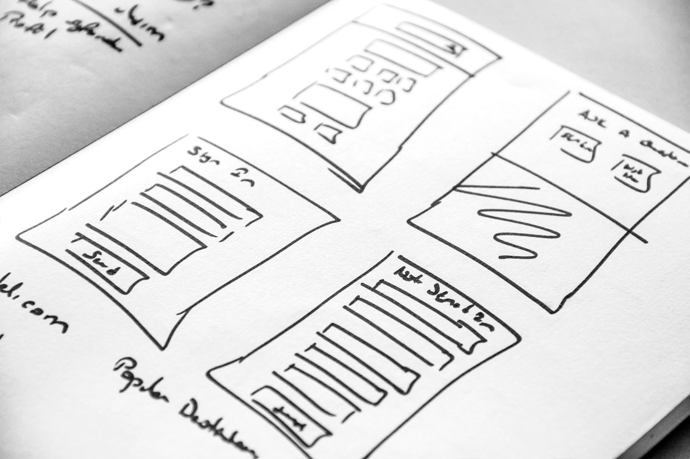

# Kom igång med landningssidor {#get-sarted-lp}

>[!CONTEXTUALHELP]
>id="acw_homepage_welcome_rn5"
>title="Landningssidor"
>abstract="Upptäck den nya landningssidans upplevelse. Skapa, designa och dela landningssidor på ett ögonblick för att dirigera användarna till webbsidor på webben där ni kan hantera kundvärvning, prenumeration/avprenumeration och blocklist användningsfall, baserat på inbyggda mallar."
>additional-url="https://experienceleague.adobe.com/docs/campaign-web/v8/whats-new.html" text="Se versionsinformation"

[!DNL Adobe Campaign] gör att du kan skapa, utforma och dela landningssidor.

När det gäller marknadsföringskampanjer är en landningssida en fristående webbsida där en besökare dirigeras efter att ha klickat på en länk i en leverans eller på en webbplats.

Med landningssidor kan du dirigera dina användare till onlineformulär där de kan uppdatera sina data, välja att inte ta emot meddelanden eller prenumerera på en viss tjänst, till exempel ett nyhetsbrev.

>[!CAUTION]
>
>Landningssidor som du skapar i gränssnittet för Campaign-webben skiljer sig från webbformulär som skapas från klientkonsolen. Du kan inte visa eller redigera webbformulär i gränssnittet för webbkampanjen.
>
>Läs mer om webbformulär i [Dokumentation för kampanjkonsol](https://experienceleague.adobe.com/docs/campaign/campaign-v8/content/webapps.html){target="_blank"}.

De viktigaste funktionerna för landningssidor anges nedan:

* Skapa, designa och dela landningssidor direkt med färdiga **förfyllda mallar** matchar olika användningsfall. [Läs mer](create-lp.md)
* Utnyttja [!DNL Adobe Campaign] funktioner för att enkelt bygga **responsiva landningssidor**. [Läs mer](lp-content.md)
* Konfigurera **avanmälnings- och avanmälningsflöden** snabbt och smidigt. [Läs mer](lp-use-cases.md)
* Skapa prenumerationstjänster så att användarna kan **prenumerera på en tjänst**. [Läs mer](lp-use-cases.md#lp-subscription)
* Förse mottagarna med **möjlighet att avbryta prenumerationen** från att ta emot meddelanden. [Läs mer](lp-use-cases.md#lp-unsubscription)
  <!--Send a **confirmation email** upon opt-in or opt-out.-->

<table style="table-layout:fixed"><tr style="border: 0;">
<td>

<a href="create-lp.md"><strong>Skapa landningssidor</strong>

</td>
<td>

<a href="../audience/manage-services.md"><strong>Skapa prenumerationstjänster</strong></a>

</td>
<td>

<a href="lp-content.md"><strong>Utforma landningssidor</strong></a>

</td>
<td>

<a href="lp-templates.md"><strong>Arbeta med innehållsmallar</strong></a>

</td>
</tr></table>
