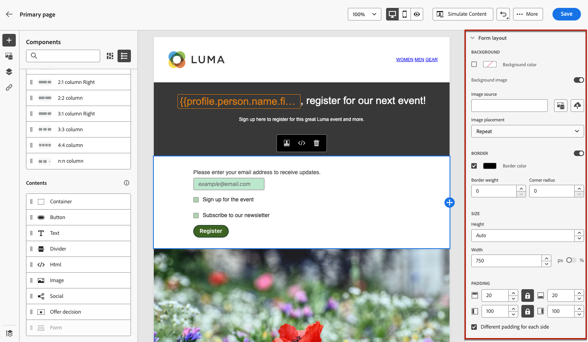

# Definiera landningssidspecifikt innehåll {#lp-content}

>[!CONTEXTUALHELP]
>id="ac_lp_components"
>title="Använda innehållskomponenter"
>abstract="Innehållskomponenterna är tomma platshållare för innehåll som du kan använda för att skapa layouten för en landningssida. Använd formulärkomponenten för att definiera specifikt innehåll som gör att användare kan välja och skicka sina val."

När du redigerar innehållet på en sida på landningssidan är den redan ifylld.

Den primära sidan är den sida som visas omedelbart för användarna efter att de har klickat på länken till din landningssida, till exempel från ett e-postmeddelande eller en webbplats. Den primära sidan är redan förfylld med [landningssidspecifik formulärkomponent](#use-form-component) för att göra det möjligt för användare att välja och skicka sina val. Du kan också definiera [landningssidspecifika format](#lp-form-styles).

Om du vill designa innehållet på landningssidan ytterligare kan du använda samma komponenter som för ett e-postmeddelande. [Läs mer](../email/content-components.md#add-content-components)

<!--
The content of the **[!UICONTROL Confirmation]**, **[!UICONTROL Error]** and **[!UICONTROL Expiration]** pages is also pre-filled. Edit them as needed.

Set the subscription form to the appropriate fields from the database to make sure it will work correctly.

The landing page default fields are already there for the selected template.

>[!NOTE]
>
>You can also create a click-through landing page without a **[!UICONTROL Form]** component. In that case, the landing page will be displayed to users, but they will not be required to submit any form. This can be useful if you only want to showcase a landing page without requiring any action from your recipients such as opt-in or opt out, or want to provide information that doesn't require user input.

Using the landing page content designer, you can also leverage contextual data coming from the primary page in a subpage. [Learn more](#use-primary-page-context)-->

## Använda formulärkomponenten {#use-form-component}

>[!CONTEXTUALHELP]
>id="ac_lp_formfield"
>title="Ange formulärkomponentfälten"
>abstract="Definiera hur dina mottagare ska se och skicka sina val från din landningssida."

>[!CONTEXTUALHELP]
>id="acw_landingpages_calltoaction"
>title="Vad händer när du klickar på knappen"
>abstract="Definiera vad som ska hända när användare skickar in landningssidans formulär."

Om du vill definiera specifikt innehåll som gör det möjligt för användare att välja och skicka sina val från landningssidan använder du **[!UICONTROL Form]** -komponenten. Följ stegen nedan för att göra det.

1. Specifikt för landningssidan **[!UICONTROL Form]** -komponenten visas redan på arbetsytan för den valda mallen.

   >[!NOTE]
   >
   >The **[!UICONTROL Form]** -komponenten kan bara användas en gång på samma sida.

1. Markera den. The **[!UICONTROL Form content]** visas på den högra paletten så att du kan redigera de olika fälten i formuläret.

   

   >[!NOTE]
   >
   >Växla till **[!UICONTROL Styles]** när som helst för att redigera formaten för formulärkomponentens innehåll. [Läs mer](#lp-form-styles)

1. Expandera det första textfältet. Från **[!UICONTROL Text field 1]** kan du redigera fälttypen, fältet från databasen, etiketten och texten som ska visas i fältet innan användaren fyller i fältet.

   

1. Markera **[!UICONTROL Make form field mandatory]**-alternativet om det behövs.  I så fall kan landningssidan endast skickas om användaren har fyllt i detta fält.

   >[!NOTE]
   >
   >Om ett obligatoriskt fält inte är ifyllt visas ett felmeddelande när användaren skickar sidan.

1. Lägg till en kryssruta. Välj om kryssrutan ska uppdatera en tjänst eller ett fält från databasen.

   

   Ange om den här kryssrutan ska avanmäla användare till eller från. Välj bland de två alternativen nedan:

   * **[!UICONTROL Subscribe if checked]**: Användarna måste markera kryssrutan för att godkänna (anmälan).
   * **[!UICONTROL Unsubscribe if checked]**: Användarna måste markera kryssrutan för att ta bort sitt samtycke (avanmälan).

1. Du kan ta bort och lägga till så många textfält och/eller kryssrutor som behövs.

1. När du har lagt till alla önskade kryssrutor och/eller textfält klickar du på **[!UICONTROL Call to action]** för att expandera motsvarande avsnitt. Här kan du definiera hur knappen ska fungera i **[!UICONTROL Form]** -komponenten.

   

1. Definiera vad som ska hända när du klickar på knappen:

   * **[!UICONTROL Confirmation page]**: Användaren omdirigeras till **[!UICONTROL Confirmation]** siduppsättning för den aktuella landningssidan.

   * **[!UICONTROL Redirect URL]**: Ange URL-adressen till sidan som användarna ska omdirigeras till.

1. Om du vill göra ytterligare uppdateringar när du skickar formuläret väljer du **[!UICONTROL Addtional updates]**, välja **[!UICONTROL Opt in]** eller **[!UICONTROL Opt out]** och ange om du vill uppdatera en prenumerationslista, kanalen eller bara den e-postadress som används.

   

1. Spara innehållet för att gå tillbaka till [egenskaper för landningssida](create-lp.md).

## Definiera format för landningssidor {#lp-form-styles}

1. Om du vill ändra formaten för formulärkomponentens innehåll växlar du när som helst till **[!UICONTROL Style]** -fliken.

   

1. The **[!UICONTROL Fields]** -avsnittet är som standard utökat och du kan redigera utseendet på textfältet, t.ex. etikett- och platshållarteckensnitt, placeringen av etiketten, fältets bakgrundsfärg eller fältkanten.

   

1. Expandera **[!UICONTROL Checkboxes]** för att definiera utseendet på kryssrutorna och motsvarande text. Du kan till exempel justera teckensnittsfamiljen eller storleken, eller kryssrutans kantfärg.

   

1. Expandera **[!UICONTROL Buttons]** för att ändra utseendet på knappen i komponentformuläret. Du kan till exempel ändra teckensnitt, lägga till en kant, redigera etikettfärgen vid hovring eller justera justeringen av knappen.

   

   Du kan förhandsgranska vissa inställningar, t.ex. knappetikettfärg vid hovring med hjälp av **[!UICONTROL Simulate content]** -knappen. Läs mer om testning av landningssidor [här](create-lp.md#test-landing-page).

1. Expandera **[!UICONTROL Form layout]** om du vill redigera layoutinställningar som bakgrundsfärg, utfyllnad eller marginal.

   

<!--
1. Expand the **[!UICONTROL Form error]** section to adjust the display of the error message that displays in case a problem occurs. Check the corresponding option to preview the error text on the form.

    -->

