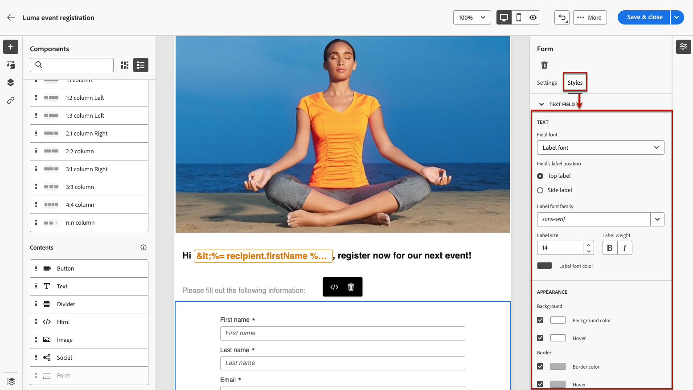

# Definiera landningssidspecifikt innehåll {#lp-content}

>[!CONTEXTUALHELP]
>id="ac_lp_components"
>title="Använda innehållskomponenter"
>abstract="Innehållskomponenterna är tomma platshållare för innehåll som du kan använda för att skapa layouten för en landningssida. Använd formulärkomponenten för att definiera specifikt innehåll som gör att användare kan välja och skicka sina val."

När du redigerar innehållet på en sida på landningssidan är den redan ifylld.

Den första sidan, som visas omedelbart för användarna när de klickar på länken till landningssidan, är redan förfylld med [landningssidspecifik formulärkomponent](#use-form-component) för den valda mallen<!-- to enable users to select and submit their choices-->. Du kan också definiera [format för landningssidan](#lp-form-styles).

Om du vill designa innehållet på landningssidan ytterligare kan du använda samma komponenter som för ett e-postmeddelande. [Läs mer](../email/content-components.md#add-content-components)

Innehållet i **[!UICONTROL Confirmation]**, **[!UICONTROL Error]** och **[!UICONTROL Expiration]** sidorna är också förfyllda. Redigera dem efter behov.

## Använda formulärkomponenten {#use-form-component}

>[!CONTEXTUALHELP]
>id="ac_lp_formfield"
>title="Ange formulärkomponentfälten"
>abstract="Definiera hur dina mottagare ska se och skicka sina val från din landningssida."

>[!CONTEXTUALHELP]
>id="acw_landingpages_calltoaction"
>title="Vad händer när du klickar på knappen"
>abstract="Definiera vad som ska hända när användare skickar in landningssidans formulär."

Om du vill definiera specifikt innehåll som gör det möjligt för användare att välja och skicka sina val från landningssidan använder du **[!UICONTROL Form]** -komponenten. Följ stegen nedan för att göra det.

1. Specifikt för landningssidan **[!UICONTROL Form]** -komponenten visas redan på arbetsytan för den valda mallen.

   >[!NOTE]
   >
   >The **[!UICONTROL Form]** -komponenten kan bara användas en gång på samma sida.

1. Markera den. The **[!UICONTROL Form content]** visas på den högra paletten så att du kan redigera de olika fälten i formuläret.

   

   >[!NOTE]
   >
   >Växla till **[!UICONTROL Styles]** när som helst för att redigera formaten för formulärkomponentens innehåll. [Läs mer](#lp-form-styles)

1. Expandera det första textfältet om det finns något, eller lägg till ett med **[!UICONTROL Add]** -knappen. Från **[!UICONTROL Text field 1]** kan du redigera fälttypen, det databasfält som ska uppdateras, etiketten och texten som ska visas i fältet innan användaren anger ett värde.

   

1. Markera **[!UICONTROL Make form field mandatory]**-alternativet om det behövs.  I så fall kan landningssidan endast skickas om användaren har fyllt i detta fält.

   >[!NOTE]
   >
   >Om ett obligatoriskt fält inte är ifyllt visas ett felmeddelande när användaren skickar sidan.

1. Expandera eventuella kryssrutor eller lägg till en med **[!UICONTROL Add]** -knappen. Välj om kryssrutan ska uppdatera en tjänst eller ett fält från databasen.

   

   Om du väljer **[!UICONTROL Subscription & services]**, välj en tjänst i listan och välj mellan de två alternativen nedan:

   * **[!UICONTROL Subscribe in if checked]**: Användarna måste markera kryssrutan för att godkänna (anmälan).
   * **[!UICONTROL Unsubscribe if checked]**: Användarna måste markera kryssrutan för att ta bort sitt samtycke (avanmälan).

   Om du väljer **[!UICONTROL Field]** markerar du ett fält i attributlistan och väljer mellan de två alternativen nedan:

   * **[!UICONTROL Yes if checked]**<!--TBC-->

   * **[!UICONTROL No if checked]**<!--TBC-->

1. Du kan ta bort och lägga till så många fält (t.ex. textfält, alternativknappar, kryssrutor, listrutor) efter behov.

1. När alla fält har lagts till eller uppdaterats klickar du på **[!UICONTROL Call to action]** för att expandera motsvarande avsnitt. Här kan du definiera hur knappen ska fungera i **[!UICONTROL Form]** -komponenten.

   

1. Definiera vad som ska hända när du klickar på knappen:

   * **[!UICONTROL Confirmation page]**: Användaren omdirigeras till **[!UICONTROL Confirmation]** siduppsättning för den aktuella landningssidan.

   * **[!UICONTROL Redirect URL]**: Ange URL-adressen till sidan som användarna ska omdirigeras till.

1. Om du vill göra ytterligare uppdateringar när du skickar formuläret väljer du **[!UICONTROL Additional updates]** och markera det objekt som du vill uppdatera:
   * En prenumerationstjänst - ange i så fall om du vill välja bort eller avanmäla användare när du skickar formuläret.
   * E-postadressen som användes när formuläret fylldes i.
   * Alla kanaler - när formuläret skickas in väljs användarna in eller ut (beroende på den valda mallen) till/från all kommunikation från ert varumärke i alla kanaler
   * Ett fält från databasen - välj ett fält i attributlistan och definiera om det ska anges som Sant eller Falskt när formuläret skickas.

   

1. Spara innehållet för att gå tillbaka till [egenskaper för landningssida](create-lp.md#create-landing-page).

## Definiera format för landningssidor {#lp-form-styles}

1. Om du vill ändra formaten för formulärkomponentens innehåll växlar du när som helst till **[!UICONTROL Styles]** -fliken.

1. The **[!UICONTROL Text field]** -avsnittet är som standard utökat. Du kan redigera utseendet på textfälten, t.ex. etikettens teckensnitt, placeringen av etiketten, fältets bakgrundsfärg eller fältets kantlinje.

   

1. Expandera **[!UICONTROL Checkbox]** för att definiera utseendet på kryssrutorna och motsvarande text. Du kan till exempel justera teckensnittsfamiljen och storleken eller kryssrutans kantlinjefärg.

   

1. Utöka och redigera andra avsnitt som motsvarar andra fält som du har lagt till (alternativknapp, listruta, datum och tid osv.) till formuläret.

1. Expandera **[!UICONTROL Call to action]** för att ändra utseendet på knappen i komponentformuläret. Du kan till exempel ändra teckensnitt, lägga till en kant, redigera etikettfärgen vid hovring eller justera justeringen av knappen.

   

   Du kan förhandsgranska vissa inställningar, t.ex. knappetikettfärg vid hovring med hjälp av **[!UICONTROL Simulate content]** -knappen. [Läs mer](create-lp.md#test-landing-page)

1. Spara ändringarna.
