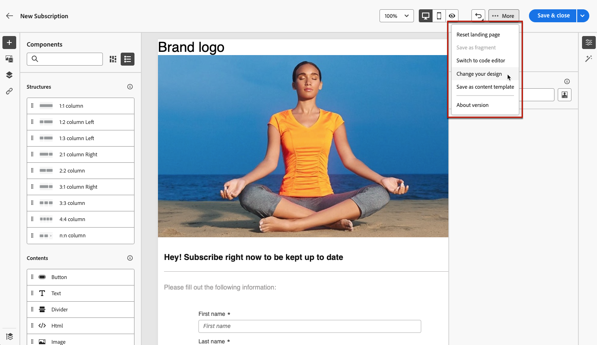

# Arbeta med innehållsmallar för landningssidor {#work-with-templates}

## Spara en sida som en mall {#save-as-template}

När du har utformat [innehållet på landningssidan](lp-content.md) kan du spara det för framtida återanvändning. Följ stegen nedan för att göra detta.

1. Klicka på knappen **[!UICONTROL More]** överst till höger på skärmen.

1. Välj **[!UICONTROL Save as content template]** i listrutan.

   {zoomable="yes"}

1. Lägg till ett namn för mallen.

1. Klicka på **[!UICONTROL Save]**.

Nästa gång du skapar en landningssida kan du använda den här mallen för att bygga ditt innehåll. Lär dig hur i [avsnittet](#use-saved-template) nedan.

{zoomable="yes"}

## Använda en sparad mall {#use-saved-template}

<!--Not for GA?-->

1. När du redigerar innehåll för en landningssida klickar du på knappen **[!UICONTROL More]** och väljer **[!UICONTROL Change your design]**.

   {zoomable="yes"}

1. Bekräfta ditt val.

   >[!NOTE]
   >
   >Den här åtgärden tar bort och ersätter det aktuella innehållet med innehållet från den nya mallen.

1. Listan över alla tidigare sparade mallar visas på fliken **[!UICONTROL Saved templates]**. Du kan sortera dem **[!UICONTROL By name]**, **[!UICONTROL Last modified]** och **[!UICONTROL Last created]**.

   {zoomable="yes"}

1. Välj önskad mall i listan. När du har valt det här alternativet kan du navigera mellan alla sparade mallar med höger- och vänsterpilarna.

   {zoomable="yes"}

1. Klicka på **[!UICONTROL Use this template]**.

1. Redigera innehållet efter behov med hjälp av designern för landningssidan.

<!--Primary page templates and subpage templates are managed separately, meaning that you cannot use a primary page template to create a subpage, and vice versa. TBC in Web user interface-->
