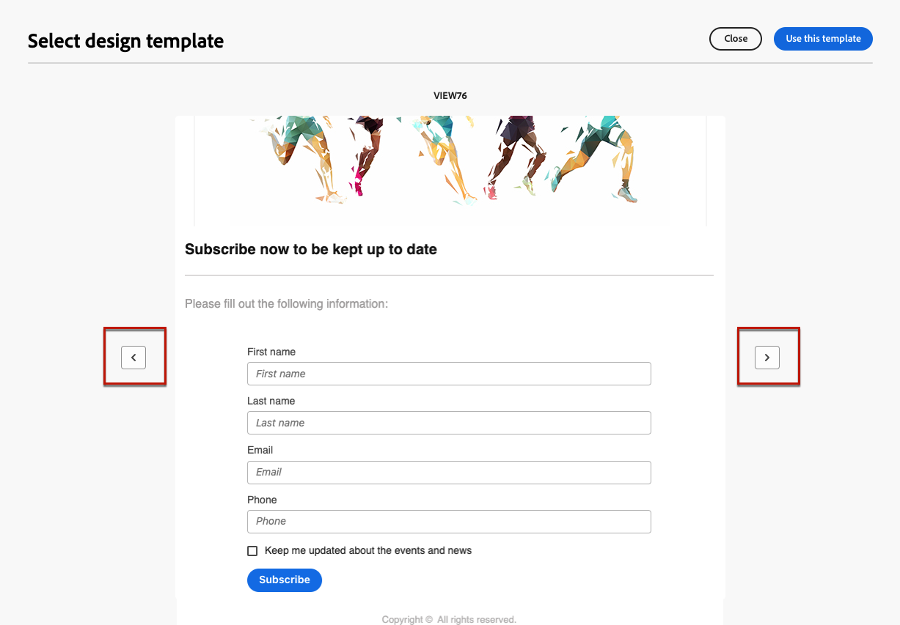

# Arbeta med innehållsmallar för landningssidor {#work-with-templates}

## Spara en sida som en mall {#save-as-template}

När du har utformat [innehållet på landningssidan](lp-content.md) kan du spara det för framtida återanvändning. Följ stegen nedan om du vill spara en sida som en mall.

1. Klicka på knappen **[!UICONTROL More]** längst upp till höger på skärmen.

1. Välj **[!UICONTROL Save as content template]** i listrutan.

   {zoomable="yes"}

1. Lägg till ett namn för mallen.

1. Klicka på **[!UICONTROL Save]**.

Du kan använda den här mallen för att skapa innehåll nästa gång du skapar en landningssida. Lär dig hur i [avsnittet](#use-saved-template) nedan.

{zoomable="yes"}

## Använda en sparad mall {#use-saved-template}

<!--Not for GA?-->

1. När du redigerar innehållet på landningssidan klickar du på knappen **[!UICONTROL More]** och väljer **[!UICONTROL Change your design]**.

   {zoomable="yes"}

1. Bekräfta ditt val.

   >[!NOTE]
   >
   >Den här åtgärden tar bort och ersätter det aktuella innehållet med innehållet från den nya mallen.

1. Listan över alla tidigare sparade mallar visas på fliken **[!UICONTROL Saved templates]**. Du kan sortera dem **[!UICONTROL By name]**, **[!UICONTROL Last modified]** och **[!UICONTROL Last created]**.

   {zoomable="yes"}

1. Välj önskad mall i listan. När du har valt det här alternativet navigerar du mellan alla sparade mallar med höger- och vänsterpilarna.

   {zoomable="yes"}

1. Klicka på **[!UICONTROL Use this template]**.

1. Redigera innehållet efter behov med hjälp av designern för landningssidan.

<!--Primary page templates and subpage templates are managed separately, meaning that you cannot use a primary page template to create a subpage, and vice versa. TBC in Web user interface-->