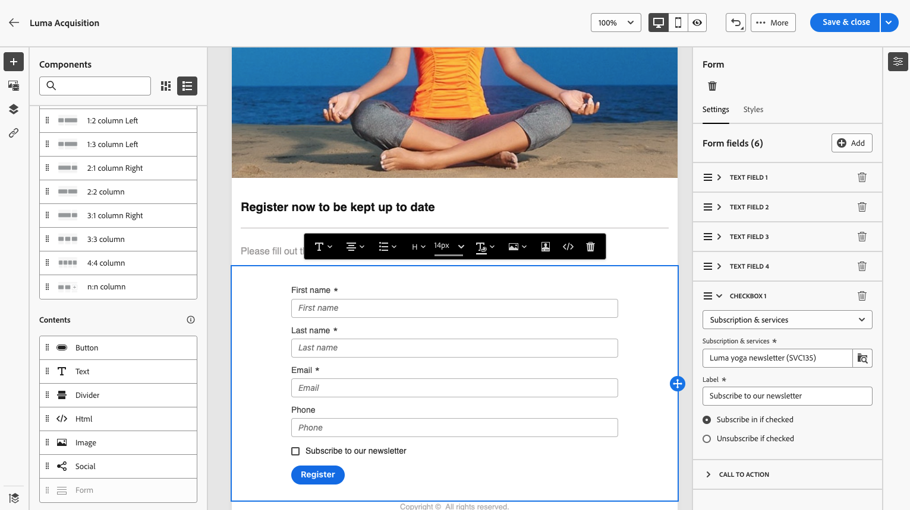

# Använda en landningssida {#lp-use-cases}

>[!CONTEXTUALHELP]
>id="acw_landingpages_url"
>title="Kopiera URL med försiktighet"
>abstract="Om du vill testa eller utnyttja landningssidan fullt ut kan du inte kopiera och klistra in länken direkt i en webbläsare eller i leveranser. Använd i stället **Simulera innehåll** för att testa den och följa de steg som beskrivs i dokumentationen för att använda landningssidan på rätt sätt."

Om du vill använda landningssidan på rätt sätt bör du referera till den som en länk i en leverans med det dedikerade alternativet.

>[!CAUTION]
>
>Om du vill utnyttja din landningssida fullt ut kan du inte kopiera och klistra in länken som visas på den publicerade kontrollpanelen för leverans direkt på leveransen eller till en webbsida.

I [!DNL Adobe Campaign Web] fyra färdiga mallar gör det möjligt att implementera olika användningsområden. Huvudstegen är dock fortfarande desamma och beskrivs nedan.

1. [Skapa en landningssida](create-lp.md#create-landing-page) och välj den mall du vill använda.

1. Definiera egenskaper och inställningar för landningssidan.

   {zoomable=&quot;yes&quot;}

1. Välj **[!UICONTROL Acquisition]**, **[!UICONTROL Subscription]**, **[!UICONTROL Unsubscription]** eller **[!UICONTROL Denylist]** sida.

1. Sidans innehåll visas. Markera den del som motsvarar landningssidans formulär.

   {zoomable=&quot;yes&quot;}

1. Redigera ditt innehåll enligt den valda mallen:

   * [Förvärv](#lp-acquisition)
   * [Prenumeration](#lp-subscription)
   * [Avsluta prenumeration](#lp-unsubscription)
   * [Blockeringslista](#lp-denylist)

1. Ändra resten av innehållet efter behov, spara ändringarna och stäng.

1. Redigera **[!UICONTROL Confirmation]** sida efter behov, samt **[!UICONTROL Error]** och **[!UICONTROL Expiration]** sidor. The **[!UICONTROL Confirmation]** visas för mottagarna när de har skickat in formuläret.

   {zoomable=&quot;yes&quot;}

1. [Testa](create-lp.md#test-landing-page) och [publicera](create-lp.md#publish-landing-page) din landningssida.

1. Skapa en [e-post](../email/create-email.md) leverans för att köra trafik till landningssidan.

1. [Infoga en länk](../email/message-tracking.md#insert-links) i ert meddelandeinnehåll. Välj **[!UICONTROL Landing page]** som **[!UICONTROL Link type]** och välj den landningssida som du skapade.

   {zoomable=&quot;yes&quot;}

   >[!NOTE]
   >
   >Om du vill kunna skicka ditt meddelande kontrollerar du att landningssidan du valt inte har gått ut ännu. [Läs mer](create-lp.md#create-landing-page)

När mottagarna har fått e-postmeddelandet klickar du på länken till landningssidan och skickar formuläret:

* De dirigeras till bekräftelsesidan.

* Alla andra åtgärder som definieras på landningssidan ska tillämpas. Användare prenumererar till exempel på din tjänst eller får inga fler meddelanden från dig.

Nedan finns några exempel på hur du kan använda [!DNL Adobe Campaign] landningssidor i olika möjliga användningsfall.

## Profilinsamling {#lp-acquisition}

Med den första mallen kan du lägga till eller uppdatera en profil i Campaign-databasen.

1. När [skapa en landningssida](create-lp.md#create-landing-page)väljer du **[!UICONTROL Acquisition]** mall.

1. I landningssidans egenskaper ska du se till att välja **[!UICONTROL Pre-fill with the data referenced in the form]** för att förhandsladda eventuell befintlig information från profilen och undvika att skapa dubbletter.

1. Välj **[!UICONTROL Acquisition]** sida för att redigera innehållet.

1. Redigera textfälten efter behov enligt den information som du vill samla in i dina profiler.

1. Dessutom kan du lägga till en kryssruta där kunderna bjuds in att prenumerera på nyhetsbrevet. [Lär dig skapa en tjänst](../audience/manage-services.md)

   {zoomable=&quot;yes&quot;}

1. Justera innehållet efter behov och spara ändringarna.

1. Granska och [publicera](create-lp.md#publish-landing-page) din landningssida.

1. Skapa en [e-post](../email/create-email.md) och [lägga till en länk](../email/message-tracking.md#insert-links) till landningssidan.

När mottagarna har fått e-postmeddelandet klickar du på länken till landningssidan och skickar formuläret, så läggs deras profil till i Campaign-databasen eller uppdateras med den information de har angett.

{zoomable=&quot;yes&quot;}

Om de valde att ta emot ditt nyhetsbrev kommer de att prenumerera på motsvarande tjänst.

{zoomable=&quot;yes&quot;}

## Prenumeration på en tjänst {#lp-subscription}

Ett av de vanligaste användningsområdena är att bjuda in kunderna till [prenumerera på en tjänst](../audience/manage-services.md) (till exempel ett nyhetsbrev eller ett evenemang) via en landningssida. Följ stegen nedan.

<!--For example, let's say you organize an event next month and you want to launch an event registration campaign. To do this, you're going to send an email including a link to a landing page that will enable your recipients to register for this event. The users who register will be added to the subscription list that you created for this purpose.-->

1. Börja med att skapa en bekräftelsemall för användare som prenumererar på ditt evenemang, så att du enkelt kan välja det när du skapar tjänsten. [Läs mer](../audience/manage-services.md#create-confirmation-message)

   {zoomable=&quot;yes&quot;}

1. Skapa en prenumerationstjänst som lagrar registrerade användare till ditt evenemang. [Lär dig skapa en tjänst](../audience/manage-services.md)

1. Välj den mall som du skapade som det bekräftelsemeddelande som användarna får när de prenumererar.

   {zoomable=&quot;yes&quot;}

1. [Skapa en landningssida](create-lp.md#create-landing-page) för att göra det möjligt för mottagarna att registrera sig för evenemanget. Välj **[!UICONTROL Subscription]** mall.

1. Välj **[!UICONTROL Subscription]** sida för att redigera innehållet.

1. Sidans innehåll visas. Markera den del som motsvarar landningssidans formulär och utöka **[!UICONTROL Checkbox 1]** -avsnitt.

1. I **[!UICONTROL Subscriptions & services]** markerar du den tjänst du skapade för evenemanget. Lämna **[!UICONTROL Subscribe in if checked]** aktiverat alternativ.

   {zoomable=&quot;yes&quot;}
<!--
1. You can add an additional checkbox to offer subscription to your newsletter for example.-->

1. Justera innehållet efter behov och spara ändringarna.

1. Granska och [publicera](create-lp.md#publish-landing-page) din landningssida.

1. Skapa en [e-post](../email/create-email.md) och [lägga till en länk](../email/message-tracking.md#insert-links) att köra trafik till landningssidan för registrering.

1. Designa e-postmeddelandet för att meddela att registreringen nu är öppen för ditt event.

När mottagarna har fått e-postmeddelandet klickar du på länken till landningssidan och skickar formuläret, så dirigeras de till bekräftelsesidan och läggs till i prenumerationslistan.

## Avsluta prenumeration {#lp-unsubscription}

Du kan göra det möjligt för dina kunder att avbryta prenumerationen på en tjänst via en landningssida.

1. Kontrollera att du har skapat en bekräftelsemall för användare som vill avbryta prenumerationen på tjänsten, så att du enkelt kan välja den när du skapar tjänsten. [Läs mer](../audience/manage-services.md#create-confirmation-message)

1. I [prenumerationstjänst](../audience/manage-services.md)väljer du den mall som du skapade som det bekräftelsemeddelande som användarna får när de avbeställer prenumerationen.

1. [Skapa en landningssida](create-lp.md#create-landing-page). Välj **[!UICONTROL Unsubscription]** mall.

1. Välj **[!UICONTROL Unsubscription]** sida för att redigera innehållet.

1. Sidans innehåll visas. Markera den del som motsvarar landningssidans formulär.

1. Du kan lägga till en **[!UICONTROL Checkbox]** väljer du tjänsten och väljer **[!UICONTROL Unsubscribe if checked]** alternativ.

   {zoomable=&quot;yes&quot;}

1. Du kan även utöka **[!UICONTROL Call to action]** -avsnittet och välj **[!UICONTROL Additional updates]** alternativ. Välj tjänsten och kontrollera **[!UICONTROL Opt out]** alternativ.

   {zoomable=&quot;yes&quot;}

1. Justera innehållet efter behov och spara ändringarna.

1. Granska och [publicera](create-lp.md#publish-landing-page) din landningssida.

1. Skapa en [e-post](../email/create-email.md) och [lägga till en länk](../email/message-tracking.md#insert-links) till landningssidan.

När mottagarna har fått e-postmeddelandet klickar du på länken till landningssidan och skickar formuläret, så dirigeras de till bekräftelsesidan för avprenumeration och tas bort från motsvarande prenumerationstjänst.

## Blockeringslista {#lp-denylist}

Att ge mottagarna möjlighet att avbryta prenumerationen på information från ett varumärke är ett juridiskt krav. Därför måste du alltid inkludera en **avbeställ länk** i alla e-postmeddelanden som skickas till mottagarna. När du klickar på den här länken dirigeras mottagarna till en landningssida med en knapp som bekräftar att de avanmäler sig.

Du kan konfigurera en **[!UICONTROL Denylist]** landningssida som gör det möjligt för användare att välja bort alla leveranser.

1. När [skapa en landningssida](create-lp.md#create-landing-page)väljer du **[!UICONTROL Denylist]** mall.

1. Välj **[!UICONTROL Denylist]** sida för att redigera innehållet.

1. Expandera **[!UICONTROL Call to action]** -avsnittet och välj **[!UICONTROL Additional updates]** alternativ.

1. I motsvarande listruta väljer du **[!UICONTROL Channel (email)]** för att göra det möjligt för dina mottagare att välja bort från e-postmeddelanden endast. Du kan också välja **[!UICONTROL By all channel]** för att välja dem alla från all kommunikation i alla kanaler.

   {zoomable=&quot;yes&quot;}

1. Justera innehållet efter behov och spara ändringarna.

1. Granska och [publicera](create-lp.md#publish-landing-page) din landningssida.

1. Skapa en [e-post](../email/create-email.md) och [lägga till en länk](../email/message-tracking.md#insert-links) till din landningssida för att göra det möjligt för användarna att välja bort från att ta emot meddelanden.

När mottagarna har fått e-postmeddelandet och klickar på länken till landningssidan och skickar formuläret dirigeras de till bekräftelsesidan för blockeringslista och deras profil uppdateras med den information de har angett.

Om du vill kontrollera att den aktuella profilens val har uppdaterats går du till **[!UICONTROL Profiles]** och välj den profilen.

Om du till exempel väljer att uppdatera **[!UICONTROL Channel (email)]** på landningssidan, **[!UICONTROL No longer contact by email]** alternativet markeras.

{zoomable=&quot;yes&quot;}

Profilen får inte e-postmeddelanden från ert varumärke om du inte prenumererar igen.

