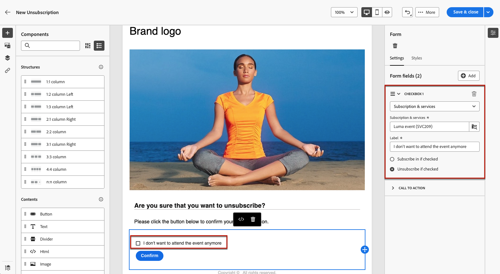

# Använda en landningssida {#lp-use-cases}

>[!CONTEXTUALHELP]
>id="acw_landingpages_url"
>title="Kopiera URL med försiktighet"
>abstract="Om du vill testa eller utnyttja landningssidan fullt ut kan du inte kopiera och klistra in länken direkt i en webbläsare eller i leveranser. Använd i stället funktionen **Simulera innehåll** för att testa det och följ stegen som beskrivs i dokumentationen för att använda landningssidan på rätt sätt."

>[!CONTEXTUALHELP]
>id="acw_landingpages_templates"
>title="Kopiera URL med försiktighet"
>abstract="När du skapar en landningssida kan du med fyra färdiga mallar implementera olika användningsfall: lägga till eller uppdatera en profil i Campaign-databasen, prenumerera på en tjänst, avbeställa dem från en tjänst eller avanmäla användare."
>additional-url="https://experienceleague.adobe.com/docs/campaign-web/v8/landing-pages/create-lp.html?lang=sv-SE#create-landing-page" text="Skapa en landningssida"

Om du vill använda landningssidan på rätt sätt ska du referera till den som en länk i ett meddelande med det dedikerade alternativet. Du kan inte kopiera och klistra in länken som visas på den publicerade kontrollpanelen direkt i leveranser eller på en webbsida. Använd i stället funktionen **Simulera innehåll** för att testa det.

I gränssnittet [!DNL Adobe Campaign Web] kan du använda fyra färdiga mallar för att implementera olika användningsfall. Huvudstegen är dock fortfarande desamma och beskrivs nedan.

1. [Skapa en landningssida](create-lp.md#create-landing-page) och välj önskad mall beroende på användningsfall.

1. Definiera egenskaper och inställningar för landningssidan.

   {zoomable="yes"}

1. Välj sidan **[!UICONTROL Acquisition]**, **[!UICONTROL Subscription]**, **[!UICONTROL Unsubscription]** eller **[!UICONTROL Denylist]** beroende på ditt fall.

1. Sidans innehåll visas. Markera den del som motsvarar landningssidans formulär.

   {zoomable="yes"}

1. Redigera ditt innehåll enligt den valda mallen:

   * [Förvärv](#lp-acquisition)
   * [Prenumeration](#lp-subscription)
   * [Avsluta prenumeration](#lp-unsubscription)
   * [Blockeringslista](#lp-denylist)

1. Ändra resten av innehållet efter behov, spara ändringarna och stäng.

1. Redigera sidan **[!UICONTROL Confirmation]** efter behov, samt sidorna **[!UICONTROL Error]** och **[!UICONTROL Expiration]**. Sidan **[!UICONTROL Confirmation]** visas för mottagarna när de har skickat formuläret.

   {zoomable="yes"}

1. [Testa](create-lp.md#test-landing-page) och [publicera](create-lp.md#publish-landing-page) din landningssida.

1. Skapa en [e-postleverans](../email/create-email.md) för att köra trafik till landningssidan.

1. [Infoga en länk](../email/message-tracking.md#insert-links) i meddelandeinnehållet. Välj **[!UICONTROL Landing page]** som **[!UICONTROL Link type]** och välj den landningssida som du skapade.

   {zoomable="yes"}

   >[!NOTE]
   >
   >Om du vill kunna skicka ditt meddelande kontrollerar du att landningssidan du valt inte har gått ut ännu. [Läs mer](create-lp.md#create-landing-page)

När mottagarna har fått e-postmeddelandet klickar du på länken till landningssidan och skickar formuläret:

* De dirigeras till bekräftelsesidan.
* Alla andra åtgärder som definieras på landningssidan ska tillämpas. Användare prenumererar till exempel på din tjänst eller får inga fler meddelanden från dig.

Nedan visas några exempel på hur du kan använda [!DNL Adobe Campaign] landningssidor i olika möjliga användningsfall.

## Profilinsamling {#lp-acquisition}

Med den första mallen kan du lägga till eller uppdatera en profil i Campaign-databasen.

1. När [skapar din landningssida](create-lp.md#create-landing-page) väljer du mallen **[!UICONTROL Acquisition]**.

1. I landningssidans egenskaper väljer du alternativet **[!UICONTROL Pre-fill with the data referenced in the form]** för att förhandsladda eventuell befintlig information från profilen och undvika att skapa dubbletter.

1. Markera sidan **[!UICONTROL Acquisition]** om du vill redigera innehållet.

1. Redigera textfälten efter behov enligt den information som du vill samla in i dina profiler.

1. Lägg till en kryssruta där kunderna bjuds in att prenumerera på nyhetsbrevet. [Lär dig skapa en tjänst](../audience/manage-services.md)

   {zoomable="yes"}

1. Justera innehållet efter behov och spara ändringarna.

1. Granska och [publicera](create-lp.md#publish-landing-page) din landningssida.

1. Skapa ett [e-postmeddelande](../email/create-email.md) och [lägg till en länk](../email/message-tracking.md#insert-links) på landningssidan.

När mottagarna har fått e-postmeddelandet klickar du på länken till landningssidan och skickar formuläret, så läggs deras profil till i Campaign-databasen eller uppdateras med den information de har angett.

{zoomable="yes"}

Om de valde att ta emot ditt nyhetsbrev kommer de att prenumerera på motsvarande tjänst.

{zoomable="yes"}

## Prenumeration på en tjänst {#lp-subscription}

>[!CONTEXTUALHELP]
>id="acw_landingpages_subscription"
>title="Ange startsida för prenumerationen"
>abstract="Med en prenumerationssida kan dina kunder prenumerera på en tjänst."

Ett av de vanligaste användningsområdena är att bjuda in dina kunder att [prenumerera på en tjänst](../audience/manage-services.md) (till exempel ett nyhetsbrev eller en händelse) via en landningssida. Följ stegen nedan.

<!--For example, let's say you organize an event next month and you want to launch an event registration campaign. To do this, you're going to send an email including a link to a landing page that will enable your recipients to register for this event. The users who register will be added to the subscription list that you created for this purpose.-->

1. Skapa en bekräftelsemall för användare som prenumererar på din aktivitet, så att du enkelt kan välja den när du skapar tjänsten. [Läs mer](../audience/manage-services.md#create-confirmation-message)

   {zoomable="yes"}

1. Skapa en prenumerationstjänst som lagrar registrerade användare för evenemanget. [Lär dig skapa en tjänst](../audience/manage-services.md)

1. Välj den mall som du skapade som det bekräftelsemeddelande som användarna får när de prenumererar.

   {zoomable="yes"}

1. [Skapa en landningssida](create-lp.md#create-landing-page) så att dina mottagare kan registrera sig för din aktivitet. Välj mallen **[!UICONTROL Subscription]**.

1. Markera sidan **[!UICONTROL Subscription]** om du vill redigera innehållet.

1. Sidans innehåll visas. Markera den del som motsvarar landningssidans formulär och expandera avsnittet **[!UICONTROL Checkbox 1]**.

1. I fältet **[!UICONTROL Subscriptions & services]** väljer du den tjänst som du skapade för händelsen. Låt alternativet **[!UICONTROL Subscribe in if checked]** vara aktiverat.

   {zoomable="yes"}
<!--
1. You can add an additional checkbox to offer subscription to your newsletter for example.-->

1. Justera innehållet efter behov och spara ändringarna.

1. Granska och [publicera](create-lp.md#publish-landing-page) din landningssida.

1. Skapa ett [e-postmeddelande](../email/create-email.md) och [lägg till en länk](../email/message-tracking.md#insert-links) för att köra trafik till startsidan för registrering.

1. Designa e-postmeddelandet för att meddela att registreringen nu är öppen för ditt event.

När mottagarna har fått e-postmeddelandet klickar du på länken till landningssidan och skickar formuläret, så dirigeras de till bekräftelsesidan och läggs till i prenumerationslistan.

## Avsluta prenumeration {#lp-unsubscription}

Du kan göra det möjligt för dina kunder att avbryta prenumerationen på en tjänst via en landningssida.

1. Skapa en bekräftelsemall för användare som avbryter prenumerationen på tjänsten, så att du enkelt kan välja den när du skapar tjänsten. [Läs mer](../audience/manage-services.md#create-confirmation-message)

1. I din [prenumerationstjänst](../audience/manage-services.md) väljer du den mall som du skapade som det bekräftelsemeddelande e-postmeddelande som användarna får när de avbeställer prenumerationen.

1. [Skapa en landningssida](create-lp.md#create-landing-page). Välj mallen **[!UICONTROL Unsubscription]**.

1. Markera sidan **[!UICONTROL Unsubscription]** om du vill redigera innehållet.

1. Sidans innehåll visas. Markera den del som motsvarar landningssidans formulär.

1. Lägg till ett **[!UICONTROL Checkbox]**-avsnitt, markera tjänsten och välj alternativet **[!UICONTROL Unsubscribe if checked]**.

   {zoomable="yes"}

1. Expandera avsnittet **[!UICONTROL Call to action]** och markera alternativet **[!UICONTROL Additional updates]**. Markera tjänsten och markera alternativet **[!UICONTROL Opt out]**.

   {zoomable="yes"}

1. Justera innehållet efter behov och spara ändringarna.

1. Granska och [publicera](create-lp.md#publish-landing-page) din landningssida.

1. Skapa ett [e-postmeddelande](../email/create-email.md) och [lägg till en länk](../email/message-tracking.md#insert-links) på landningssidan.

När mottagarna har fått e-postmeddelandet klickar du på länken till landningssidan och skickar formuläret, så dirigeras de till bekräftelsesidan för avprenumeration och tas bort från motsvarande prenumerationstjänst.

## Blockeringslista {#lp-denylist}

Att ge mottagarna möjlighet att avbryta prenumerationen på information från ett varumärke är ett juridiskt krav. Därför måste du alltid inkludera en **länk för att avbryta prenumerationen** i alla e-postmeddelanden som skickas till mottagarna. När du klickar på den här länken dirigeras mottagarna till en landningssida med en knapp som bekräftar att de avanmäler sig.

Du kan konfigurera en **[!UICONTROL Denylist]**-landningssida som gör att användare kan välja bort alla leveranser.

1. När [skapar din landningssida](create-lp.md#create-landing-page) väljer du mallen **[!UICONTROL Denylist]**.

1. Markera sidan **[!UICONTROL Denylist]** om du vill redigera innehållet.

1. Expandera avsnittet **[!UICONTROL Call to action]** och markera alternativet **[!UICONTROL Additional updates]**.

1. I motsvarande nedrullningsbara lista väljer du **[!UICONTROL Channel (email)]** om du bara vill att dina mottagare ska kunna avanmäla sig från e-postkommunikation. Du kan också välja **[!UICONTROL By all channel]** för att avanmäla dem från alla kommunikationer i alla kanaler.

   {zoomable="yes"}

1. Justera innehållet efter behov och spara ändringarna.

1. Granska och [publicera](create-lp.md#publish-landing-page) din landningssida.

1. Skapa ett [e-postmeddelande](../email/create-email.md) och [lägg till en länk](../email/message-tracking.md#insert-links) på din landningssida så att användarna kan välja att inte ta emot kommunikation.

När mottagarna har fått e-postmeddelandet och klickar på länken till landningssidan och skickar formuläret dirigeras de till bekräftelsesidan för blockeringslista och deras profil uppdateras med den information de har angett.

Om du vill kontrollera att den motsvarande profilens val har uppdaterats går du till **[!UICONTROL Profiles]**-menyn och väljer den profilen.

Om du till exempel väljer att uppdatera alternativet **[!UICONTROL Channel (email)]** på landningssidan, markeras alternativet **[!UICONTROL No longer contact by email]**.

{zoomable="yes"}

Profilen får inte e-postmeddelanden från ert varumärke om du inte prenumererar igen.