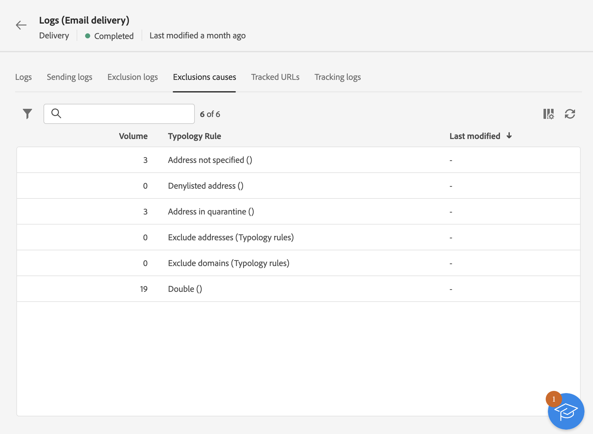

# Övervaka leveransloggar {#delivery-logs}

>[!CONTEXTUALHELP]
>id="acw_deliveries_email_preparation_logs"
>title="Leveransloggar"
>abstract="Leveransloggarna visar information om sändningen. De visar detaljerna för utskicket, vilket eller vilka mål som har uteslutits och varför de har uteslutits. De visar även spårningsinformation som exempelvis öppningar och klick."

När leveransen har förberetts och du klickar på knappen **Skicka** bläddrar du till leveransloggarna för att kontrollera varningar, fel, status, undantag och spårningsdata. Loggarna kan nås direkt från meddelandekontrollpanelen. De visar detaljerna för utskicket, vilket eller vilka mål som har uteslutits och varför de har uteslutits. De visar även spårningsinformation som exempelvis öppningar och klick.

Om du vill visa loggarna öppnar du din kontrollpanel och klickar på knappen **Loggar** .

Följande flikar är tillgängliga:

* [Loggar](#logs-tab)
* [Leveranser](#deliveries-tab)
* [Undantag](#exclusion-tab)
* [Uteslutningsorsaker](#exclusion-causes)
* [Spårade URL:er](#tracked-urls)
* [Spåra](#tracking)

## Loggar {#logs-tab}

Fliken **Loggar** innehåller alla meddelanden som hör till leveransen och korrekturet. Med specifika ikoner kan du identifiera fel eller varningar.

Alla valideringssteg, varningar och fel visas. Färgade ikoner visar meddelandetypen:

* Den grå ikonen visar ett informativt meddelande.
* Den gula ikonen indikerar ett icke-kritiskt bearbetningsfel.
* Den röda ikonen anger ett kritiskt fel som förhindrar leverans. Allvarliga fel måste åtgärdas för att leveransen ska kunna skickas.

{zoomable="yes"}

## Leveranser {#deliveries-tab}

Fliken **Skickar loggar** innehåller en historik över alla förekomster av leveransen. Listan med skickade meddelanden och deras status lagras här.        Du kan visa leveransstatus för varje mottagare.

{zoomable="yes"}

## Undantag {#exclusion-tab}

Fliken **Uteslutningsloggar** visar alla meddelanden som har uteslutits från målet och anger orsaken till sändningsfelet.

{zoomable="yes"}

## Uteslutningsorsaker {#exclusion-causes-tab}

Fliken **Uteslutning orsakar** visar, för varje möjlig orsak, antalet meddelanden som har uteslutits från målet.

{zoomable="yes"}

## Spårade URL:er {#tracked-urls-tab}

Fliken **Spårade URL:er** grupperar URL:erna som finns i skickade meddelanden, inklusive deras URL-typ och deras käll-URL.

{zoomable="yes"}

## Spåra {#tracking-tab}

Fliken **Spårning** visar historiken för den här leveransen. På den här fliken visas spårningsdata för skickade meddelanden, inklusive alla URL:er som spåras av Adobe Campaign.

{zoomable="yes"}

>[!NOTE]
>
>Om spårning inte är aktiverat för en leverans visas inte den här fliken.