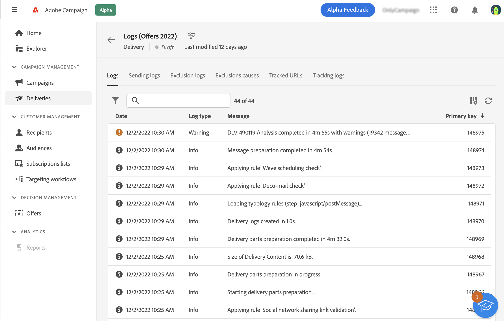
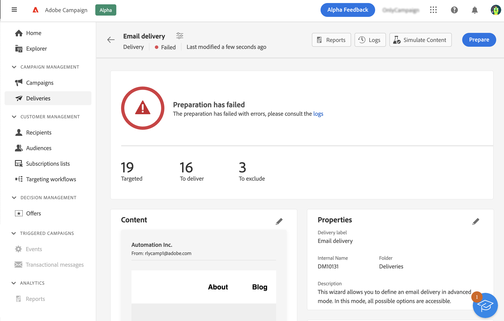

# Förbered och skicka e-post {#prepare-send}

<!--

	show how to prepare and send the email + the live kpis in the dashboard

like acc when preparation, target calculated then send
real time KPIs, not in AJO. similar to ACS.
exclusion logs, causes
-->

<!--
send also KPIs
-->

## Förbered sändningen{#prepare}

När ni har definierat ert innehåll, er målgrupp och ert schema är ni redo att ta fram ert budskap. Under beredningen beräknas målpopulationen och meddelandeinnehållet genereras för varje profil som ingår i målet. När färdigställandet är klart är meddelandena klara att skickas, antingen omedelbart eller vid det schemalagda datumet och klockslaget. Valideringsreglerna som används vid analysen beskrivs i [Campaign Classic v7-dokumentation](https://experienceleague.adobe.com/docs/campaign-classic/using/sending-messages/key-steps-when-creating-a-delivery/steps-validating-the-delivery.html#validation-process-with-typologies){target="_blank"}.

Följ stegen nedan:

1. Klicka på **Förbered** i det övre högra hörnet och bekräfta.

   

   Förberedelseförloppet visas. Beroende på storleken på målpopulationen kan den här åtgärden ta en stund.

   >[!NOTE]
   >
   >Du kan när som helst avbryta beredningen med **Stoppa förberedelse** -knappen. Under beredningsfasen skickas inga meddelanden. Du kan därför starta eller stoppa detta utan risk för att påverka något.

1. Kontrollera KPI:erna när färdigställandet är klart. Om antalet meddelanden som ska skickas inte matchar dina förväntningar ändrar du målgruppen och startar om förberedelsen.

   

   Här visas olika KPI:er:

   * **Målinriktad**: antalet mottagare
   * **Att leverera**: antalet meddelanden som ska skickas
   * **Att exkludera**: antalet meddelanden som utelämnats av en typologiregel

1. Klicka på **Loggar** och kontrollera att det inte finns något fel. I det sista loggmeddelandet visas eventuella felmeddelanden och antalet fel. Mer information finns i [det här avsnittet](delivery-logs.md).

   

Om ett kritiskt fel upptäcks som förhindrar att leveransen skickas, visas statusen för förberedelsen som misslyckad på kontrollpanelen för leverans.

Om du behöver göra några ändringar i leveransen efter färdigställandet måste du starta om preparatet för att dessa ändringar ska beaktas.

När färdigställandet är klart utan fel är ditt meddelande klart att skickas. Mer information finns i [det här avsnittet](#send).

## Skicka meddelandet{#send}

>[!CONTEXTUALHELP]
>id="acw_deliveries_email_metrics_delivered"
>title="Levererat"
>abstract="Antal meddelanden som har levererats. Indikatorn uppdateras var femte minut. Procentandelen som visas baseras på det totala antalet skickade meddelanden."

>[!CONTEXTUALHELP]
>id="acw_deliveries_email_metrics_opens"
>title="Öppnar"
>abstract="Antalet öppnade meddelanden. Indikatorn uppdateras var femte minut. Procentandelen som visas är förhållandet mellan antalet distinkta öppningar och antalet levererade meddelanden."

>[!CONTEXTUALHELP]
>id="acw_deliveries_email_metrics_clicks"
>title="Klickningar"
>abstract="Antalet mottagare som klickade minst en gång i e-postmeddelandet. Indikatorn uppdateras var femte minut. Procentandelen som visas är förhållandet mellan antalet distinkta klickningar och antalet levererade meddelanden."

När färdigställandet är klart kan du nu skicka ditt meddelande. Det här steget krävs bara för meddelanden som skickas omedelbart. Om meddelandet är schemalagt skickas det vid angivet datum.

Följ de här stegen:

1. Klicka på **Skicka** i det övre högra hörnet och bekräfta.

   

1. Sändningsförloppet visas. Kontrollera de KPI:er som visas. Du kan också kontrollera loggarna. Mer information finns i [det här avsnittet](delivery-logs.md).

   

   Här visas olika KPI:er:

   * **Levererat**: antalet meddelanden som har levererats. Procentandelen som visas baseras på det totala antalet skickade meddelanden.
   * **Öppnar**: antalet öppnade meddelanden. Procentandelen som visas är förhållandet mellan antalet distinkta öppningar och antalet levererade meddelanden.
   * **Klickningar**: antalet mottagare som klickade minst en gång i e-postmeddelandet. Procentandelen som visas är förhållandet mellan antalet distinkta klickningar och antalet levererade meddelanden.

   >[!NOTE]
   >
   >Alla indikatorer uppdateras var femte minut efter att leveransen påbörjats. Indikatorerna för leveransförberedelser är i realtid.

   Du kan när som helst pausa sändningen och sedan återuppta den. Om du avbryter leveransen medan den skickas kan du inte återuppta den.
