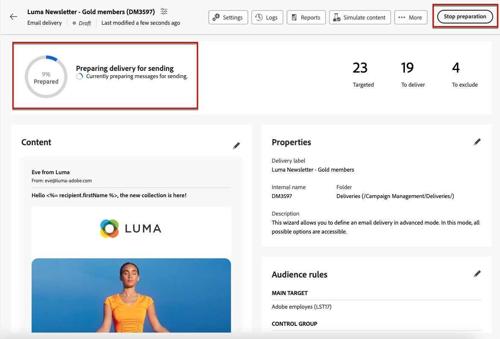
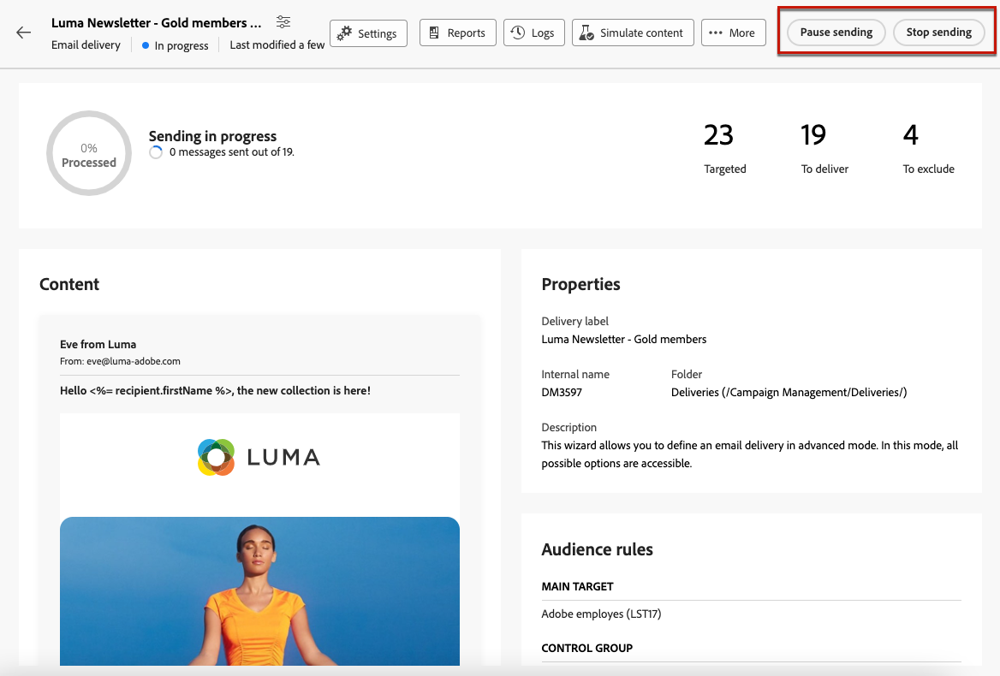

# Förbered och skicka e-post {#prepare-send}

## Förbered sändningen {#prepare}

När du har definierat [innehåll](../email/edit-content.md), [publik](../audience/add-audience.md)och [schema](../msg/gs-messages.md#schedule-the-delivery-sending-gs-schedule)är du redo att förbereda din e-postleverans.

Under leveransförberedelsen beräknas målpopulationen och meddelandeinnehållet genereras för varje profil som ingår i målet. När färdigställandet är klart är meddelandena klara att skickas, antingen omedelbart eller vid det schemalagda datumet och den schemalagda tidpunkten.

Valideringsreglerna som används vid leveransförberedelsen beskrivs i [Kampanjdokumentation v8 (klientkonsol)](https://experienceleague.adobe.com/docs/campaign/campaign-v8/campaigns/send/validate/delivery-analysis.html){target="_blank"}.

De viktigaste stegen för att förbereda sändningen visas nedan.

1. Klicka på **[!UICONTROL Review and send]**.

   {zoomable=&quot;yes&quot;}

1. Klicka på **[!UICONTROL Prepare]** i det övre högra hörnet och bekräfta.

   {zoomable=&quot;yes&quot;}

   >[!NOTE]
   >
   >Om du har schemalagt din leverans och inaktiverat **[!UICONTROL Enable confirmation before sending]** kan förberedelse och sändning grupperas tillsammans under **[!UICONTROL Prepare and send]** -knappen. [Läs mer om planering](../msg/gs-messages.md#gs-schedule)

1. Förberedelseförloppet visas. Beroende på storleken på målpopulationen kan den här åtgärden ta en stund.

   Du kan när som helst avbryta beredningen med **[!UICONTROL Stop preparation]** -knappen.

   {zoomable=&quot;yes&quot;}

   >[!NOTE]
   >Under beredningsfasen skickas inga meddelanden. Du kan därför starta eller stoppa detta utan risk för att påverka något.

1. Kontrollera KPI:erna när färdigställandet är klart. Om antalet meddelanden som ska skickas inte matchar dina förväntningar ändrar du målgruppen och startar om förberedelsen.

   {zoomable=&quot;yes&quot;}

   Här visas olika KPI:er:

   * **[!UICONTROL Targeted]**: antalet mottagare.
   * **[!UICONTROL To deliver]**: antalet meddelanden som ska skickas.
   * **[!UICONTROL To exclude]**: antalet meddelanden som utelämnats av en [typologiregel](../advanced-settings/delivery-settings.md#typology).

1. Klicka på **[!UICONTROL Logs]** och kontrollera att det inte finns något fel. I det sista loggmeddelandet visas eventuella felmeddelanden och antalet fel. [Läs mer](delivery-logs.md)

   {zoomable=&quot;yes&quot;}

1. Om ett kritiskt fel upptäcks som förhindrar att leveransen skickas, visas statusen för förberedelsen som misslyckad på kontrollpanelen för leverans.

   {zoomable=&quot;yes&quot;}

1. Om du ändrar något efter färdigställandet måste du starta om preparatet för att dessa ändringar ska beaktas.

När färdigställandet är klart utan fel är ditt meddelande klart att skickas.

## Skicka meddelandet {#send}

När [förberedelse](#prepare) är klar kan du nu skicka ditt e-postmeddelande.

Om meddelandet är schemalagt skickas det vid angivet datum och klockslag. [Läs mer](../msg/gs-messages.md#gs-schedule)

### Skicka omedelbart {#send-immediately}

Följ stegen nedan om du vill skicka ett e-postmeddelande omedelbart.

1. Klicka på **[!UICONTROL Send]** i det övre högra hörnet.

   {zoomable=&quot;yes&quot;}

1. Bekräfta den här åtgärden för att omedelbart skicka meddelandet till huvudmålet.

1. Sändningsförloppet visas.

### Schemalägg sändning {#schedule-the-send}

Om du har schemalagt ditt e-postmeddelande att skicka det vid ett senare datum och en senare tidpunkt följer du stegen nedan.

1. Innan du trycker **[!UICONTROL Review and send]** ska du kontrollera att du har definierat ett schema för e-postmeddelandet. [Läs mer](../msg/gs-messages.md#gs-schedule)

1. Klicka på **[!UICONTROL Send as scheduled button]** i det övre högra hörnet.

   {zoomable=&quot;yes&quot;}

1. Klicka på **[!UICONTROL Confirm sending]**. Leveransen skickas på det schemalagda datumet till huvudmålet.

   >[!NOTE]
   >
   >Om du har inaktiverat **[!UICONTROL Enable confirmation before sending]** kan förberedelse och sändning grupperas tillsammans under **[!UICONTROL Prepare and send]** -knappen. [Läs mer om planering](../msg/gs-messages.md#gs-schedule)

## Pausa eller stoppa sändningen {#pause-stop-sending}

Om leveransen är schemalagd eller inte<!--TBC-->kan två åtgärder utföras när som helst under sändningsprocessen:

* Klicka **[!UICONTROL Pause sending]** för att avbryta sändningen av meddelandena. Du kan fortsätta skicka när som helst.

* Klicka **[!UICONTROL Stop sending]** för att omedelbart avbryta sändningen. Varken förberedelsen eller sändningen kan återupptas när den har stoppats.

{zoomable=&quot;yes&quot;}

## Kontrollera nyckeltal {#check-kpis}

>[!CONTEXTUALHELP]
>id="acw_deliveries_email_metrics_delivered"
>title="Levererat"
>abstract="Antal meddelanden som har levererats. Indikatorn uppdateras var femte minut. Procentandelen som visas baseras på det totala antalet skickade meddelanden."
>additional-url="https://experienceleague.adobe.com/docs/campaign-web/v8/reports/kpis.html" text="Förstå nyckeltal"

>[!CONTEXTUALHELP]
>id="acw_deliveries_email_metrics_opens"
>title="Öppnar"
>abstract="Antalet öppnade meddelanden. Indikatorn uppdateras var femte minut. Procentandelen som visas är förhållandet mellan antalet distinkta öppningar och antalet levererade meddelanden."
>additional-url="https://experienceleague.adobe.com/docs/campaign-web/v8/reports/kpis.html" text="Förstå nyckeltal"

>[!CONTEXTUALHELP]
>id="acw_deliveries_email_metrics_clicks"
>title="Klickningar"
>abstract="Antalet mottagare som klickade minst en gång i e-postmeddelandet. Indikatorn uppdateras var femte minut. Procentandelen som visas är förhållandet mellan antalet distinkta klickningar och antalet levererade meddelanden."
>additional-url="https://experienceleague.adobe.com/docs/campaign-web/v8/reports/kpis.html" text="Förstå nyckeltal"

>[!CONTEXTUALHELP]
>id="acw_deliveries_email_metrics_sent"
>title="Skickade mått"
>abstract="Totalt antal meddelanden som bearbetats under leveransanalysen."
>additional-url="https://experienceleague.adobe.com/docs/campaign-web/v8/reports/kpis.html" text="Förstå nyckeltal"

>[!CONTEXTUALHELP]
>id="acw_deliveries_email_metrics_errors"
>title="Felmått"
>abstract="Totalt antal fel som sammanställts under leverans och automatisk returbehandling i relation till totalt antal skickade meddelanden."
>additional-url="https://experienceleague.adobe.com/docs/campaign-web/v8/reports/kpis.html" text="Förstå nyckeltal"

När sändningen är klar kan du kontrollera de nyckeltal som visas:

{zoomable=&quot;yes&quot;}

* **[!UICONTROL Sent]**: antalet meddelanden som levereras. Procentandelen som visas baseras på det totala antalet meddelanden som ska levereras.

* **[!UICONTROL Delivered]**: antalet meddelanden som har levererats. Procentandelen som visas baseras på det totala antalet skickade meddelanden.

* **[!UICONTROL Opens]**: antalet öppnade meddelanden. Procentandelen som visas är antalet distinkta öppningar jämfört med antalet levererade meddelanden.

* **[!UICONTROL Clicks]**: antalet mottagare som klickade minst en gång i e-postmeddelandet. Den procentandel som visas är antalet distinkta klick jämfört med antalet levererade meddelanden.

* **[!UICONTROL Errors]**: antalet e-postmeddelanden med felstatus. Procentandelen som visas baseras på det totala antalet skickade meddelanden.

>[!NOTE]
>
>Alla indikatorer uppdateras var femte minut efter att leveransen påbörjats. Indikatorerna för leveransförberedelser är i realtid.

Läs mer om KPI:er i [den här sidan](../reporting/kpis.md).

Du kan också kontrollera loggarna. [Läs mer](delivery-logs.md)