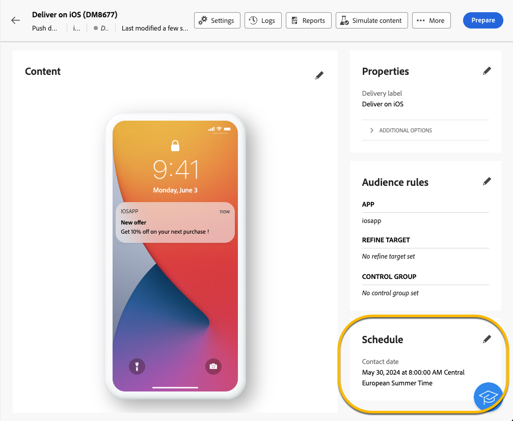

# Schemalägg sändning av leverans {#schedule-sending}

Du kan schemalägga sändning av en leverans. Stegen för detta beror på om det är en fristående leverans (en bild) eller om du arbetar i ett kampanjarbetsflöde.

## Fristående leverans

För fristående leveranser kan du schemalägga direkt datum och tid för leveransen.
Se exempel nedan för varje typ av leverans: e-post, sms, push-meddelanden.

### E-post {#schedule-email-standalone}

Följ stegen nedan för att schemalägga sändning av e-postmeddelanden:

1. Aktivera alternativet **[!UICONTROL Enable scheduling]** i avsnittet **[!UICONTROL Schedule]** i leveransegenskaperna

1. Ange önskat datum och tid för sändning och klicka på knappen **[!UICONTROL Review and send]**.

   {zoomable="yes"}

>[!NOTE]
>
>Som standard är alternativet **[!UICONTROL Enable confirmation before sending]** aktiverat. Det här alternativet kräver att du bekräftar att leveransen ska skickas innan det schemalagda datumet och den schemalagda tidpunkten. Om du behöver **skicka leveransen automatiskt** på det schemalagda datumet och den schemalagda tidpunkten måste du inaktivera det här alternativet.
>

1. Kontrollera att schemat är korrekt och klicka på knappen **[!UICONTROL Prepare]**.

{zoomable="yes"}

1. När färdigställandet är klart är meddelanden klara att skickas. Nyckeltal för leveransen visas: total målpopulation, antal meddelanden som ska levereras, antal uteslutna mottagare. Klicka på knappen **[!UICONTROL Send as scheduled]** för att bekräfta att du tillåter att leveransen skickas på det schemalagda datumet och den schemalagda tiden till huvudmålet.

{zoomable="yes"}

### Sms

Om du vill schemalägga din SMS-leverans till ett visst datum och en viss tid är stegen samma som för e-postleveranser, [se ovan](#schedule-email-standalone).

{zoomable="yes"}

Du kan också kontrollera att schemat har tagits med i beräkningen:

{zoomable="yes"}

### Push-meddelande

Om du vill schemalägga en fristående push-leverans till ett visst datum och en viss tid är stegen samma som för e-postleveranser, [se ovan](#schedule-email-standalone).

{zoomable="yes"}

Du kan också kontrollera att schemat har tagits med i beräkningen:

{zoomable="yes"}

### Fristående leverans i en kampanj

Du kan skapa en fristående leverans inom en kampanj utan att använda ett arbetsflöde. Du kan ställa in datum- och tidsplanering för den här leveransen enligt ovan.
Kampanjen kan ha sitt schema, med ett startdatum och ett slutdatum. Det här schemat påverkar inte ditt leveransschema.

{zoomable="yes"}

## Schemalägg en leverans i ett kampanjarbetsflöde

I ett kampanjarbetsflöde är **bästa praxis** att använda aktiviteten **[!UICONTROL Scheduler]** för att använda ett datum och en tid som startar arbetsflödet, vilket innebär att leveransen skickas. [Läs mer om Schemaläggaren](../workflows/activities/scheduler.md)

{zoomable="yes"}

Du måste konfigurera datum och tid i aktiviteten **[!UICONTROL Scheduler]**.

{zoomable="yes"}

>[!NOTE]
>
>När du använder aktiviteten **[!UICONTROL Scheduler]** för att schemalägga sändning av leverans i ett arbetsflöde ska **inte** aktivera **[!UICONTROL Enable scheduling]**-växeln i aktivitetsinställningarna för **[!UICONTROL Delivery]**. Leveransen skickas automatiskt.
>

Om du aktiverar växeln **[!UICONTROL Enable scheduling]** i aktivitetsinställningarna för **[!UICONTROL Delivery]** och ställer in ett datum och en tid där, väntar leveransen på att skickas vid detta datum och denna tid. Det innebär att om det är en fördröjning mellan startdatumet för arbetsflödet och datumet för sändningen kanske målgruppen inte är aktuell.
