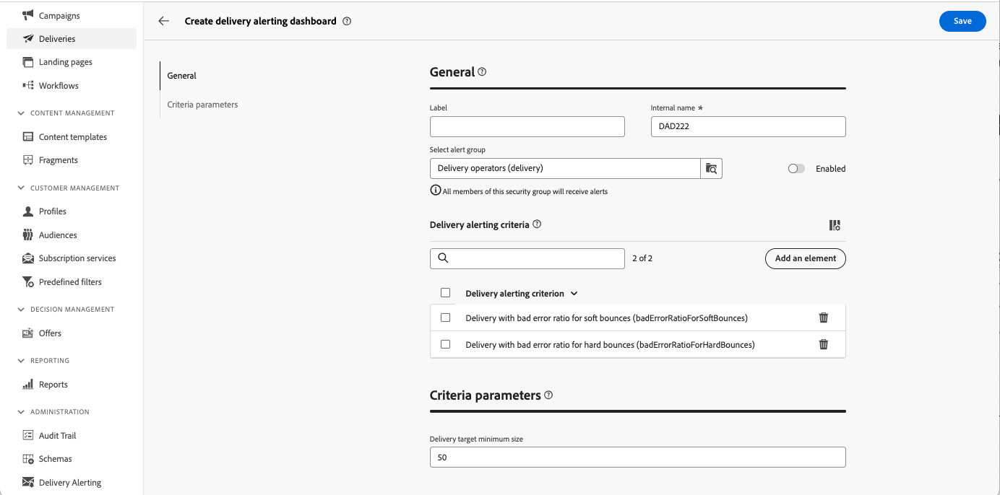

# Kontrollpaneler för leveransvarningar {#delivery-alerting-dashboards}

>[!CONTEXTUALHELP]
>id="acw_delivery_alerting_dashboards"
>title="Kontrollpaneler för leveransvarningar"
>abstract="Delivery Alerting är ett varningshanteringssystem som gör det möjligt för användargrupper att automatiskt få e-postmeddelanden med information om leveransen. Med kontrollpaneler för leveransvarningar kan du ange vem som ska få e-postvarningar, välja och konfigurera aviseringsvillkor som ska användas för att skicka dessa varningar och få tillgång till historiken för alla skickade meddelanden."

Med kontrollpaneler för leveransvarningar kan du ange vem som ska få e-postvarningar, välja och konfigurera aviseringsvillkor som ska användas för att skicka dessa varningar och få tillgång till historiken för alla skickade meddelanden. De är tillgängliga på menyn **Leveransvarning** i den vänstra navigeringsrutan, på fliken **Kontrollpaneler** .

>[!AVAILABILITY]
>
>Den här funktionen är begränsad tillgänglighet (LA). Den är begränsad till kunder som migrerar **från Adobe Campaign Standard till Adobe Campaign v8** och kan inte distribueras i någon annan miljö.

## Skapa en kontrollpanel för leverans {#dashboards}

>[!CONTEXTUALHELP]
>id="acw_delery_alerting_dashboard_create"
>title="Skapa kontrollpanel för leveransvarningar"
>abstract="Genom att skapa en kontrollpanel för leveransvarningar kan du ange vem som ska få e-postvarningar, välja och konfigurera varningsvillkoren som ska användas för att skicka dessa varningar och få tillgång till historiken för alla skickade meddelanden."

>[!CONTEXTUALHELP]
>id="acw_delivery_alerting_create_general"
>title="Allmänna parametrar för leveransvarningar"
>abstract="Ange allmänna egenskaper för kontrollpanelen för leveransvarningar. I fältet **Välj varningsgrupp** kan du ange att **operatörsgruppen** ska ta emot aviseringar från den här instrumentpanelen."

>[!CONTEXTUALHELP]
>id="acw_delivery_alerting_create_criteria_add"
>title="Villkor för leveransvarning"
>abstract="I det här avsnittet lägger du till villkor som du vill använda för att skicka aviseringar från den här instrumentpanelen. Välj bland fördefinierade kriterier eller skapa egna kriterier som passar in efter specifika behov."

>[!CONTEXTUALHELP]
>id="acw_delivery_alerting_create_criteria_parameters"
>title="Kriterieparametrar"
>abstract="Kriterierna har standardparametervärden som definierar hur de måste tillämpas. I det här avsnittet kan du ändra dessa värden så att de passar dina behov."

Så här skapar du en kontrollpanel för leverans:

1. Navigera till menyn **Leveransvarning** i den vänstra navigeringsrutan och klicka på **Skapa leveransinstrumentpanel**.

   

1. Namnge instrumentpanelen i fältet **Etikett**. Fältet **Internt namn** fylls i automatiskt och är skrivskyddat.

1. I fältet **Välj varningsgrupp** anger du den **operatorgrupp** som ska ta emot aviseringar från den här instrumentpanelen. Alla medlemmar i den valda operatörsgruppen får aviseringarna.

   Läs mer om behörigheter och operatörsgrupper i [Adobe Campaign v8-dokumentationen (konsolen)](https://experienceleague.adobe.com/sv/docs/campaign/campaign-v8/admin/permissions/gs-permissions){target="_blank"}

1. I avsnittet **Leveransaviseringsvillkor** lägger du till villkor som du vill använda för att skicka aviseringar. Välj bland fördefinierade kriterier eller skapa egna kriterier som passar in efter specifika behov. [Lär dig arbeta med villkor](../msg/delivery-alerting-criteria.md)

1. Kriterierna har standardparametervärden som definierar hur de måste tillämpas. Du kan ändra dessa värden så att de passar dina behov i avsnittet **Kriterieparametrar**.

   

   Som standard är villkorsparametern **Minimistorlek** för leveransmål satt till 50, vilket innebär att en leverans inkluderas i aviseringen som skickas av den här instrumentpanelen endast om den har minst 50 profiler som mål. Du kan ändra den här parametern om du vill ta med leveranser som har färre än 50 profiler som mål.

   Expandera avsnittet nedan om du vill ha mer information om varje kriterieparameter:

   +++Tillgängliga kriterieparametrar

   * **Minimistorlek för leveransmål**: Om du till exempel anger 100 i det här fältet skickas ett meddelande endast för leveranser med ett mål som är lika med eller större än 100 mottagare. Den här parametern gäller för alla villkor.
   * **Övervakningsperiod före och efter kontaktdatumet (i timmar)**: Antal timmar före och efter den aktuella tiden. Endast leveranser som har ett kontaktdatum i det här tidsintervallet beaktas. Den här parametern gäller för alla villkor. Som standard är värdet för det här fältet inställt på 24 timmar.
   * **Maximal proportion för mjuka studsfel**: Ett meddelande skickas för alla leveranser med en felkvot för mjuk studs som är större än det angivna värdet. Som standard är fältets värde inställt på 0,05 (5 %).
   * **Maximal proportion för hårda studsfel**: Ett meddelande skickas för alla leveranser med ett felförhållande för hårda studsfel som är större än det angivna värdet. Som standard är fältets värde inställt på 0,05 (5 %).
   * **Lägsta tröskelvärde för leveranstid i statusen Påbörja väntande (i minuter)**: Ett meddelande skickas för alla leveranser med statusen Påbörja väntande för längre tid än vad som anges i det här fältet, Påbörja väntande status, vilket innebär att meddelanden ännu inte har beaktats av systemet.
   * **Minimitid som krävs för beräkning av dataflöde (i minuter)**: Endast leveranser som har startats (med statusen Pågående) under mer än den angivna varaktigheten beaktas för leveranser med kriteriet för låg dataström.
   * **Maximal procentandel av bearbetade meddelanden för beräkning av dataflöde**: Endast leveranser med en procentandel av bearbetade meddelanden som är lägre än den angivna procentandelen tas med i beräkningen för leveranser med lågt dataflöde.
   * **Minsta förväntade dataflöde (i skickade meddelanden per timme)**: Endast leveranser med ett dataflöde som är lägre än det angivna värdet beaktas för leveranser med lågt dataflöde.
   * **Minsta antal bearbetade meddelanden som krävs för kriteriet &#39;Pågående leveranser&#39;**: Endast leveranser med en procentandel av bearbetade meddelanden som är högre än den angivna procentandelen tas med i beräkningen.

   +++

1. Som standard är varningsmeddelanden inaktiverade, vilket innebär att e-postaviseringar som är länkade till den här instrumentpanelen inte skickas. Om du vill aktivera instrumentpanelen omedelbart växlar du alternativet **Aktiverad** i avsnittet **Allmänt** bredvid fältet för val av varningsgrupp.

   Du kan också spara kontrollpanelen och aktivera den senare.

   

1. Klicka på knappen **Spara** om du vill spara varningsinstrumentpanelen.

Aviseringspanelen öppnas med tomma data. När du är redo att aktivera den och skicka meddelanden klickar du på knappen **Inställningar** och växlar alternativet **Aktiverad** om du inte har gjort det tidigare.

Varje gång en leverans uppfyller de villkor som definierats i den här kontrollpanelen skickas nu ett varningsmeddelande till den angivna operatörsgruppen.

## Hantera aviseringspaneler

>[!CONTEXTUALHELP]
>id="acw_delivery_alerting_dashboard_alerts"
>title="Leveransmeddelanden har skickats"
>abstract="I det här avsnittet kan du visualisera information om de senaste skickade aviseringarna."

>[!CONTEXTUALHELP]
>id="acw_delivery_alerting_dashboard_history"
>title="Historik för leveransaviseringar"
>abstract="Panelen **Historik** innehåller alla aviseringar som skickas från den här instrumentpanelen. Klicka på ett objekt för att komma åt motsvarande aviseringar som skickats vid den aktuella tidpunkten."

Alla skapade aviseringspaneler är tillgängliga på menyn **Leveransavisering** på fliken **Kontrollpaneler** .

Du kan duplicera eller ta bort en instrumentpanel med knappen **Fler åtgärder** bredvid namnet.

Om du vill visa en detaljerad vy av en kontrollpanel klickar du på dess namn i listan. Från den här skärmen kan du visualisera den senaste skickade varningen. Alla skickade aviseringar visas i den vänstra rutan. Klicka på ett objekt för att komma åt motsvarande aviseringar som skickats vid den aktuella tidpunkten.

Om du vill redigera kontrollpanelen klickar du på knappen **Inställningar** i det övre högra hörnet och gör önskade ändringar.