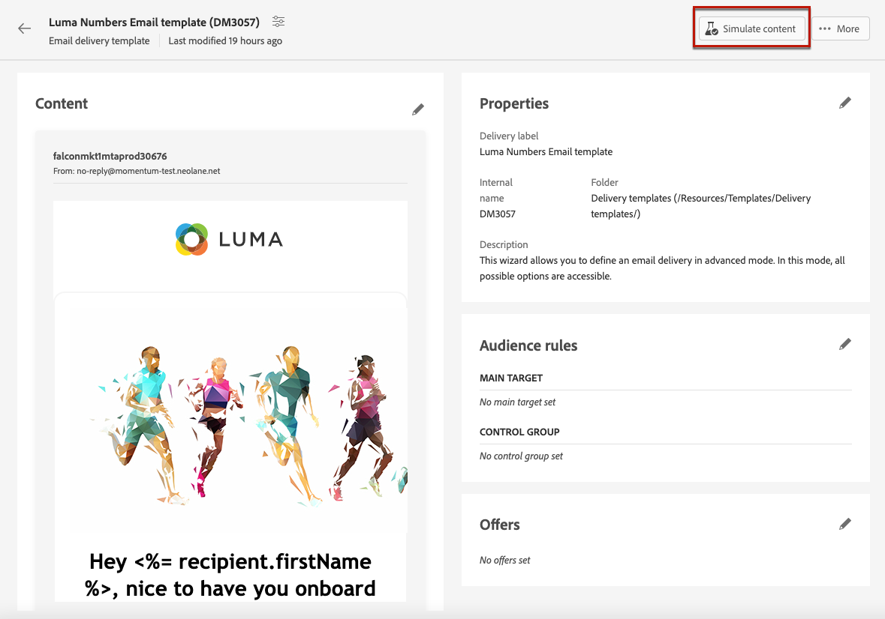

# Arbeta med leveransmallar {#work-with-delivery-templates}

>[!CONTEXTUALHELP]
>id="acw_delivery_template_for_campaign"
>title="Leveransmallar"
>abstract="Använd leveransmallar för att standardisera den kreativa looken och känslan, så att ni snabbare kan genomföra och lansera kampanjer"

För en snabbare och förbättrad designprocess kan ni skapa leveransmallar för att enkelt återanvända anpassat innehåll och anpassade inställningar i era kampanjer. Med den här funktionen kan ni standardisera den kreativa utseendet och känslan för att kunna genomföra och lansera kampanjer snabbare.

En mall kan innehålla:

* [Typologier](../advanced-settings/delivery-settings.md#typology),
* Avsändarens adress.
* An [publik](../audience/about-audiences.md), inklusive [kontrollgrupper](../audience/control-group.md),
* Egen [innehåll](../content/edit-content.md),
* [Personaliserade fält](../personalization/personalize.md) och [villkorligt innehåll](../personalization/conditions.md),
* Länkar till [spegelsida](../content/mirror-page.md) och prenumerera [länkar](../content/message-tracking.md),
* Andra leveransegenskaper, som resursgiltighet, återförsöksparametrar eller karantäninställningar.

>[!NOTE]
>
>Leveransmallar skiljer sig från [mallar för e-postinnehåll](../content/email-templates.md), som gör att du bara kan återanvända innehållet i dina meddelanden.

## Få åtkomst till och hantera leveransmallar {#access-manage-templates}

>[!CONTEXTUALHELP]
>id="acw_delivery_templates"
>title="Arbeta med leveransmallar"
>abstract="Använd leveransmallar för att enkelt skapa och spara befintliga leveranser för framtida bruk."
>additional-url="https://experienceleague.adobe.com/docs/campaign-web/v8/msg/delivery-template.html#copy-an-existing-template" text="Duplicera en befintlig mall"
>additional-url="https://experienceleague.adobe.com/docs/campaign-web/v8/msg/delivery-template.html#convert-an-existing-delivery" text="Konvertera en leverans till en mall"

Om du vill komma åt innehållsmalllistan väljer du **[!UICONTROL Campaign Management]** > **[!UICONTROL Deliveries]** från den vänstra menyn och bläddra till **Mallar** -fliken.

Alla mallar som [skapad](#create-a-delivery-template) i den aktuella miljön visas.

Du kan filtrera innehållsmallar på kanaler och mappar. Du kan också ange avancerade filter genom att skapa en regel med hjälp av leveransattribut. [Läs mer om regelbyggaren](../audience/segment-builder.md)

Om du vill redigera en mall klickar du på önskat objekt i listan. Därifrån:

* Ni kan ändra dess innehåll, egenskaper, målgrupp och eventuella erbjudanden som är kopplade till den.
* Du kan också testa mallen. [Läs mer](#test-template)

Ta bort eller [duplicera](#copy-an-existing-template) en mall väljer du motsvarande åtgärd från **[!UICONTROL More actions]** menyn, antingen från **[!UICONTROL Templates]** eller från en mallversionsskärm.

>[!NOTE]
>
>När en mall redigeras eller tas bort påverkas inte leveranser som skapats med den här mallen.

## Skapa en leveransmall {#create-a-delivery-template}

Om du vill skapa en leveransmall kan du:
* Duplicera en befintlig mall - [Läs mer](#copy-an-existing-template)
* Konvertera en befintlig leverans till en mall - [Läs mer](#convert-an-existing-delivery)
* Skapa en leveransmall från grunden - [Läs mer](#create-a-new-template)

### Duplicera en befintlig leveransmall {#copy-an-existing-template}

Campaign innehåller en uppsättning inbyggda mallar för varje kanal: e-post, push, SMS. Det enklaste sättet att skapa en leveransmall är att duplicera och anpassa en inbyggd mall.

>[!NOTE]
>
>Du kan också duplicera en anpassad mall.

Så här duplicerar du en leveransmall:

1. Gå till **Mallar** -fliken, från **Leveranser** vänster meny. [Läs mer](#access-manage-templates)
1. Klicka på **[!UICONTROL More actions]** till höger om mallnamnet och välj  **[!UICONTROL Duplicate]**.

   Du kan också välja en mall i listan och välja det här alternativet från mallversionsskärmen.

1. Bekräfta duplicering.

   

1. Den nya mallkontrollpanelen öppnas på den centrala skärmen. Redigera mallinställningarna efter behov.

   

1. Klicka på **[!UICONTROL Review]** för att spara och granska mallen. Du kan fortfarande redigera alla dess inställningar, ta bort och duplicera den.

   

1. Testa mallåtergivningen vid behov. [Läs mer](#test-template)

Den nya mallen läggs till i [**Mallar** list](#access-manage-templates). Du kan nu välja den när du skapar en ny leverans.

### Konvertera en leverans till en mall {#convert-an-existing-delivery}

Alla leveranser kan konverteras till mallar för framtida upprepade leveransåtgärder.

Så här sparar du en leverans som en mall:

1. Gå till **[!UICONTROL Campaign management]** > **[!UICONTROL Deliveries]** -menyn.
1. Från **[!UICONTROL Browse]** klickar du på **[!UICONTROL More actions]** till höger om leveransnamnet och välj **[!UICONTROL Copy as a template]**.

   

1. Bekräfta duplicering.

1. Den nya mallkontrollpanelen öppnas på den centrala skärmen. Redigera mallinställningarna efter behov.

1. Klicka på **[!UICONTROL Review]** för att spara och granska mallen. Du kan fortfarande redigera alla dess inställningar, ta bort och duplicera den.

1. Testa mallåtergivningen vid behov. [Läs mer](#test-template)

Den nya mallen läggs till i [**Mallar** list](#access-manage-templates). Du kan nu välja den när du skapar en ny leverans.

### Skapa en ny leveransmall {#create-a-new-template}

>[!NOTE]
>
>För att undvika konfigurationsfel rekommenderar Adobe att du [duplicera en inbyggd mall](#copy-an-existing-template) och anpassa egenskaperna i stället för att skapa en ny mall.

Så här konfigurerar du en leveransmall från grunden:

1. Gå till **Mallar** -fliken, från **Leveranser** vänster meny. [Läs mer](#access-manage-templates)
1. Klicka på knappen **[!UICONTROL Create template]**.

   

1. Välj den kanal som du vill använda för mallen.
1. Den inbyggda leveransmallen för den kanalen används som standard för att hjälpa dig att skapa en egen mall. Använd den dedikerade knappen till höger om den valda kanalen för att välja en annan mall vid behov.

   

1. Klicka på **[!UICONTROL Create template]** igen.

1. Definiera mallegenskaperna, [publik](../audience/add-audience.md) och innehåll beroende på den valda kanalen.

   >[!NOTE]
   >
   >Läs mer om distributionskanaler och hur du utformar respektive innehåll i avsnitten nedan:
   >
   > * [E-postkanal](../email/create-email.md)
   > * [Push-meddelandekanal](../push/gs-push.md)
   > * [SMS-kanal](../sms/create-sms.md)

1. För e-postmallar kan dessutom avancerade inställningar, som typologiregler och målmappningar, nås via **[!UICONTROL Settings]** på skärmens övre högra hörn. [Läs mer](../advanced-settings/delivery-settings.md)

1. Klicka på **[!UICONTROL Review]** för att spara och granska mallen. Du kan fortfarande redigera alla dess inställningar, ta bort och duplicera den.

1. Testa mallåtergivningen vid behov. [Läs mer](#test-template)

Den nya mallen läggs till i [**Mallar** list](#access-manage-templates). Du kan nu välja den när du skapar en ny leverans.

## Testa en leveransmall {#test-template}

Du kan testa återgivningen av alla leveransmallar, oavsett om de har skapats från grunden eller från ett befintligt innehåll. För att göra detta, följ nedanstående steg.

1. Gå till **Mallar** tabba igenom **[!UICONTROL Campaign management]** > **[!UICONTROL Deliveries]** och välj en mall. [Läs mer](#access-manage-templates)

1. Klicka på **[!UICONTROL Simulate content]** överst till höger på skärmen.

   

1. Markera en eller flera testprofiler för att kontrollera e-poståtergivningen. Du kan också välja riktiga profiler från databasen.

1. Växla mellan de olika profilerna för att få en personlig representation av meddelandet enligt den valda profilen.

   <!--[Learn more on test profiles](../preview-test/test-deliveries.md#recipients)-->

   Du kan också justera zoomnivån och välja skrivbordsvy eller mobilvy.

   

1. Stäng fönstret för att gå tillbaka till mallversionen.

>[!NOTE]
>
>Du kan inte använda e-poståtergivning eller skicka korrektur i en leveransmall.

* [Läs mer om hur du förhandsgranskar e-postinnehåll](../preview-test/preview-content.md)

* [Läs mer om förhandsgranskning av SMS-innehåll](../sms/content-sms.md)

* [Läs mer om hur du förhandsgranskar push-innehåll](../push/gs-push.md)

