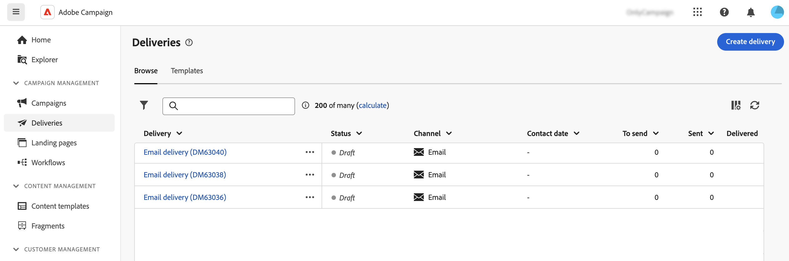

# Åtkomstleveranser {#work-with-deliveries}

>[!CONTEXTUALHELP]
>id="acw_deliveries_list"
>title="Leveranser"
>abstract="En leverans är en kommunikation som skickas till en publik via en viss kanal: e-post, SMS eller push. På den här skärmen kan du redigera, duplicera och ta bort befintliga leveranser. Du kan även visa rapporter för slutförda leveranser. Klicka på knappen **Skapa leverans** för att lägga till en ny leverans."

## Åtkomstleveranser {#access}

>[!CONTEXTUALHELP]
>id="acw_deliveries_additional_target"
>title="Ytterligare mål"
>abstract="Dessa regler kan bara ändras i klientkonsolen."

Leveranser är tillgängliga på menyn **[!UICONTROL Deliveries]** i den vänstra navigeringen. Alla leveranser som skapats antingen från klientkonsolen eller webbanvändargränssnittet visas i den här listan. Från den här skärmen kan du övervaka alla befintliga leveranser, duplicera eller ta bort dem eller skapa nya.

Om du vill öppna en leverans klickar du på dess namn i listan. Leveransen öppnas så att du kan utföra olika åtgärder, som att redigera dess parametrar, kontrollera körningen eller övervaka dess prestanda med hjälp av dedikerade rapporter.

Om du öppnar en leverans som skapats i klientkonsolen kan två nya avsnitt visas för målgruppen. De här parametrarna kan bara ändras i konsolen.

* **[!UICONTROL Additional target]**: anger att flera mål har konfigurerats för den här leveransen.

* **[!UICONTROL Additional proof target]**: anger att ett dynamiskt villkor har definierats för korrekturmål i den här leveransen.

{zoomable="yes"}

## Duplicera en leverans {#delivery-duplicate}

Du kan skapa en kopia av en befintlig leverans, antingen från leveranslistan eller från kontrollpanelen för leverans.

Så här duplicerar du en leverans från listan med leveranser:

1. Klicka på knappen med tre punkter till höger bredvid namnet på den leverans som ska dupliceras.
1. Välj **[!UICONTROL Duplicate]**.
1. Bekräfta duplicering. Den nya kontrollpanelen för leverans öppnas på den centrala skärmen.

Så här duplicerar du en leverans från kontrollpanelen:

1. Öppna leveransen och klicka på knappen **[!UICONTROL ...More]** överst på skärmen.
1. Välj **[!UICONTROL Duplicate]**.
1. Bekräfta duplicering. Den nya leveransen ersätter den aktuella leveransen på den centrala skärmen.

## Ta bort en leverans {#delivery-delete}

Leveranser tas bort från leveranslistan, antingen från huvudposten i det vänstra fältet eller från leveranslistan för en kampanj.

Så här tar du bort en leverans från listan över leveranser:

1. Klicka på knappen med tre punkter till höger bredvid namnet på den leverans som ska tas bort.
1. Välj **[!UICONTROL Delete]**.
1. Bekräfta borttagning.

Alla leveranser är tillgängliga i de här listorna, men leveranser som har skapats i ett arbetsflöde kan inte tas bort därifrån. Om du vill ta bort en leverans som har skapats i ett arbetsflöde tar du bort leveransaktiviteten från arbetsflödet.

Så här tar du bort en leverans från ett arbetsflöde:

1. Välj leveransaktivitet.
1. Klicka på ikonen **[!UICONTROL Delete]** på den högra panelen.
1. Bekräfta borttagning. Om leveransen har underordnade noder väljer du att ta bort dem också eller behålla dem.

